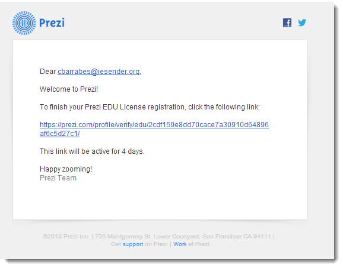
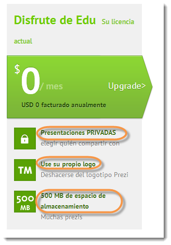

# 1.1. Registrarse en Prezi (Lic. Edu)

### Registrarse en Prezi

1.  Entramos en [http://prezi.com/](http://prezi.com/ "Página Web Prezi")
2.  Podemos **Registrarnos** por correo electrónico o **identificarnos** con nuestro facebook
3.  Podemos pasarnos a ver los precios. (Parte inferior: Producto - Precios) Clic en Precios
4.  Elegir nuestra licencia. Interesa esta, por sus 500 MB y coste.
5.  Registrase. (**Nota: **Las licencias educativas de Prezi pueden registrarse exclusivamente con direcciones de correo que coincidan con el dominio de la institución educativa.)
6.  Verificación Estudiante/Profesor: Indica tu dirección de correo electrónico. Si deseas registrarte para tener una cuenta educativa, tendrás que usar una dirección de correo electrónico que pertenezca claramente a una institución educativa. **Recuerda** que tu correo será tu nombre de usuario.
7.  Si deseas cambiar tu licencia actual a una licencia EDU, tendrás que [identificarte](https://prezi.com/login/ "Identificarse") primero y elegir Ampliar en la página de Configuración y licencia.
8.  Podemos usar nuestra **cuenta.....@educa.aragon.es** o si tenemos dominio en el centro pedir al coordinador que nos cree una.
9.  Rellenar datos de nuestro centro: Nombre, Ciudad, País y web del centro (Ten en cuenta que solo puedes registrarte si tu institución educativa dispone de página web) **Confirmar** (marcar casilla: Confirmo que la institución educativa que he indicado anteriormente es donde soy  
    estudiante o profesor/a) y **continuar**
10.  Nos saldrá un mensaje: 
    * Registro de la licencia para la Educación ×
    * Un correo electrónico de confirmación se ha enviado a vosotros.  
    * Por favor, abre el mensaje y haz **clic en el enlace** para completar el registro.  
    * Puede cerrar esta ventana del navegador ahora.
11.  Tenemos un plazo de 4 días para activar la cuenta haciendo clic en el mensaje de correo similar al de la figura
12.  Tras verificar el correo. Rellenamos nuestros datos. Nombre, apellidos, ya nos coge el mail dado, contraseña, leer las condiciones, marcar la casilla aceptar y contratar.  (Hemos elegido: Usted ha elegido "EDU Disfrute de suscripción" por $ 0/year) Tenemos 500 MB para trabajar presentaciones privadas, podemos poner el logo del centro y mucho espacio coste 0.

