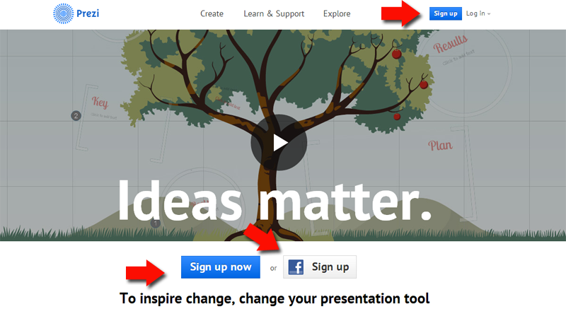

# 1.2. Manejar Prezi

### Empezar a crear nuestro primer Prezi

Presentaciones dinámicas multimedias, colaborativa y sociales.

1.  Si no estamos registrados, repasar 1.1. Registrarse en Prezi. Ir a Sign Up
2.  Como ya estamos registrados. Entramos en Prezi.com con Log In ([https://prezi.com/login/](https://prezi.com/login/ "Entrar en Prezi"))
3.  Click en el icono entrar 

También podríamos entrar con nuestra cuenta Facebook se está vinculada con el Prezi 

### Cooperación on-line

**C**on Prezi se puede _**trabajar de manera colaborativa con hasta diez usuarios registrados a la vez**_, que pueden editar la misma presentación al mismo tiempo.

Las presentaciones realizadas en Prezi pueden ser descargadas y son compatibles con Mac, Windows xp, Windows 7

**Nueva presentación **

Buscamos algunos de los botones: **Nuevo Prezi**

Le asignaremos un título y una descripción

Elegimos una plantilla

Tras la elección (que nos ayudará a completar nuestras primeras presentaciones), ya podemos empezar a insertar, textos, imágenes, vídeos, etc.

**La barra de herramientas:** Present (presentamos presentación), crear una nueva, Salvar (o guardar)...

Podemos agregar nuevos marcos (Frames), cambiar el tema, insertar imágenes, flechas, archivos multimedia, powerpoint, documentos, archivos, pdf's...

**Marcos:** Redondos, cuadrados, transparentes...

**Temas:** Podemos cambiar el color de fondo, tipo de letra, diagramas... podemos personalizarlos

**Insertar imágenes:** Podemos insertar imágenes desde un archivo de nuestra máquina o desde una dirección URL

**Insertar Flechas y Figuras:** Podemos insertar flechas, líneas...

**Insertar vídeo:** Desde archivo de nuestra máquina y desde Youtube

**Podemos Insertar un Powerpoint:** Lo importa y los sitúa en la barra lateral

**Acciones:** Podemos invitar a otros para editar, imprimirlo en Pdf, cambiar de vista, ver ayuda y guardar y salir.

Podemos **reutilizar Prezi:** Podemos copiar y remixar (ver premisos autor) Si lo permitimos, clic en Permitir copia.

_**Para seguir Aprendiendo veamos lo manuales siguientes:**_

[http://prezi.com/learn/](http://prezi.com/learn/ "Aprender Más")

[https://prezi.com/support/](https://prezi.com/support/ "Soporte")

Aprende a manejar Prezi en 15 minutos:

[http://prezi.com/yqfu-lxm9kxr/tutorial-prezi-en-espanol-aprender-a-utilizarlo-en-15-minutos-academia-prezi/](http://prezi.com/yqfu-lxm9kxr/tutorial-prezi-en-espanol-aprender-a-utilizarlo-en-15-minutos-academia-prezi/ "Aprender a manejar Prezi")

Manual Prezi

[http://prezi.com/6jexsvrnm84s/manual-de-prezi-actualizado-2013-en-espanol/](http://prezi.com/6jexsvrnm84s/manual-de-prezi-actualizado-2013-en-espanol/ "Manual Prezi")

Manejar Prezi

http://youtu.be/sXgqHqNal4o

https://www.youtube.com/watch?v=DgiMnq4PYYM

