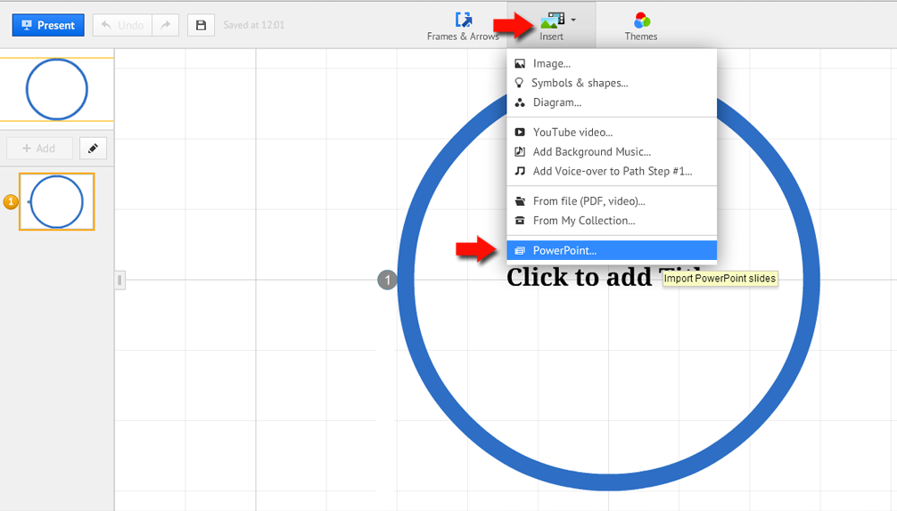

# 1.3. Pasar de Powerpoint a Prezi

Hemos elegido nuestra cuenta Educativa, nos sale está imagen. Recordar que nos dan mayor espacio.

Elegiremos una plantilla en blanco:

Vamos a Insertar:

Seleccionamos la Carpeta con el archivo que deseemos, en nuestro caso un archivo .pptx. Abrir y empezará la carga. (Ver 

Tras la subida, podemos insertar alguna diapositiva suelta o todas como veremos en la 

O insertarlas todas. Hay algunas diferencias, si las subimos todas ya nos dará un orden y solamente nos hará falta cuadrar, textos e imágenes u objetos a los nuevos frames.

 

