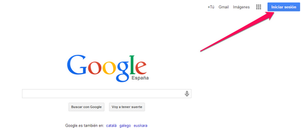
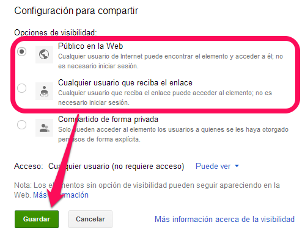

# 3.1. DRIVE

1.  Crear una cuenta en Google (o Gmail es lo mismo) si no la tienes creada: [http://www.catedu.es/facilytic/2013/10/09/crea-una-cuenta-de-gmail/](http://www.catedu.es/facilytic/2013/10/09/crea-una-cuenta-de-gmail/)
2.  Entramos en nuestra cuenta en [www.google.es](http://www.google.es) :  

    

3.  Una vez que estramos dentro de nuestra cuenta entramos en Google Drive :  

    

4.  Realizamos los siguientes pasos que indican la imagen:
    1.  Subimos la presentación pulsando en el botón de la flecha hacia arriba que al ponernos encima nos pone **Subir > Archivo o Carpeta.**
    2.  Seleccionamos la presentación o paquete comprimido.En nuestro caso hemos elegido el archivo 2, es de Open office extensión .odt
    3.  Abrir
    4.  Saldrá un diálogo que indicará el proceso de subida, esperar al 100%, disponemos de 15G para usar

( Fig.0.3.1: C.Barrabés, montaje pantalla captura programa, [Algunos derechos reservados](http://creativecommons.org/licenses/by-nc-sa/2.0/deed.es "Derechos reservados. Atribución-NoComercial-CompartirIgual 2.0 Genérica (CC BY-NC-SA 2.0)"))

Una vez ya subido, paso 5:

*   Pinchar sobre el archivo subido
    *   Dependiendo de la naturaleza del archivo subido la visualiza o no
    *   Se puede dar a configurar y convertir los archivos a Google Docs, PDF, JPG.. pero no es nuestro objetivo.
*   Elegir **Compartir  

      

    **
*   **Obtenemos el enlace del achivo a compartir. Este es el enlace que enviaremos al tutor** (lo copiamos y se lo enviamos)
*   **IMPORTANTE** TENEMOS QUE HACER QUE EL ENLACE PARA COMPARTIR **QUE SEA PUBLICO**pues tal y como está sólo sirve para colaboradores, esto se hace en el botón de **Cambiar....** tienes dos opciones, la que quieras de las dos:
    *   Publico en la web
    *   Cualquier usuario que reciba el enlace

 

( Fig.0.3.2: C.Barrabés, montaje pantalla captura programa,  [Algunos derechos reservados](http://creativecommons.org/licenses/by-nc-sa/2.0/deed.es "Derechos reservados. Atribución-NoComercial-CompartirIgual 2.0 Genérica (CC BY-NC-SA 2.0)"))

Podemos compartir a través del Gmail, g+ (grupo de google), Facebook o Twitter pero esto no es ahora nuestro objetivo...

## Para saber más de Drive

*   [http://www.catedu.es/facilytic/2013/05/30/manual-google-drive/](http://www.catedu.es/facilytic/2013/05/30/manual-google-drive/)

