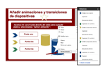

# Actividad de lectura 4.2.1

## Animaciones en Drive

Visitar estos enlaces:

[https://support.google.com/drive/answer/1689475?hl=es](https://support.google.com/drive/answer/1689475?hl=es)

Clic en imagen y Ver Imagen:

**Añadir animaciones sencillas **a la presentación que estáis realizando.

%accordion%Solución%accordion%

Podemos añadir tantas animaciones a una diapositiva como queramos, una por figura.

Para añadir una animación a una figura, seleccionarla y clic en **+Añadir animación** en el panel **Animaciones**. O clic con el botón derecho del ratón en la figura y seleccionar **Aplicar animación**.

%/accordion%

