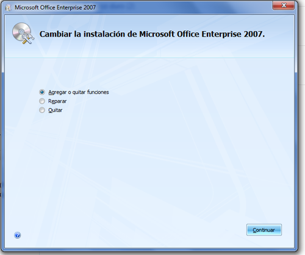
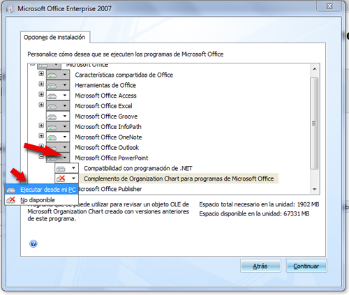

# Agregar y quitar

Si  en un  PC que tiene ya instalado el Office 2007 lo volvemos a intentar instalar (es decir  meter el DVD de instalación y ejecutar el archivo Setup tal y como indica en la sección de instalación) nos saldrá esta ventana:

Si elegimos la primera opción de Agregar o quitar funciones, nos aparece la misma ventana que nos apareció en instalación.

Si vemos la figura en el caso de PowerPoint tenemos intalado el módulo de "Compatibilidad con programación de .NET" y no tenemos el "Complemento de organización Chart para programas de Microsoft Office".

Si queremos instalar el componente que nos falta simplemente seleccionar "Ejecutar desde mi PC"

De igual manera si queremos desinstalar un componente, entonces seleccionariamos "No disponible" 

