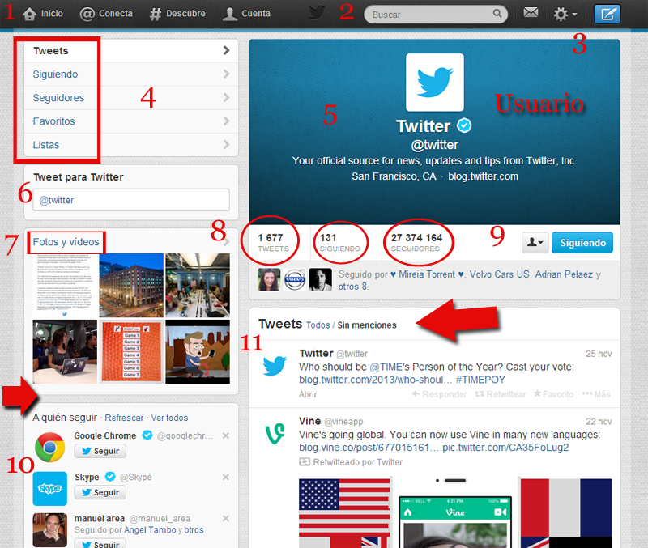

# Aplicación didáctica

## Crear debate en clase en una presentación

**Justificación:** Tras una ponencia, se abre un turno de preguntas, algunas no llegan a ser realizadas en directo, por falta de tiempo, por timidez del oyente u otras causas. Por eso pensamos que las redes sociales pueden ser un buen instrumento, para **abrir un espacio de preguntas** que va más allá de la presentación y además **queda constancia escrita** para futuras consultas.

**Dentro de las redes sociales una de las que más me gusta es:**

**Twitter** es un programa que para muchos, es un servicio inútil y sin sentido. Sin embargo, es importante reflexionar que en estas herramientas están perdiendo el tiempo nuestros alumnos. 

Lo utilizamos para compartir páginas que nos gustan, enlaces a vídeos. Sigo a gente que me aporta información interesante. Por otro lado cuento a mis seguidores algo que he descubierto como me siento, si me ha gustado algo. Podemos tweetear una clase, un curso un congreso, preguntar opinar y el receptor lo ve al instante. Si me quieres seguir o comentar algo enviarme un tweet a [@claudiobarrabes ](https://twitter.com/claudiobarrabes "Twitter Autor")

Otra cosa muy interesante son las **listas**: Una lista es un grupo seleccionado de usuarios de Twitter. Puedes crear tus propias listas o suscribirte a las listas creadas por otros usuarios. Al ver una cronología de lista se mostrará una cronología de Tweets realizados solamente por los usuarios que están incluidos en dicha lista.

Aprendamos un poco sobre el programa:

1\. **Inicio**: Me lleva a la páginas de los tweets (mensajes de menos de 140 caracteres). **@ Conecta:** enlaza con interacciones o acciones. **#Descubre: **

Tweets. Lo que está sucediendo ahora, hecho a tu medida.

2\. **Buscar**: Puedo buscar usuarios

3\. El sobre es para mandar mensajes directo a un usario y que no los lean los demás. La rueda engranaje configurar mi perfil (mis datos)

4\. **Enlaza** a las diferentes zonas escritas

5\. Muy interesante aquí es donde puedo poner mi página web, blog personal y algunos datos que quiero que sean públicos, es una forma de ganar visitas a nuesto blog, ENLAZAR con nuestra página

6\. En donde pondré el mensaje al usuario (truco si quiero que sea privado pondré una D @)

7\. Zona donde se verán los vídeos o fotos que subo a twitter. (Puedo enlazar otras redes sociales, o aplicaciones...)

8\. Zona donde vemos el nº de Twetts de un usuario, a quien sigue y los seguidores que tiene.

9\. En éste caso estamos siguiendo a @twitter tengo el botón azul. Twittear, añadir, bloquear etc.

10\. Nos suguiere a quien seguir.

11\. Vemos los twetts de la gente que seguimos.

.

Twitter es un sistema de **[microblogging](http://es.wikipedia.org/wiki/MicroBlogging)** que nos permite (en no más de 140 caracteres) informar a nuestros seguidores o quien decida “seguirnos”, que es lo que estamos haciendo; es una bitácora de nuestras actividades y a la vez un sistema de comunicación que permite enviar mensajes a otros usuarios.

Ideas de cómo aprovechar el potencial de Twitter en la docencia Tomado de: “Teaching with Twitter” de Steve Wheeler:

1.  **Tablón de anuncios “Twit “**Para comunicar a los estudiantes cambios en el contenido de los cursos, horarios, lugares u otra información importante.
2.  “**Resumiendo**” Pedir a los alumnos que lean un artículo y a continuación, hacer un resumen o síntesis de los principales puntos
3.  **Compartir enlaces**. Compartir un hipervínculo – una tarea dirigida a estudiantes – periódicamente cada estudiante tiene la obligación de compartir un nuevo enlace a una web que han descubierto interesante.
4.  **Lingua Tweeta. **Para el aprendizaje de idiomas modernos. Enviar mensajes en lenguas extranjeras y pedir a los estudiantes responder en la misma lengua o traducir en su lenguaje nativo.
5.  **Micro Escritura. **Escritura progresiva y colaborativa en Twitter para crear microrrelatos. De acuerdo con los estudiantes se turnan para contribuir a un cuento o “historia” en un período de tiempo.
6.  **Micro-encuentros **Mantener conversaciones en las que participen todos los estudiantes suscritos a la cuenta de Twitter. Mientras todo el mundo está siguiendo todo el grupo, nadie debería perderse en el flujo de Twitter. Deben participar todos los estudiantes, porque la secuencia de los contribuyentes será acordada de antemano.

**Recursos on-line para profundizar**  
[http://edutwitter.com/](http://edutwitter.com/)  
[http://www.edmodo.com/](http://www.edmodo.com/ "http://www.edmodo.com/")  
[http://www.tecnotic.com/node/750](http://www.tecnotic.com/node/750)

[http://www.galileo.edu/publicaciones-estudiantes/el-fenomeno-del-twitter-y-sus-aplicaciones-didacticas/](http://www.galileo.edu/publicaciones-estudiantes/el-fenomeno-del-twitter-y-sus-aplicaciones-didacticas/)

