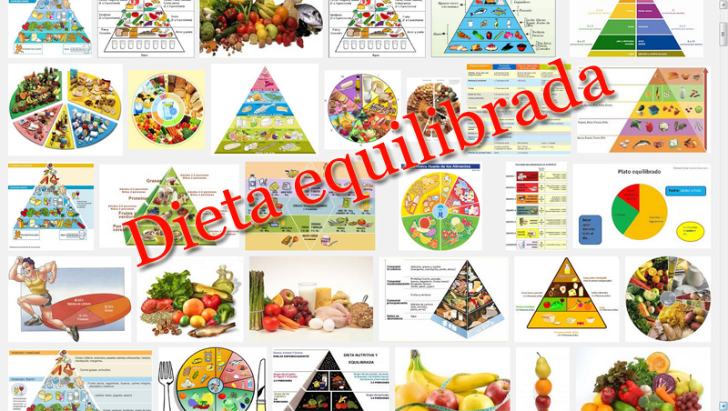

# Aplicaciones didácticas

Vamos a intentar **desarrollar un ejemplo, más en profundidad**  de trabajo con los contenidos de éste **módulo 6**. Lógicamente, todo girará en torno a la **creación de  presentaciones multimedia** con las herramientas trabajadas.

Trataremos de dar una visión de algunos **ejemplos** de tareas que se podrían hacer en el aula, con alguna anotación desde el punto de vista .

### El ejemplo que vamos a desarrollar:

Vamos a comentar una posible opción de **trabajo de presentación** en Segundo ciclo de primaria, para el área de conocimiento del medio, sobre el contenido "**Desayunar Bien**", intentando integrar las TIC de una manera eficiente en nuestra tarea docente e incluso utilizando los tablet en el aula con nuestros alumnos. Os ofreceremos una propuesta didáctica con contenidos curriculares concretos, donde observarás una opción de aplicar los recursos TIC mediante una estrategia metodológica concreta.

El presente módulo formativo está enclavado en la etapa educativa de **Educación Primaria**, referida al área de **Conocimiento del medio natural, social y cultural **y dentro del bloque de contenidos que trabaja el "**los hábitos saludables"**

[Dieta equilibrada](http://www.aula21.net/Nutriweb/dieta_equilibrada.htm "Web").

