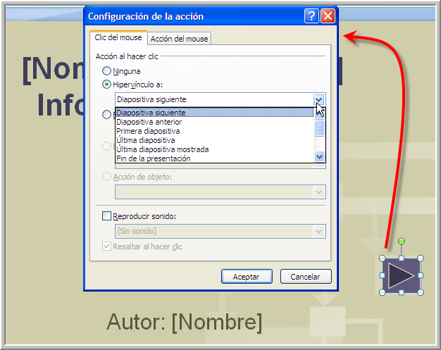

# Botones de acción

## Consejo de estilo

Aconsejamos colocar los botones de navegación en todas las diapositivas, excepto la primera diapositiva que suele ser el título de la presentación

La mejor manera de que no estén descolocados entre diapositiva y diapositiva es ponerlo EN EL PATRÓN DE DIAPOSITIVAS

**Botones de Acción en PowerPoint**

PowerPoint nos ofrece la posibilidad de unos gráficos llamados botones de acción que facilitan la creación de enlaces. Por ejemplo, en nuestra consabida presentación sería muy útil la existencia de un botón que nos permitiera retroceder de diapositiva al hacer clic sobre él.  Escogemos el que corresponde a la acción de hacia atrás o anterior. 

Pero antes que nada descargamos una plantilla interesante de Internet, con la que decidamos hacer las prácticas y así aprender de otros:

( Fig.3.1.1.3.1.3.1 y 2: C.Barrabés, montaje pantalla captura programa,  [Algunos derechos reservados](http://creativecommons.org/licenses/by-nc-sa/2.0/deed.es "Derechos reservados. Atribución-NoComercial-CompartirIgual 2.0 Genérica (CC BY-NC-SA 2.0)"))

 

  Después de seleccionarla y con conexión a Internet la descargamos.

 

Insertamos un botón de acción en la nueva presentación:

Hemos ido a insertar **Formas** y hemos seleccionado la del gráfico.

( Fig.3.1.1.3.1.3.3 : C.Barrabés, montaje pantalla captura programa, [Algunos derechos reservados](http://creativecommons.org/licenses/by-nc-sa/2.0/deed.es "Derechos reservados. Atribución-NoComercial-CompartirIgual 2.0 Genérica (CC BY-NC-SA 2.0)"))

Nos aparece el cuadro de configuración de la acción y podremos seleccionar el hipervínculo deseado.

 

Si queremos **cambiar las características estéticas del botón,** es algo tan fácil como hacer clic sobre él con el botón derecho del ratón. Comprobamos la existencia de **formato de forma** y la seleccionamos. 

Ahora podemos cambiar diferentes elementos, entre ellos el **color**, si elegimos fondo, nos pone el botón en el color de fondo y queda muy bien. En el gráfico ponemos un azul suave como ejemplo.

 

( Fig.3.1.1.3.1.3.4 : C.Barrabés, montaje pantalla captura programa, [Algunos derechos reservados](http://creativecommons.org/licenses/by-nc-sa/2.0/deed.es "Derechos reservados. Atribución-NoComercial-CompartirIgual 2.0 Genérica (CC BY-NC-SA 2.0)"))

## Reflexión

Ya lo tenemos a nuestro gusto. Ahora es el momento de insertar dicho botón al resto de las diapositivas salvo la primera, ¿hay alguna manera de hacer esto automáticamente?

var feedback105_9text = "Mostrar retroalimentación";

### Retroalimentación

Pues claro que sí, utilizando el Patrón de diapositivas para ello insertamos los botones en el patrón de diapositivas por ejemplo en el pie de página, pero no en el patrón de títulos (la primera diapositiva tiene que ser de sólo título como es lo habitual)

## Atención

No hagas hipervínculos a documentos con los botones de acción, suelen hacer rutas absolutas.

Los botones de acción de ir a diapositiva siguiente, anterior, principio y fin, son botones que se repiten en varias diapositivas, por lo que nuestro consejo es realizarlo en la vista patrón para conseguir uniformidad.

Sería una tontería hacerlos en la vista normal: Uno saldría hacia arriba, otros hacia abajo, además de realizar un trabajo de tontos. **Se hace en la vista patrón**, y se consigue que sólo se hace una vez y uniformidad en la presentación.

**Agregar botones en OpenOffice Impress**

Podemos insertar cualquier Objeto y ponerle interactividad.

( Fig.3.1.1.3.1.3.5 : C.Barrabés, montaje pantalla captura programa,  [Algunos derechos reservados](http://creativecommons.org/licenses/by-nc-sa/2.0/deed.es "Derechos reservados. Atribución-NoComercial-CompartirIgual 2.0 Genérica (CC BY-NC-SA 2.0)"))

Pero también podemos insertar objetos más complicados:

## Para agregar un botón a un documento

1.  Eligimos **Ver - Barras de herramientas - Campos de control de formulario**.
    
2.  En la barra de herramientas Campos de control de formulario, clic en el icono **Botón de comando**.
    
    El puntero del ratón adopta el aspecto de una cruz.
    
3.  Arrastramos en el documento para dibujar el botón.
    
4.  Clic con el botón derecho y seleccionamos **Campo de control**.
    
5.  Especificar las propiedades del botón.
    
6.  Para cambiar la etiqueta del botón, clic en la ficha **General** y editamos el texto del cuadro **Etiqueta**.
    
7.  Para asignar una macro al botón, clic en la ficha **Eventos** y clic en el botón de puntos suspensivos **...** que hay junto a la acción del botón que se desea que ejecute la macro. En el diálogo **Asignar macro**, buscamos la macro que deseamos usar (Hemos elegido Botón)y haga clic en **Aceptar**.
    
8.  Cerramos el diálogo **Propiedades**.
    
9.  (Opcional) Especificamos las propiedades del formulario al cual el botón pertenece.
    
10.  Clic con el botón derecho en el botón y seleccionamos **Formulario**.
    
11.  Se abre el diálogo **Propiedades del formulario**.
    
12.  Especificamos las propiedades para el formulario y luego cerramos el diálogo.
    

( Fig.3.1.1.3.1.3.6 : C.Barrabés, montaje pantalla captura programa,  [Algunos derechos reservados](http://creativecommons.org/licenses/by-nc-sa/2.0/deed.es "Derechos reservados. Atribución-NoComercial-CompartirIgual 2.0 Genérica (CC BY-NC-SA 2.0)"))

**Agregar Formas en Drive**

Drive nos sigue sorprendiendo por su sencillez, podemos insertar botones o más bien formas de varias formas, dentro de la propia presentación o preparar un dibujo para utilizarlo después, lo mostramos en las dos figuras siguientes:

 ( Fig.3.1.1.3.1.3.7 : C.Barrabés, montaje pantalla captura programa,  [Algunos derechos reservados](http://creativecommons.org/licenses/by-nc-sa/2.0/deed.es "Derechos reservados. Atribución-NoComercial-CompartirIgual 2.0 Genérica (CC BY-NC-SA 2.0)"))

( Fig.3.1.1.3.1.3.8 : C.Barrabés, montaje pantalla captura programa,  [Algunos derechos reservados](http://creativecommons.org/licenses/by-nc-sa/2.0/deed.es "Derechos reservados. Atribución-NoComercial-CompartirIgual 2.0 Genérica (CC BY-NC-SA 2.0)"))

**Cómo convertir un objeto en un hipervínculo**

  
Podemos convertir texto, imágenes y **figuras** en **hipervínculos que realicen una acción** cuando se haga clic en ellos durante una presentación.

Al convertir un **objeto** en un hipervínculo, se marca con un distintivo de flecha curva en el lienzo de diapositivas; este distintivo no es visible cuando se visualiza la presentación.

Las **flechas** predibujadas que apuntan hacia delante y hacia atrás son un ejemplo de un elemento de navegación que puede usarse en un pase de diapositivas. El pequeño distintivo de flecha curva que se muestra en la esquina inferior de cada una indica que se ha convertido en un hipervínculo.

**Añadir Figuras en Keynote**

**Añadir una figura**

1.  Clic en Figura  en la barra de herramientas.

    
    Para ver más estilos de figura, clic en las flechas.
    
2.  Seleccionamos una figura para añadirla a la diapositiva.
    

**Añadir texto dentro de una figura**

*   Hacemos doble clic en la figura para hacer aparecer el punto de inserción y escribimos el texto. Si hay demasiado texto que mostrar en la figura, aparecerá un indicador de recorte (+). Para cambiar de tamaño una figura, clic en ella y, a continuación, arrastrar cualquier tirador de selección hasta que aparezca todo el texto.

Podemos formatear el texto que hay dentro de la figura, al igual que cualquier otro texto en la diapositiva. Seleccionamos el texto y, a continuación, utilizamos las herramientas del panel Texto del inspector de formato para modificarlo.

