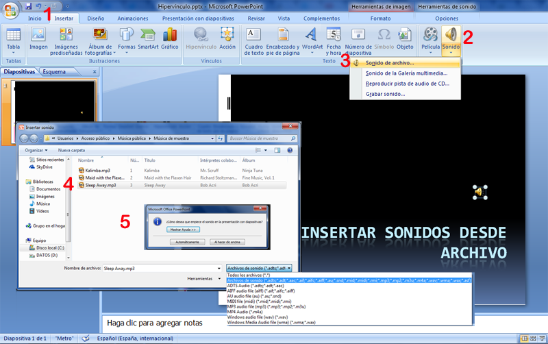
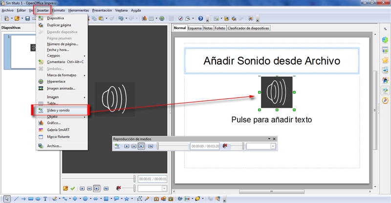
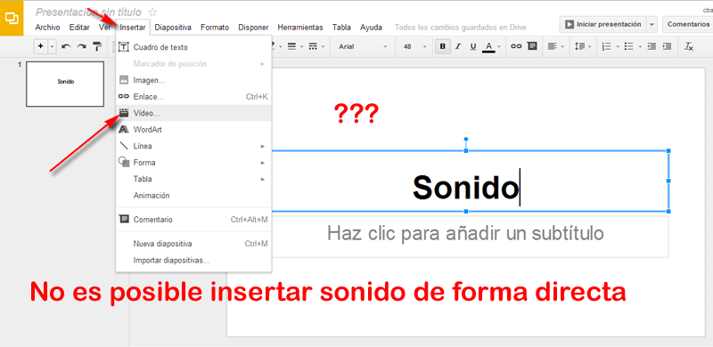
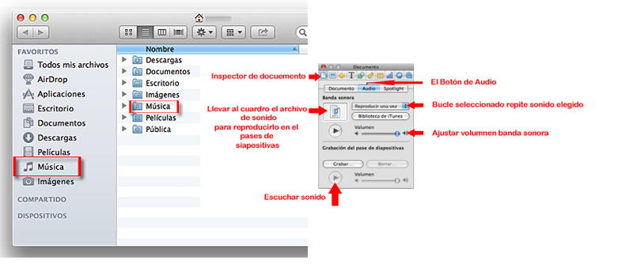

# Desde archivo

**Insertar sonido desde archivo en PowerPoint**

Ya lo hemos visto al principio repasar U1. [Insertar Sonido y películas.](u1_insertar_sonido_y_pelculas.html)

1.  En la ficha** 1****Insertar**, en el grupo **Clip multimedia**, clic en la flecha situada bajo **2****Sonido**.
    

    

    

( Fig.5.2.f.1: C.Barrabés, montaje pantalla captura programa, [Algunos derechos reservados](http://creativecommons.org/licenses/by-nc-sa/2.0/deed.es "Derechos reservados. Atribución-NoComercial-CompartirIgual 2.0 Genérica (CC BY-NC-SA 2.0)")) 

**PERO ATENCIÓN:** **ANTES DE REALIZAR ESTA OPERACIÓN, ASEGURARNOS QUE EL ARCHIVO ESTÁ EN LA MISMA CARPETA QUE LA PRESENTACIÓN**

¿Por qué hay que tener esa precaución?

var feedback122_9text = "Mostrar retroalimentación";

### Retroalimentación

Si te cuestionas esa pregunta es que no las leido la reflexión última de [Herramientas de sonido](herramientas_de_sonido.html)

** LUEGO ANTES DE INSERTAR UN ARCHIVO DE AUDIO, ASEGURATE QUE ESTÁ EN LA MISMA CARPETA QUE LA PRESENTACIÓN**

Y el archivo de sonido y la presentación están casados y juntitos para siempre.

¿lo de "_casados y juntitos_" no te suena? eso es que no has hecho el capítulo de ATENCIÓN de las películas.

Hay que tener las mismas precauciones que en la inserción de películas !!!! 

## Reflexión

¿para todos los archivos de audio?

var feedback158_9text = "Mostrar retroalimentación";

### Retroalimentación

¡¡¡¡¡ Otra vez !!!!!! si te cuestionas esto, es que no has leido la primera reflexión de [Herramientas de sonido](herramientas_de_sonido.html) donde explica que por defecto todos los sonidos de menos de 100k sí que los guarda PowerPoint por lo tanto no hay que tener esta precaución  

Generalmente son los archivos de la galería de sonidos que son efectos sonoros cortos e instrumentales son de menos de 100k.

Normalmente un archivo de audio ocupa más de 100k luego tienes que tener estas precauciones: Repito: antes de insertar el audio en la diapositiva tiene que estar en la misma carpeta donde está almacenada la presentación y dejar los dos archivos juntos.

**Insertar sonido desde archivo en OpenOffice Impress**

Ya lo hemos visto al principio repasar U1. [Insertar Sonido y películas.](u1_insertar_sonido_y_pelculas.html)

Repasarlo en en siguiente enlace: [http://wiki.open-office.es/Galeria\_en\_OpenOffice\_Writer\_-\_Insertar\_videos\_y\_sonidos](http://wiki.open-office.es/Galeria_en_OpenOffice_Writer_-_Insertar_videos_y_sonidos)

<lo haríamos igual que insertar un objeto. Vamos a **Insertar, vídeo y sonido **seleccionamos la carpeta donde tenemos guardados lo sonidos y **abrir.**

 

( Fig.5.2.f.2: C.Barrabés, montaje pantalla captura programa,  [Algunos derechos reservados](http://creativecommons.org/licenses/by-nc-sa/2.0/deed.es "Derechos reservados. Atribución-NoComercial-CompartirIgual 2.0 Genérica (CC BY-NC-SA 2.0)")) 

**Insertar sonido desde archivo en Google Drive**

No es posible insertar directamente sonido a una presentación en Drive.

Lo que podemos hacer es insertar un archivo de sonido a modo de vídeo o enlazarlo con un archivo de sonido subido a Drive y ponerle un enlace.

( Fig.5.2.f.3: C.Barrabés, montaje pantalla captura programa,  [Algunos derechos reservados](http://creativecommons.org/licenses/by-nc-sa/2.0/deed.es "Derechos reservados. Atribución-NoComercial-CompartirIgual 2.0 Genérica (CC BY-NC-SA 2.0)")) 

**Insertar sonido  en Keynote**

**Arrastrar** un archivo de sonido **desde el Finder** hasta cualquier lugar del lienzo de diapositivas o hasta un marcador de posición de contenido.  
Clic en Multimedia en la barra de herramientas, **seleccionar iTunes** en el panel Audio del visualizador multimedia, seleccionar una lista de reproducción y arrastrar un archivo o una lista de reproducción a cualquier lugar del lienzo de la diapositiva (incluso a un marcador de posición de contenido).

( Fig.5.2.f.4: C.Barrabés, montaje pantalla captura programa,  [Algunos derechos reservados](http://creativecommons.org/licenses/by-nc-sa/2.0/deed.es "Derechos reservados. Atribución-NoComercial-CompartirIgual 2.0 Genérica (CC BY-NC-SA 2.0)")) 

