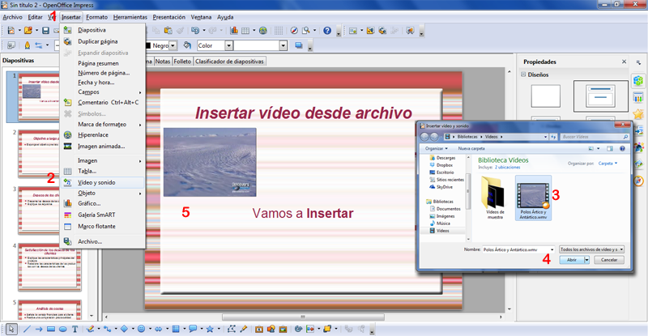

# Desde archivo

**Insertar películas desde archivo en PowerPoint**

Repasamos [U1 Insertar Sonido y películas:](u1_insertar_sonido_y_pelculas.html)

1.  En la ficha **1** **Insertar**, en el grupo **2** **Clips multimedia**, clic en la flecha situada bajo **Película**. Pero elegiremos en **3** Película de archivo.
    

    

    

( Fig.5.3.3.3.1: C.Barrabés, montaje pantalla captura programa,  [Algunos derechos reservados](http://creativecommons.org/licenses/by-nc-sa/2.0/deed.es "Derechos reservados. Atribución-NoComercial-CompartirIgual 2.0 Genérica (CC BY-NC-SA 2.0)"))

 **PERO ATENCIÓN:** **ANTES DE REALIZAR ESTA OPERACIÓN, ASEGURARNOS QUE EL ARCHIVO ESTÁ EN LA MISMA CARPETA QUE LA PRESENTACIÓN**

Si nos fijamos acepta muchos formatos, ver [Preliminares](formatos2.html) para ver cual es el correcto y si hay problemas de visualización

(  Fig.5.3.3.3.2: C.Barrabés, montaje pantalla captura programa, [Algunos derechos reservados](http://creativecommons.org/licenses/by-nc-sa/2.0/deed.es "Derechos reservados. Atribución-NoComercial-CompartirIgual 2.0 Genérica (CC BY-NC-SA 2.0)"))

Esta opción es interesante cuando hemos grabado el vídeo nosotros mismos desde una cámara, o WebCam

**Varias películas en una misma diapositiva**

Si insertamos más películas en la misma diapositiva, PowerPoint las organiza automáticamente en un diseño de hasta cuatro películas. Las películas se reproducirán en el orden en que se insertaron

**Insertar películas desde archivo en OpenOffice Impress**

Es muy similar al resto de programas. 

1.  Vamos a Insertar
2.  Buscamos Vídeo y sonido
3.  Nos vamos a la carpeta que hemos guardado los vídeos que queramos insertar.
4.  Abrir
5.  Vemos ya el vídeo en la pantalla de la diapositiva. 

Cuidado con el formato que sea correcto para el programa y se visualiza bien.

Recordar poner todo en una misma carpeta por si acaso.

(  Fig.5.3.3.3.3: C.Barrabés, montaje pantalla captura programa,  [Algunos derechos reservados](http://creativecommons.org/licenses/by-nc-sa/2.0/deed.es "Derechos reservados. Atribución-NoComercial-CompartirIgual 2.0 Genérica (CC BY-NC-SA 2.0)"))

**Insertar películas desde archivo en Google Drive**

No nos compliquemos la vida en Drive hacerlo como vimos anteriormente.

Unidad 1. [Repasar punto 1.3](u1_insertar_sonido_y_pelculas.html)

**Insertar Películas desde Drive**

Para añadir una carpeta que contiene películas, clic en **Películas** en el **visualizador multimedia** y, a continuación, arrastrar la carpeta desde el Finder hasta el visualizador multimedia.

Para que aparezcan las películas o los archivos de sonido que faltan, volvamos a añadirlos al documento tal y como lo hicimos originalmente. Para evitar este problema, podemos guardar los archivos multimedia como parte del documento al guardarlo.

**Cómo colocar una película en una diapositiva**

  
Las películas pueden colocarse dentro de marcadores de posición de gráficos o en cualquier lugar del lienzo de diapositivas. También pueden moverse dentro y fuera de una diapositiva, o iniciarse y detenerse cuando el presentador hace clic con el ratón, mediante el uso de composiciones de objetos. 

**Cómo añadir una película:**

  
**Arrastrar** un archivo de **película** desde el Finder **hasta el lienzo de diapositivas** o hasta un marcador de posición de contenido.  
Clic en Multimedia en la barra de herramientas y clic en Películas en el visualizador multimedia.

Seleccionar un archivo y arrastrarlo hasta el lienzo de diapositivas o hasta un marcador de posición de contenido.  
Seleccionar **Insertar** \> **Seleccionar** y buscar el archivo de película que deseemos.  
Seleccionarlo  y clic en **Insertar**. Arrastrar la película al lugar donde deseemos en el lienzo de diapositivas.

