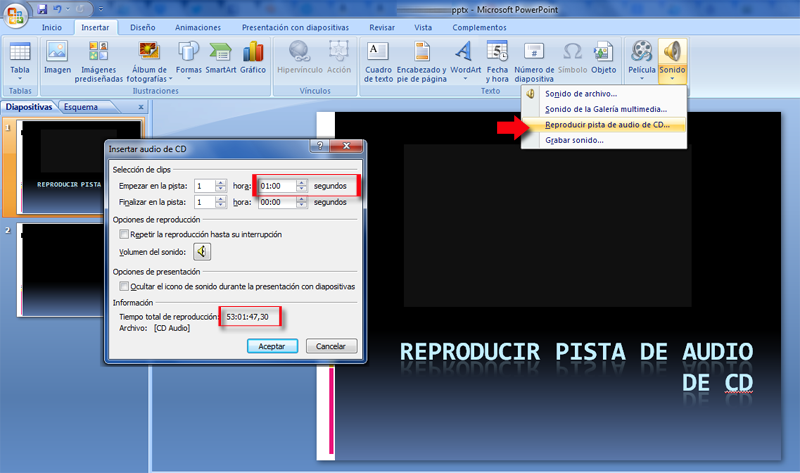

# Desde CD

**Vamos a explicar insertar sonido desde un CD con el Programa PowerPoint**

En el menú de **Insertar**-**Sonidos** nos aparece una opción que es **reproducir desde CD**, sale después un diálogo para decidir la pista, la duración y demás opciones.

No recomendamos esta forma de insertar audios desde CD pues implica TENER EL CD INSERTADO, con las consecuencias de no portabilidad de la presentación e inseguridad de depender que la unidad de CD trabaje correctamente.

Si el sonido que nos interesa está en un CD ACONSEJAMOS CONVERTIRLO A ARCHIVO MP3 y como archivo MP3 insertarlo en la presentación tal y como explicamos en el capítulo [Desde archivo..](desde_archivo.md)

### Insertar sonido desde un CD con el Programa  Open Office Impress

Sería muy similar a lo visto en el PowerPoint.

Repasar [U.1. Insertar Sonido y películas](u1_insertar_sonido_y_pelculas.md)

Lo hacemos desde Insertar y buscamos este botón: 

### Insertar sonido desde un CD con el Programa Google Drive Presentaciones

Sería muy similar a lo visto en insertar sonido. Lo haríamos desde un archivo externo ya editado y el programa Drive, no lo permite directamente.

Repasar [U.1. Insertar Sonido y películas](u1_insertar_sonido_y_pelculas.md)

### Insertar sonido desde un CD con el Programa Keynote

Sería muy similar a lo visto en el PowerPoint.

Repasar [U.1. Insertar Sonido y películas](u1_insertar_sonido_y_pelculas.md)

