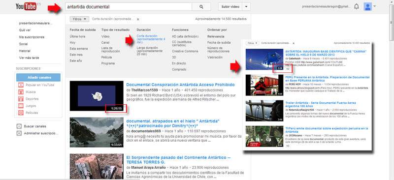

# Desde Internet

**Dónde encontrar películas en internet**

El lugar por excelencia es [Youtube](http://es.youtube.com/) pero si queremos vídeos con calidad también en [Vimeo](http://www.vimeo.com/) y existen otros portales como [Altavista](http://es.altavista.com/video/default) o en [Google](http://video.google.es/?hl=es&tab=wv).

Hay otros lugares con vídeos educativos como:

**Educatube** es una web abierta a todos para publicar **vídeos educativos y didácticos** o vídeos con contenidos que se puedan trabajar en las aulas.

Principalmente está dirigido a profesores, padres y alumnos de primaria, secundaria y bachillerato.

[http://www.educatube.es](http://www.educatube.es)

Si estamos muy interesados ver [apartado 3.7](dnde_podemos_conseguir_vdeos_educativos.html)

**Elegir películas cortas**

Sobre todo de cara al envío del ejercicio al tutor, es importante elegir un vídeo corto, para ello por ejemplo en Youtube pinchamos en Opciones de búsqueda y marcamos películas cortas, y a la hora de elegir el vídeo, también tendremos la precaución de elegir una película de corta duración de menos de un minuto sería lo mejor para el envío del ejercicio al tutor

( Fig.5.3.3.4.1: C. Barrabes, montaje pantalla captura programa,  [Algunos derechos reservados](http://creativecommons.org/licenses/by-nc-sa/2.0/deed.es "Derechos reservados. Atribución-NoComercial-CompartirIgual 2.0 Genérica (CC BY-NC-SA 2.0)"))

**¿Cómo bajarlas de Internet?**

Youtube no facilita como muchos portales Web 2.0 que se "bajen" los archivos subidos por los usuarios, por cuestiones de derechos y de competitividad (a Youtube le interesa que veas el vídeo en su canal).

Existen numerosas técnicas para bajarse el vídeo. Como cada vez salen más herramientas, unas son fáciles, otras complicadas, unas con mucho potencialidad, y otras con menos, te mostramos [en la siguiente página](http://www.catedu.es/aularagonpowerpoint/TEMATICOS/VIDEOYFLASH/comobajarvideos.html) cómo bajarte desde Youtube los vídeos ordenados de mayor a menor preferencia particular.

[http://www.catedu.es/aularagonpowerpoint/TEMATICOS/VIDEOYFLASH/comobajarvideos.html](http://www.catedu.es/aularagonpowerpoint/TEMATICOS/VIDEOYFLASH/comobajarvideos.html)

**¿Y el formato?**

Como ves muchos métodos lo bajan en formato FLV QUE NO LO SOPORTA POWERPOINT por lo tanto tienes dos opciones:

*   Elegir un método que lo baje en el formato más adecuado que soporta Power Point(ver [formato que lea PowerPoint)](formatos2.html)
*   Convertir el archivo de formato FLV a [formato que lea PowerPoint](formatos2.html) con programas tipo [Koyote](http://koyote-free-video-converter.softonic.com/) y [Quick Media Converter](http://quick-media-converter.softonic.com/)
*   Otro programa es el AtubeCather. Al final tienes un párrafo para que aprendas cómo se utiliza.

  

**Bueno ya lo tengo ¿ahora qué?**

Pues ya lo tienes en archivo, sólo tienes que insertarlo en el PowerPoint tal y como lo explicamos en el [capítulo correspondiente.](desde_archivo2.html)

Recuerda que si tienes problemas de visualización (se ve pero no se oye o al revés o se ve mal) es por los codecs, visita [Preliminares](formatos2.html)

**Cómo se maneja el aTubeCatcher **

Permite a los usuarios realizar descargas de vídeos desde casi cualquier sitio.

**Descargarlo de:**

[http://atube-catcher.dsnetwb.com/video/](http://atube-catcher.dsnetwb.com/video/)

Vamos a descargar, elegimos el *.exe, no sin antes pasarle el antivirus. Cuidado con descargar Toolbar, leer bien lo que nos piden, desmarcar la instalación de elementos innecesarios que luego ralentizarán nuestra máquina. Cuidado que después de Tollbar, no pide instalar un programa en nuestro caso el Win.zip, declinar. Nos pide el idioma, elegir el que mejor nos vaya.

 ( Fig.5.3.3.4.2: C. Barrabes, montaje pantalla captura programa,  [Algunos derechos reservados](http://creativecommons.org/licenses/by-nc-sa/2.0/deed.es "Derechos reservados. Atribución-NoComercial-CompartirIgual 2.0 Genérica (CC BY-NC-SA 2.0)"))

Tras la instalación no pide que queremos hacer:

( Fig.5.3.3.4.3: C. Barrabes, montaje pantalla captura programa,  [Algunos derechos reservados](http://creativecommons.org/licenses/by-nc-sa/2.0/deed.es "Derechos reservados. Atribución-NoComercial-CompartirIgual 2.0 Genérica (CC BY-NC-SA 2.0)"))

Si quiero compartir vídeo de YouTube, debo ir a Compartir, me aparecerán las redes sociales y la dirección del vídeo. Si quiero que el vídeo se reproduzca a partir de cierto segundo marco la casilla de la derecha, ver imagen inferior.

 ( Fig.5.3.3.4.4: C. Barrabes, montaje pantalla captura programa,  [Algunos derechos reservados](http://creativecommons.org/licenses/by-nc-sa/2.0/deed.es "Derechos reservados. Atribución-NoComercial-CompartirIgual 2.0 Genérica (CC BY-NC-SA 2.0)"))

Copiamos la dirección de Youtube donde tenemos el vídeo anterior

(seleccionamos la dirección con el botón derecho del ratón y dar a copiar)

 ( Fig.5.3.3.4.5: C. Barrabes, montaje pantalla captura programa,  [Algunos derechos reservados](http://creativecommons.org/licenses/by-nc-sa/2.0/deed.es "Derechos reservados. Atribución-NoComercial-CompartirIgual 2.0 Genérica (CC BY-NC-SA 2.0)"))

Entramos en el programa aTubeCather que hemos instalado en nuestro ordenador y lo pegamos en el campo **_Origen_** con el botón derecho del ratón, dando a **_Pegar 1_**

Seleccionamos dónde lo queremos descargar en **_Guardar en:_** _(Podemos cambiarlo en **3**. Por defecto en C:\\Users\\Usuario\\Videos)_

_Pulsamos en el botón **_Descargar_**_ 4 y el la zona central **5**vemos el Título del Archivo, progreso de descarga, el Status, Tamaño del vídeo descargado, formato... etc.

_ _

 ( Fig.5.3.3.4.6: C. Barrabes, montaje pantalla captura programa,  [Algunos derechos reservados](http://creativecommons.org/licenses/by-nc-sa/2.0/deed.es "Derechos reservados. Atribución-NoComercial-CompartirIgual 2.0 Genérica (CC BY-NC-SA 2.0)"))

Y elegimos el formato deseado en la imagen descargamos por defecto un WMV, lo insertamos en nuestra presentación y vemos que se reproduce bien, sin problemas.

 ( Fig.5.3.3.4.7: C. Barrabes, montaje pantalla captura programa,  [Algunos derechos reservados](http://creativecommons.org/licenses/by-nc-sa/2.0/deed.es "Derechos reservados. Atribución-NoComercial-CompartirIgual 2.0 Genérica (CC BY-NC-SA 2.0)"))

