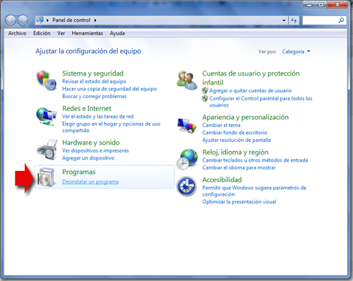
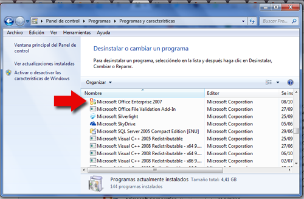

# Desinstalación

Para el proceso de desinstalación, tenemos dos opciones:

1.  Utilizar el mismo DVD de Office 2007 el programa Setup tal y como vistes en Instalación
2.  Entrar en la aplicación de Windows: "panel de control"

Una vez entrado en el programa, son las mismas pantallas que "[Agregar y quitar componentes](agregar_y_quitar.html)" pero en este caso sería quitar todo el PowerPoint o el Office

* * *

**Para hacerlo con el panél de control:**

**a) En Windows XP:**

*   **Inicio**-**Panel de control**-, **Agregar o quitar programas,** del siguiente modo:

> 1\. Cierra todos los programas.
> 
> 2\. Hacer clic en el botón **Inicio** de Windows
> 
> 3\. Seleccionar **Configuración / Panel de Control.**
> 
> 4\. Hacer doble clic en el icono **Agregar o quitar programas.**
> 
> 5\. Activar la ficha **Instalar o desinstalar,** haciendo clic sobre su solapa.
> 
> 6\. Si instalaste PowerPoint utilizando el programa de instalación de Office, hacer clic en MicrosoftOffice. En caso contrario, hacer clic sobre Microsoft PowerPoint.
> 
> 7\. Hacer clic sobre el botón **Agregar o quitar.**

* * *

**b) En Windows Vista o Windows 7**: sigue las ilustraciones.

(Fig.1.1.1.1: C.Barrabés, captura panel de control Windows 7, [Algunos derechos reservados](http://creativecommons.org/licenses/by-nc-sa/2.0/deed.es "Derechos reservados. Atribución-NoComercial-CompartirIgual 2.0 Genérica (CC BY-NC-SA 2.0)")) 

y luego

(Fig.1.1.1.2: C.Barrabés, captura panel de control Windows 7,  [Algunos derechos reservados](http://creativecommons.org/licenses/by-nc-sa/2.0/deed.es "Derechos reservados. Atribución-NoComercial-CompartirIgual 2.0 Genérica (CC BY-NC-SA 2.0)")) 

