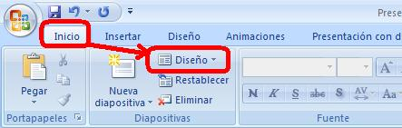
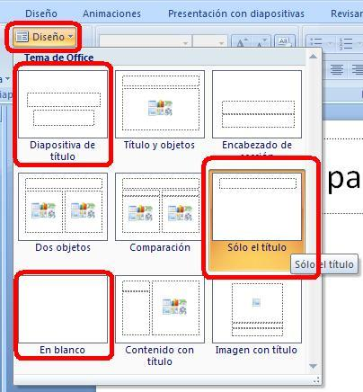

# Diseño en Power Point

**Definir un diseño a la diapositiva existente**

Es muy fácil, en el botón **Diseño **de la barra estandar correspondiente al menú **Inicio **elegir una de las opciones que se nos presentan.

Consejo: Los diseños más comunes son los siguientes:

*   **Sólo título:** Recomendable para la primera diapositiva
*   **Título y subtítulo **es recomendable para el resto, luego se incorporan en esta diapositiva los diferentes elementos: cuadros de texto, imágenes....
*   **Título y objetos** recomendable para cuando queremos exponer elementos sin perder el esquema
*   **En blanco** Recomendable cuando no seguimos ningún esquema en la diapositiva.

ES MUY CONVENIENTE QUE APLIQUEMOS DISEÑO A NUESTRAS DIAPOSITIVAS PARA CONSEGUIR UN ASPECTO HOMOGÉNEO

