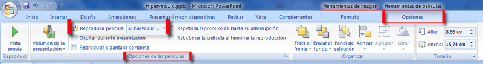

# Edición

Una vez insertada la película, haciendo click sobre ella, podemos ampliarla igual que una imagen, pero perderá resolución.

También en Herramientas de imágen podemos ponerle un marco, contorno.. pero no podemos recortar, ni aumentar brillo, contraste...

En herramientas de película tenemos varias opciones interesantes: Reproducción automática, pantalla completa, ajustar el volumen...

Para poder retrasar el inicio de un vídeo, ver enlace: [http://office.microsoft.com/es-es/powerpoint-help/configurar-las-opciones-de-una-pelicula-HA010078056.aspx](http://office.microsoft.com/es-es/powerpoint-help/configurar-las-opciones-de-una-pelicula-HA010078056.aspx)

