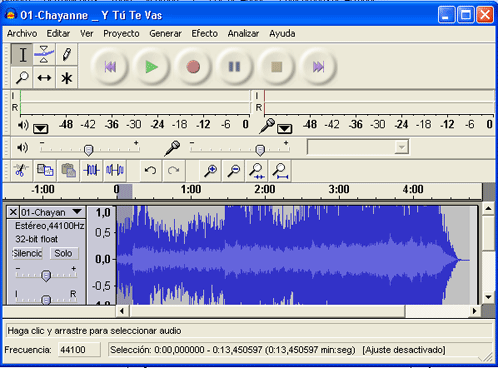

# Edición de sonido

**Audacity**

Es un programa de edición de sonidos libre y de código abierto para grabar y editar sonidos muy popular.

**Instalación de Audacity**

Está disponible para muchos sistemas operativos y se puede descargar gratuitamente de su [página oficial](http://audacity.sourceforge.net/). Su instalación no conlleva ningún problema:

*   aceptar la licencia
*   elegir la carpeta dónde lo queremos descargar, si el ordenador esta congelado descongelarlo previamente
*   activar o no las otras opciones como crear accesos directos o ejecutar el programa cuando finalice la instalación

Para manejar ficheros MP3 puede ser que nos pida un fichero, se llama lame_enc.dll es un codificador de código abierto y lo puedes descargar [aquí](http://www.free-codecs.com/Lame_Encoder_download.htm) ¿por qué el Audacity no lo incorpora? por cuestión de patentes.

**¿Cómo cortar un trozo de una canción?**

Mucha gente utiliza su canción favorita por ejemplo como tono de llamada en el móvil, sobre todo ahora que la mayoría de los teléfonos son reproductores de mp3. Esto suele plantear un problema y es que muchas veces queremos recortar una parte de la canción para que suene durante los 10-15 segundos que dura la reproducción cuando te llaman.

Lo mismo pasa con una presentación PowerPoint.

Una vez arrancado el programa, abrimos nuestra canción favorita en formato mp3, y se mostrará en detalle todo el archivo de audio.

Podemos seleccionar el punto exacto donde queremos cortar el archivo utilizando la lupa.

Si hacemos click sobre un punto de la canción podemos reproducir a partir del mismo.

Cuando sepamos que trozo del archivo queremos, realizamos los siguientes pasos:

1.  Pulsamos en el punto de inicio
2.  Sin soltar el botón nos desplazamos hasta el punto de finalización (la sección seleccionada estará en un tono más oscuro)
3.  Vamos al menú “editar”->”copiar”.
4.  Vamos al menú “archivo”->”nuevo” para crear un proyecto vacío
5.  Ir al menú “editar”->”pegar”. Ya tenemos nuestro proyecto con el trozo de canción que queremos.
6.  Guardarlo
7.  Podemos exportarlo directamente a formato WAV en el menú “Archivo”->”Exportar como wav”.
8.  Podemos hacer lo mismo para guardarlo en formato **MP3** (aconsejable)  
    1.  en el menú “Archivo”->”Exportar como mp3″  
        
    2.  si nospide el archivo lame.dll o lame_enc.dll le decimos dónde lo tenemos, si lo hemos descargado.

**¿Qué cosas puedo hacer con Audacity?**

*   Grabaciones en vivo, y por supuesto los puedes guardar en MP3
*   Y si en vez de poner el micrófono, ponemos la entrada de audio a nuestro reproductor viejo de cintas de casette o discos de vinilo ¿lo podríamos pasar a MP3? Por supuesto que sí, [visita esta página](http://cprcalam.educa.aragon.es/TIC/TEMATICOS/IMAGENYSONIDO/COMO%20PASAR%20DE%20CINTA%20DE%20CASETTE%20A%20CD.zip)
*   Podemos eliminar ruidos de las grabaciones, etc…

El manejo es muy sencillo para conseguir estos propósitos.

## Para saber más de Audacity

Aquí te mostramos un vídeo tutorial de unos pocos minutos para conocer lo básico de este programa:

https://youtu.be/5BUW0FKKfg0

