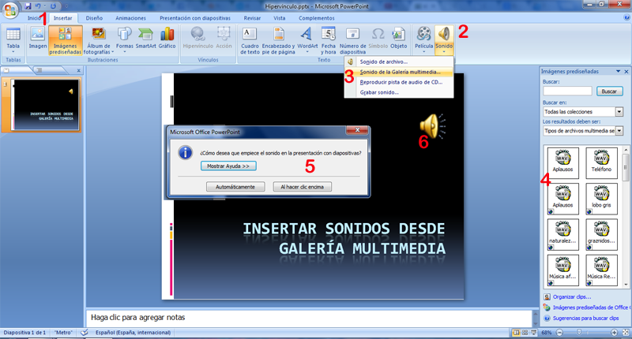
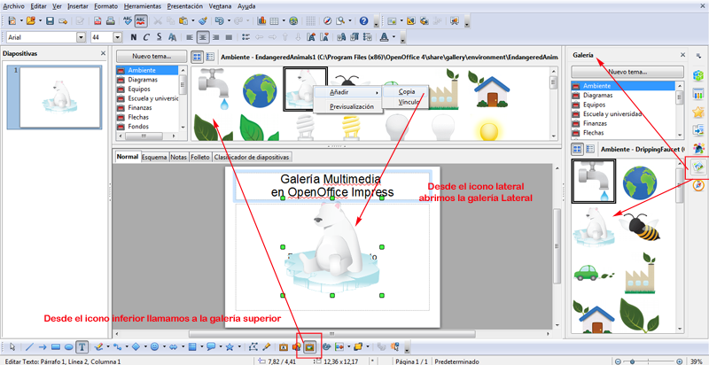
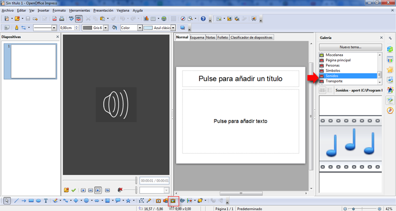
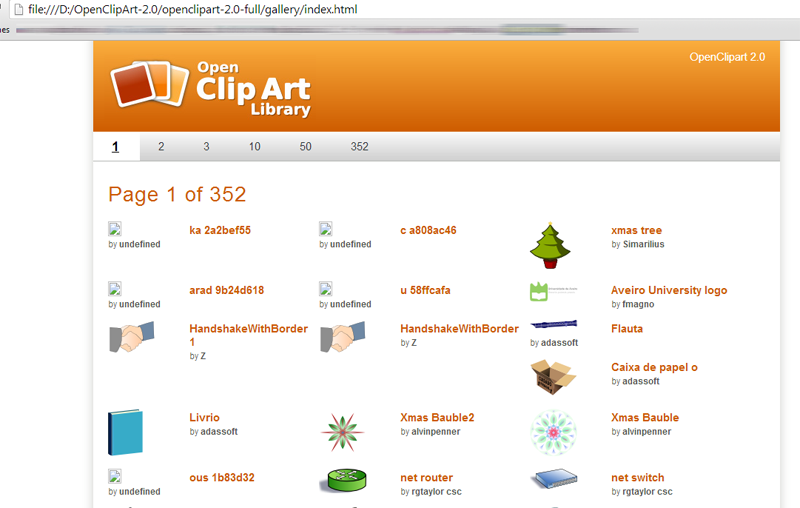
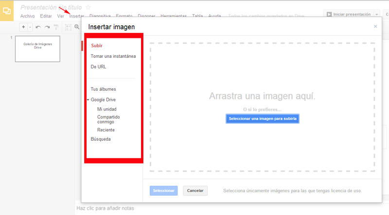
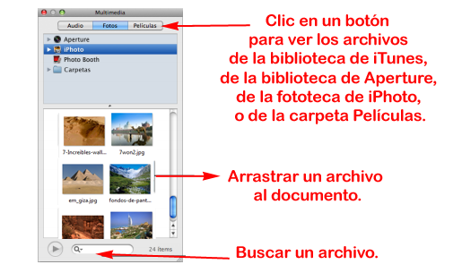

# Galería Multimedia

**Galería Multimedia en PowerPoint**

Para conseguir sonidos prediseñados, le damos a **Insertar** \- **Películas y sonidos** en la parte inferior del botón, entonces se nos abre un menú donde elegiremos **Desde Galería Multimedia.**

Nos muestra la galería multimedia donde sólo nos muestra los sonidos. Buscamos con alguna palabra clave.

Si estamos conectados a Internet saldrán muchos más que los ya instalados en el ordenador.

El sonido podemos hacerlo que se reproduzca automáticamente o al hacer clic encima. Si elegimos automáticamente, un truco para que no se visualize el icono es dejarlo fuera de la diapositiva.

NOTA: La animación, película o sonido se reproducirán en el **orden** en el que aparezcan en la diapositiva.

Por ejemplo, si una diapositiva está **animada** de tal forma que la diapositiva anterior desaparece con la diapositiva que contiene la película o el sonido, o si se agrega un efecto de animación personalizado a la película o al sonido de la diapositiva y se establece para que aparezca antes de que se reproduzcan la película o el sonido en la diapositiva.  
Si no aparece una animación en la diapositiva antes de que inserte una película o sonido, **la película o el sonido se reproducirán primero**, incluso si después aplica una nueva animación a la diapositiva.  
Clic en Automáticamente para que se reproduzca el sonido o la película al mostrar la diapositiva. Si hay otros efectos multimedia en la diapositiva, por ejemplo una animación, **el sonido o la película se reproducirá después** de dicho efecto.

  
Al hacer clic encima para que el sonido o la película se reproduzca al hacer clic encima. Esta configuración se denomina de **desencadenador** ya que es necesario hacer clic en un elemento concreto (a diferencia de hacer clic sencillamente en la diapositiva) para reproducir el sonido o la película.

  
También podemos configurar que los sonidos o las películas **se reproduzcan durante la visualización** de varias diapositivas o se reproduzcan repetidamente. Las películas también se pueden reproducir a pantalla completa.

**Galería Multimedia en OpenOffice Impress**

Impress está limitado en cuanto a diseños de presentación listos para usarse.

Sin embargo, se pueden obtener fácilmente en Internet plantillas de terceros. Lo vemos más adelante.

  

Los usuarios de OpenOffice.org Impress también pueden instalar la **Open Clip Art Library** (Biblioteca Abierta de Clip Art), que agrega una enorme galería de banderas, logos, iconos, estandartes y pancartas para presentaciones generales y proyectos de dibujo. [http://openclipart.org](http://openclipart.org)

Como su nombre lo indica, se trata de diseños libres, la licencia usada por el proyecto es **Dominio Público** de acuerdo con la licencia libre **Creative Commons**. Por lo tanto, **los archivos de imagen se pueden utilizar con cualquier fin**, incluso comercial, se pueden modificar, mejorar y usar libremente.

OpenClipArt 2,0 (417M) - Una colección de 26.000 + imágenes. También disponible como tar.gz o tar.bz2. lanzamiento 08/03/2010  
OpenClipArt 0.19 (132M) - Una colección de 12.337 imágenes. También disponible como tar.gz o tar.bz2. Publicado 31.3.2009  
banderas-1.6.tgz (1.7m) - Banderas del Mundo (417 artículos)  
nicu-0.1.tgz (162k) - Clipart de Nicu, incluyendo imágenes artísticamente decoradas, de las personas, las computadoras, flechas, smileys, frutas y símbolos de la oficina. (228 artículos)  
open_collection-0.0.tgz (88k) - logo Tux y algunos otros elementos aleatorios (9 artículos)  
road_signs-0.0.tgz (37k) - señales de tráfico de Inglés (34 artículos)  
textures_mitch-0.0.tgz (7.3M) - texturas de mapa de bits que se utilizan en la prestación (21 artículos)  
Descarga Repositorio - Visite este enlace para ver todos los enlaces de arriba y mucho más!

_**NUEVA ACTUALIZACIÓN: **La sección para descargar los paquetes se encuentran**[aquí](http://www.openclipart.org/packages).**_

Verlo en: [http://openclipart.org/collections](http://openclipart.org/collections)

**Pasos para instalar la galería**

Es válido instalar en cualquier distro GNU/Linux e incluso para instalar en window o Mac OS.

**1.- Descarga**

Nos dirigimos a la [**página oficial**](http://openclipart.org/media/viewfile/downloads.xml) del proyecto OpenClipArt, ahí encontraremos las diferentes versiones de la librería de clips libres. (Normalmente la encontraremos en descargas con el nombre openclipar-2.0-full.zip que es el archivo completo que hemos descargado. Si estamos en el navegador un **truco** para encontrar las descargas en **ctrl+j,** veremos las páginas de descargas)

**2.- Descompresión**

Una vez descargado el archivo lo descomprimimos en la carpeta que deseemos. Necesitamos un descompresor, por ejemplo 7zip nos ponemos sobre el archivo, botón derecho, 7zip y **extract Files**... elegimos la carpeta deseada y lo descomprimimos.

**3.- Instalación**

Nos dirigimos a  la casilla** galería**

Se desplegará una barra como se muestra en la imagen, correspondiente a la galería multimedia de OpenOffice.org, incluye fondos, límites, viñetas y audios por defecto. Seleccionamos **nuevo tema**

**A continuación nos dirigimos a la ubicación donde hemos descomprimido el archivo gzip, bzip o zip.**

Ahora en nuestra ventana observamos que se ordenan los archivos contenidos en la carpeta que seleccionamos previamente.

El siguiente paso es cambiarnos a la pestaña “general” dentro de la ventana abierta, agregamos el nombre que queramos dar al tema.

*   Repetir el mismo proceso para agregar las categorías previamente clasificadas o bien agregarlas sin clasificar. Para agregar una imagen a nuestra hoja de trabajo basta con dar clic derecho sobre la imagen y elegir “añadir/copia”

Para ocultar la barra que muestra la galería, basta con ir a “herramientas/galería” y desactivar la casilla o bien damos clic en el icono “galería” localizado en la barra de herramientas.

La galería instalada estará activa en todos las aplicaciones de OpenOffice.org (writer, calc, impress, etc.).

Si nos resulta complicado instalarlo y queremos ver de forma sencilla las imágenes, buscar la ruta:

Nombre que le pusimos a la carpeta/**openclipart-2.0-full/gallery/index.html**

En nuestro caso lo hemos descomprimido en **D** a la carpeta, la hemos llamado **OpenClipArt-2.0** y abrimos como página web, es una forma encima de con el botón derecho **copiar imagen** y llevarla a nuestras presentaciones.

****

**Galería Multimedia en Drive**

Más que una galería multimedia, repasaríamos como insertar imágenes desde google Drive: Insertar Imagen de varios lugares. Ver imagen inferior.

**Galería multimeda en Keynote**

El visualizador multimedia permite acceder a todos los archivos multimedia de la fototeca de iPhoto, la biblioteca de iTunes, biblioteca de Apertura y la carpeta Películas.  
Podemos arrastrar un elemento del visualizador multimedia a una diapositiva o un contenedor de imágenes de un inspector.

Si no utilizamos iPhoto o Aperture para almacenar sus fotos, ni iTunes para almacenar nuestra música, o si no guardamos las películas en la carpeta Películas, podemos añadir otras carpetas al visualizador multimedia para poder acceder a nuestros contenidos multimedia de la misma manera.

  
**Para abrir el visualizador multimedia:**

  
Clic en el botón Multimedia de la barra de herramientas, o seleccionar **Visualización** \> **Mostrar visualizador multimedia.**

**Añadir otra carpeta al visualizador multimedia:**

Para añadir una carpeta que contenga archivos de Fotos, Audios o películas, clic en Fotos, Audios o películas  en el visualizador multimedia y, a continuación, arrastrar la carpeta que deseemos desde el Finder hasta el visualizador multimedia.

**Cómo importar imágenes**

Keynote acepta todos los formatos compatibles con QuickTime, entre los que se encuentran los siguientes tipos de archivos gráficos:

*   TIFF, GIF, JPEG, PDF, PSD, EPS, PICT
    

**Para importar una imagen:**

*   Clic en **Multimedia** en la **barra de herramientas**, clic en **Fotos** en el visualizador multimedia, seleccionar el álbum donde se encuentre la imagen y, a continuación, arrastrar una miniatura para colocarla donde deseemos.
    
    Los botones en la parte superior del visualizador multimedia nos permiten acceder a las imágenes en su fototeca de iPhoto, las películas en su carpeta Películas o los archivos de audio en la biblioteca de iTunes.
    
*   Seleccionar **Insertar** \> **Seleccionar**,  el archivo y clic en **Insertar**.
    
*   Arrastrar un archivo desde el Finder.
    
*   Arrastrar un archivo desde otra aplicación.
    

Tras importar la imagen, podemos arrastrarla hasta la posición que deseemos en el lienzo de diapositivas.

Arrastrar la imagen al navegador de diapositivas para crear una nueva diapositiva que contenga dicha imagen.

Puede utilizar las herramientas de Keynote para enmascarar (recortar) una imagen, cambiar su brillo, contraste y otras cualidades, o borrar su fondo.

_Ayuda de Keynote [ver más](http://support.apple.com/)_

