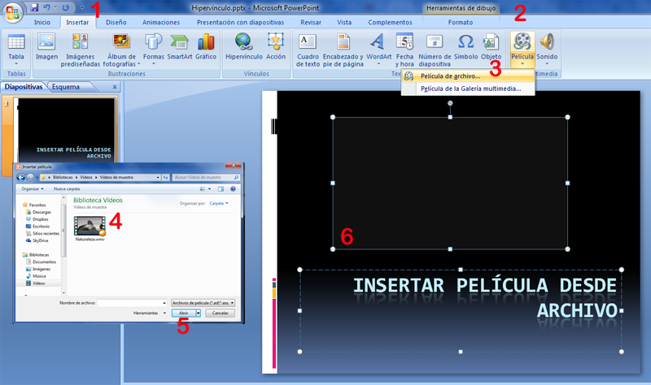

# Galería Multimedia

**Insertar película desde la Galería Multimedia en PowerPoint**

Repasamos [U1 Insertar Sonido y películas:](u1_insertar_sonido_y_pelculas.html)

1.  En la ficha **1** **Insertar**, en el grupo **2** **Clips multimedia**, clic en la flecha situada bajo **Película**. Pero elegiremos en 3 Película de La Galería Multimedia.
    

    

    

En el menú **Insertar** elegimos del botón **Película  **_la parte inferior del botón_, nos mostrará dos opciones, o desde archivo o desde la **Galería Multimedia**, si elegimos esto último nos saldrá el mismo diálogo que cuando insertábamos imágenes prediseñadas, pero si nos fijamos en el tipo de archivo sólo están marcadas las **Películas**.

Hay que señalar que casi todo lo que hay son realmente imágenes animadas tal y como vimos en el capítulo correspondiente de Gráficos-Otros elementos.

( Fig.5.3.3.2.2: J.Quintana, montaje pantalla captura programa, [Algunos derechos reservados](http://creativecommons.org/licenses/by-nc-sa/2.0/deed.es "Derechos reservados. Atribución-NoComercial-CompartirIgual 2.0 Genérica (CC BY-NC-SA 2.0)"))

**Insertar película desde la Galería Multimedia en OpenOffice Impress**

Repasamos [U1 Insertar Sonido y películas:](u1_insertar_sonido_y_pelculas.html)

Podremos insertar vídeos igual que lo hicimos con los ClipArts, pero pensamos que no tiene mucho sentido y será mejor, buscarlos en la web, descargarlos o enlazarlos.

Veamos esta web para repasar el tema: [http://wiki.open-office.es/Galeria\_en\_OpenOffice\_Writer\_-\_Insertar\_videos\_y\_sonidos](http://wiki.open-office.es/Galeria_en_OpenOffice_Writer_-_Insertar_videos_y_sonidos)

**Insertar película desde la Galería Multimedia en Drive Presentaciones**

Repasamos [U1 Insertar Sonido y películas:](u1_insertar_sonido_y_pelculas.html)

 

**Insertar película desde la Galería Multimedia en Keynote**

Repasamos [U1 Insertar Sonido y películas:](u1_insertar_sonido_y_pelculas.html)

Tampoco tiene mucho sentido crear una galería, usaremos los vídeos que nos gusten y los insertaremos.

**El visualizador multimedia**  
Recordemos que: El visualizador multimedia permite acceder a todos los archivos multimedia de la fototeca de iPhoto, la biblioteca de iTunes, biblioteca de Apertura y la carpeta Películas.  
Podemos arrastrar un elemento del visualizador multimedia a una diapositiva o un contenedor de imágenes de un inspector.

**Creación de composiciones de películas**

  
Si hemos colocado una película en una diapositiva, comenzará a reproducirse en cuanto aparezca la diapositiva, a menos que especifiquemos otra cosa. Para controlar cuándo comienza y finaliza la reproducción de una película, debemos crear una composición de película.

**Para crear una composición con películas:**

1.  Seleccionar una película en el lienzo de diapositivas.
2.  Clic en Inspector en la barra de herramientas y clic en el botón **Inspector de la composición**.
3.  Clic en **Entrada** y **Iniciar película** en el menú local Efecto.
4.  Para **detener** la película, clic en Salida y seleccionar **Detener película** en el menú local Efecto.

La película comenzará a reproducirse y se detendrá cuando aparezca la composición.

Veamos enlace relacionado: [http://clotosplace.wordpress.com/2012/05/17/como-poner-un-video-en-keynote-para-ipad/](http://clotosplace.wordpress.com/2012/05/17/como-poner-un-video-en-keynote-para-ipad/)

