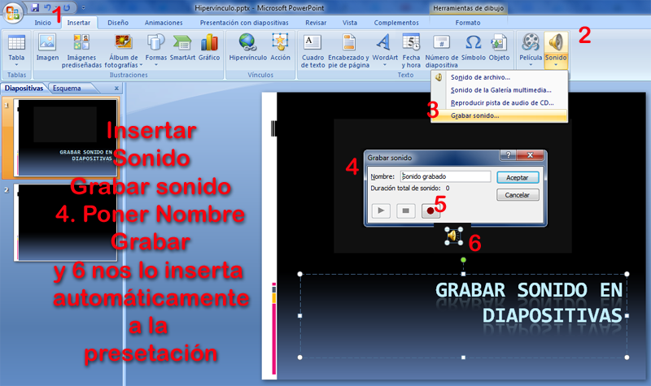

# Grabar sonido

**Grabar Sonido en PowerPoint**

Podemos grabar nuestra propia voz, o la de los alumnos (por ejemplo  la lectura de un cuento con sus dibujos en Infantil)

Elegimos **Insertar**-Icono parte inferior de **Sonidos**-**Grabar sonido...**

( Fig.5.2.e.1: C.Barrabés, montaje pantalla captura programa,  [Algunos derechos reservados](http://creativecommons.org/licenses/by-nc-sa/2.0/deed.es "Derechos reservados. Atribución-NoComercial-CompartirIgual 2.0 Genérica (CC BY-NC-SA 2.0)")) 

El diálogo que aparece es muy intuitivo:

*   El círculo rojo para grabar
*   El cuadrado para parar o pausa (muy útil la pausa con los alumnos)
*   El triángulo reproduce

## Evidentemente..

Asegurate que tienes micrófono y está bien instalado. En caso de dificultad técnica trabaja con un portatil que suele tener bien instalado el micro.

**Grabar Sonido en OpenOffice**

Grabar la narración con otro programa y luego insertarla. Utilizaríamos el Audacity:

Grabar tu voz con Audacity es bastante sencillo.

1.  Configurar los parámetros de calidad de la grabación. 
    
2.  Ajustar los niveles de Entrada y Salida. Desde la propia interfaz de Audacity o desde el mezclador de la tarjeta de sonido es posible configurar estos niveles.
    

3.  Grabar la voz a través del micrófono. Siempre graba en una pista nueva, además permite sincronizar el audio de varias pistas.
    
4.  Clic en el botón **Grabar** de la barra de controles del reproductor y hablar.
5.  Pausar la grabación con el botón de **Pausa.**
6.  Con el botón **Stop** (botón con el cuadrado amarillo) es para parar la grabación.
    
    Para escuchar lo que hemos grabado clic en el botón **Play** (botón con el triángulo verde).
    
    Los botones con los iconos violeta nos permiten ir al inicio y final de la pista.
    

**Guardar proyecto como** del menú **Archivo**, Audacity guarda la edición del archivo en el formato .aup, la extensión nativa de la aplicación que nos permitirá volver a editarlo en cualquier momento.

Si lo que queremos es guardar el archivo en formato MP3 tenemos que seleccionar la opción del menú **Archivo – Exportar**.

En la nueva ventana podemos seleccionar también otros formatos como Ogg Vorbis, Flac, Wav, AC3...

**No podemos grabar audio en el propio Google Drive Presentaciones**

Pero podemos hacer **Slidecast, presentaciones con audio**

Necesitamos un **programa de presentaciones****Google Drive **y algún aparato para grabar el audio.

Los ordenadores de cualquier sistema (Mac, Windows o Linux) suele tener un grabador de voz.

Una vez ya tenemos nuestra presentación y el fichero de audio (en **mp3**) por separado elegir la plataforma adecuada para la compartir:

*   *   Animoto [http://www.animoto.com](http://www.animoto.com)
    *   Authorstream [http://www.authorstream.com/](http://www.authorstream.com/)
    *   MyPlick [http://www.myplick.com](%20http://www.myplick.com)
    *   Presentation Zen [http://www.presentationzen.com](http://www.presentationzen.com/)
    *   Slideboom [https://www.slideboom.com](https://www.slideboom.com)
    *   Sliderocket [http://www.sliderocket.com](http://www.sliderocket.com/)
    *   Slideshare [http://www.slideshare.net](http://www.slideshare.net)
    *   Slidestory [http://www.slidestory.com](http://www.slidestory.com)
    *   Vcasmo [http://www.vcasmo.com](http://www.vcasmo.com)
    *   Voicethread [http://www.voicethread.com](http://www.voicethread.com)
    *   Yodio [http://www.yodio.com](http://www.yodio.com)

**Cómo grabar una narración en Keynote**

  
Para grabar una narración de voz, debemos hablar sobre cada diapositiva, avanzando a lo largo del pase de diapositivas.

A medida que avanzamos a través de cada diapositiva o composición, sus tiempos también se grabarán y se guardarán cuando otros usuarios reproduzcan el pase de diapositivas.  
Podemos usar el micrófono de nuestro ordenador o conectar un micrófono externo. (Conectarlo primero y usar el panel de sonido de Preferencias del Sistema para configurar los ajustes de entrada)

  
**Pasos para grabar**

  
1 **Seleccionar diapositiva** donde deseemos que empiece la grabación.   
2 Operaciones:

*   *   Abrir el Inspector del documento, clic en Audio y clic en Grabar.
    *   Seleccionar **Archivo** \> **Grabar** pase de diapositivas.

El pase de diapositivas comienza a reproducirse.

Una luz de roja intermitente en la esquina superior izquierda de la pantalla indica que la grabación está en curso.

  
3 A medida que se reproduzca la presentación, acercarnos al micrófono para hablar con claridad y grabar su narración.  
4 Para **avanzar** a la siguiente diapositiva, clic en el botón del ratón o pulsar la tecla de flecha derecha.  
5 Para poner en **pausa** la grabación, clic en el indicador de grabación de color rojo o pulsar B: Pantalla negra W: Pantalla blanca, F: Bloquear.  
Pulsar cualquier tecla para reanudar la grabación.

6 Al **finalizar la grabación** todas las diapositivas que deseemos incluir pulsar la tecla **Esc** para detener la reproducción del pase de diapositivas y guardar la grabación.  
   
7 Para **escuchar** la narración sin reproducir el pase de diapositivas, clic en el botón **Reproducir** en el panel Audio del inspector del documento. Para ajustar el volumen usar el regulador.

Truco: Si seleccionamos una diapositiva omitida, la grabación comenzará en la diapositiva no omitida anterior más cercana.

_Resumido del manual del usuario Keynote Apple._

**Cómo eliminar una grabación**

*   Abrir el inspector de documentos, clic en Audio y, a continuación, clic en Borrar.
*   Seleccionar **Archivo** \> **Borrar grabación**.

