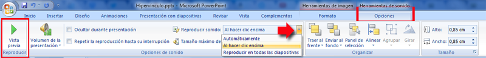
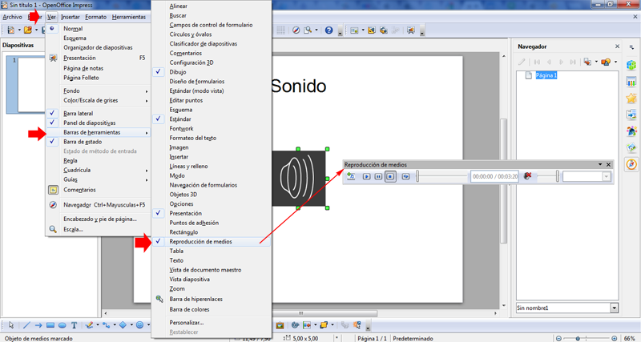

# Herramientas de sonido

### Administrar sonido en PowerPoint

Si pinchamos sobre el audio que hemos insertado en la diapositiva automáticamente en la parte superior aparece el menú **Herramientas de sonido**

Podemos:

*   modificar el volumen de la presentación
*   ocultar el icono para que no se vea en la presentación (otra método diferente de ocultarlo lo vimos en b. Galería Multimedia)
*   bucle (es decir que la música vuelva a empezar cuando acabe)
*   alinear el icono

**Que la música se oiga en todas las diapositivas**

La opción la tenemos en **Reproducir sonido.**  

## Reflexión

¿qué significa _Tamaño máximo de un archivo de sonido (KB) 100_ ?

%accordion%Solución%accordion%

La respuesta no es evidente, pero si has trabajado la sección de ATENCIÓN de la unidad de Películas lo podrás entender:

Si marca 100K significa:

**Los sonidos de menos o igual de 100k PowerPoint los incorpora dentro de la presentación**

¿qué quiere decir esto? que un sonido efecto sonoro, (todos los de la galería multimedia por ejemplo, además son sonidos instrumentales MIDI, [ver formatos en Preliminares](formatos.html)) ocupan poco, menos de 100K por lo tanto al insertarlos, ya están en la presentación.

Mientras que si insertamos un archivo de audio (que suelen ocupar más de 100K) PowerPoint no los incorpora, por lo tanto **HAY QUE TENER LAS MISMAS PRECAUCIONES QUE VIMOS EN LAS PELÍCULAS** EN ATENCIÓN

%/accordion%

### ¿Y si quiero que sólo se oiga unas determinadas diapositivas?

Esto es interesantes si la presentación lleva otros elementos, por ejemplo un vídeo, entonces no queremos que la música se interponga, pero queremos que se oiga hasta x diapositivas.

Como es un poco complicado, más vale una imagen que mil palabras:

 

### Administrar sonido en OpenOffice Impress

Cuidado debemos **guardar los sonidos en la carpeta de la  presentación:** Los archivos de sonido no se incrustan en el archivo de la presentación.

La solución para llevar el sonido con la presentación a otro equipo, **es crear una carpeta con el archivo .odp y los archivos sonoros**. Y llevarnos la carpeta entera al equipo en el que vayamos a visualizarlo.

Una vez insertado un archivo de sonido en una diapositiva desde el menú **Insertar**, Vídeo y sonidos, navegaremos hasta la carpeta en la que se encuentra el archivo, y tras seleccionarlo haremos click en el botón Abrir.

Cuando se reproduzca la diapositiva, el sonido reproducirá automáticamente.

Cada vez que seleccionemos un elemento de sonido se mostrará la barra de herramientas Reproducción de medios (si no la teníamos visible)

Desde la barra de reproducción de medios podemos:  
• Elegir otro sonido   
• Reproducirlo   
• Pausarlo   
• Pararlo   
• Silenciarlo  
Cada vez que cojamos otro sonido se introducirá el icono del altavoz en la diapositiva.

Impress incluye algunos sonidos que podemos usar en nuestras presentaciones, pero podemos también insertar un archivo de sonido que esté disponible para todas las diapositivas.

Para ello, iremos al **panel Transición de diapositivas** en la parte derecha de la ventana, y dentro de la sección **Modificar** transición en el cuadro de lista Sonido seleccionaremos **Otro sonido**, para a continuación seleccionar el archivo deseado.

Si pulsamos en el botón **Aplicar** a todas las diapositivas se comenzaría a reproducir nuevamente al cargarse cada **diapositiva** de la **presentación**.

Si marcamos la casilla **Repetir hasta el próximo sonido** que se encuentra debajo de Sonido, éste se detendrá al iniciarse otro en la siguiente diapositiva.

Para configurar un objeto para que reproduzca un sonido haremos clic con el botón derecho sobre él, y en el menú contextual seleccionaremos **Interacción,** se mostrará un cuadro de diálogo en el que deberemos seleccionar **Reproducir sonid**o y luego el archivo tras hacer click en el botón **Examinar **

**¿Herramientas de sonido en Drive?**

Parece que sólo posemos insertar vídeo a Presentaciones de Google Drive,.

Podemos buscar alternativas, vídeo con sonido o un enlace a un archivo de sonido subido a Drive y enlazarlo con un objeto por ejemplo.

**Herramientas de sonido en Keynote**

*    Clic en el botón Inspector de la barra de herramientas y clic en el botón **Inspector del documento**.
*    Clic en el botón **Audio**.
*   Para **añadir un  sonido** una lista de reproducción a la biblioteca de iTunes, clic en **Biblioteca de iTunes**. Elegir la canción o lista de reproducción que deseemos y llevarla desde el visualizador multimedia **hasta el contenedor Audio**del inspector del documento. Tener en cuenta que si realizamos cambios en la lista de reproducción de iTunes, los cambios no se reflejarán en la pista de sonido hasta que volvamos a añadir la lista de reproducción.
    

*   Para **añadir un archivo de audio** desde el Finder, arrastrarlo desde el escritorio hasta el contenedor de audio en el inspector del documento. 
    
*   Para hacer que el sonido o lista de reproducción se escuche repetidamente durante la ejecución de la presentación, seleccionar **Bucle** en el menú local adyacente al contenedor de audio.
    
*   Para previsualizar el sonido mientras trabajamos en nuestro pase de diapositivas, clic en elbotón Reproducir situado bajo el contenedor de audio.

