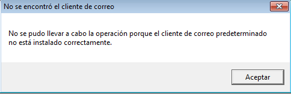

# Hipervínculo a correo electrónico

Los hipervínculos a correo electrónico facilita la comunicación para la mejora de la presentación realizando enlaces de correos electrónicos con los autores de la presentación y con personas relacionadas con la temática y que estén dispuestos a colaborar.

El problema es que el enlace normalmente no funciona porque la mayoría de ordenadores o tienen un programa de gestión de correo, pero el mismo hecho que visualice el email ya posibilita la comunicación.

**Hipervínculo a correo electrónico en PowerPoint**

Hay que tener cuidado si el ordenador no tiene instalado un correo pop, como la inmensa mayoría de PCS, lo aprendemos a continuación. 

**Hipervínculo a correo electrónico**

Para hacer un enlace a correo electrónico es exactamente igual que un hipervínculo a una dirección Web sólo que para un botón de acción hay que anteponer las palabras **mailto: **a la dirección de correo electrónico,que deseemos, fijémonos que hemos incluidoreproducir sonido y hemos elegido el sonido de Cámara que nos parece bastante adecuado. (Sobre **Botón acción **sale esta pantalla)

 ( Fig.3.1.1.2.1: C.Barrabés, montaje pantalla captura programa,  [Algunos derechos reservados](http://creativecommons.org/licenses/by-nc-sa/2.0/deed.es "Derechos reservados. Atribución-NoComercial-CompartirIgual 2.0 Genérica (CC BY-NC-SA 2.0)"))

Para un hipervínculo creado en cualquier objeto no es necesario, pues existe un botón exclusivo para estos enlaces que automáticamente ponen la palabra **mailto: **_(rellena el campo correo electrónico y verás como aparece automáticamente la palabra mailto:) _además de la posibilidad de poner el campo **Asunto:**

(Sobre el texto aparece esta pantalla)

( Fig.3.1.1.2.2: C.Barrabés, montaje pantalla captura programa, [Algunos derechos reservados](http://creativecommons.org/licenses/by-nc-sa/2.0/deed.es "Derechos reservados. Atribución-NoComercial-CompartirIgual 2.0 Genérica (CC BY-NC-SA 2.0)"))

**¿Qué programa se abre cuando se pincha en el hipervínculo?**

En versiones anteriores, se abría el programa de correo predeterminado que solía ser el Outlook, (el programa que tengamos configurado el correo electrónico por ejemplo el Outlook Express.)

En esta versión también intenta abrir el programa "de cliente de correo" que puede ser también un programa cliente POP3 como el Outlook, Thunderbird.... y si no puede, sale una advertencia:

( Fig.3.1.1.2.3: C.Barrabés, montaje pantalla captura programa, [Algunos derechos reservados](http://creativecommons.org/licenses/by-nc-sa/2.0/deed.es "Derechos reservados. Atribución-NoComercial-CompartirIgual 2.0 Genérica (CC BY-NC-SA 2.0)"))

  

He intenta abrir la web para cliente de correo para entrar en nuestro correo

( Fig.3.1.1.2.4: C.Barrabés, montaje pantalla captura programa, [Algunos derechos reservados](http://creativecommons.org/licenses/by-nc-sa/2.0/deed.es "Derechos reservados. Atribución-NoComercial-CompartirIgual 2.0 Genérica (CC BY-NC-SA 2.0)"))

  

**¿Por qué no funciona bien en la mayoría de los casos?**

Porque lo normal es tener cuentas email que no aceptan programas de gestión de correo tipo POP3, por ejemplo hotmail, yahoo... y lo normal es no tener configurado el programa de correo Outlook, Thunderbird...

PERO TEN EN CUENTA QUE EL PROBLEMA NO ES DE LA PRESENTACIÓN SINO DE QUE EL ORDENADOR DONDE SE ESTA EJECUTANDO NO ESTÁ BIEN CONFIGURADO

Es como si en la presentación hubiera un vínculo a un archivo Word y el ordenador no tiene Word, el problema es del ordenador, no de la presentación.

#### **Hipervínculo a correo electrónico en **OpenOffice

#### Abrir un mensaje de correo electrónico.

 (Fig.3.1.1.2.5: C.Barrabés, montaje pantalla captura programa,  [Algunos derechos reservados](http://creativecommons.org/licenses/by-nc-sa/2.0/deed.es "Derechos reservados. Atribución-NoComercial-CompartirIgual 2.0 Genérica (CC BY-NC-SA 2.0)"))

**Hipervínculo a correo electrónico en Keynote en google Drive**

****

(Fig.3.1.1.2.6: C.Barrabés, montaje pantalla captura programa,  [Algunos derechos reservados](http://creativecommons.org/licenses/by-nc-sa/2.0/deed.es "Derechos reservados. Atribución-NoComercial-CompartirIgual 2.0 Genérica (CC BY-NC-SA 2.0)"))

Muy similar al resto de programas sigamos los pasos:

1.  **Insertar**
2.  Marcar el **objeto**. En nuestro caso será un sobre.
3.  **Ctrl+K** o enlace
4.  Ponemos la **dirección** de coreo, nosotros no hemos puesto mailto: y funciona igual (lo pone drive)
5.  Aplicar para que grabe el correo
6.  Vemos como pone mailto:.... y si activamos el sobre o el objeto que hayamos colocado enlace a mail, nos permitirá **cambiar o eliminar** el enlace

****          Hipervínculo a correo electrónico en **Keynote**

**Añadir un enlace a texto o a un objeto**

1.  Con la tecla **Control** pulsada, clic en el **texto seleccionado** o en un **objeto** al que deseemos añadir un enlace y, a continuación, seleccionar **“Añadir enlace”.**
    
2.  Seleccionar una de las opciones del menú desplegable “**Enlazar con**”.
    
    *   **Mail****:** abre un mensaje de correo electrónico con la dirección y el asunto introducidos. Clic en Abrir para acceder a una vista previa del mensaje de correo electrónico.
        
3.  Proporcionemos la información requerida (la dirección de correo electrónico, por ejemplo).
    
4.  Clic fuera del cuadro de diálogo para cerrarlo o clic en Abrir para abrir el enlace.
    

**Pongamos un objeto y lo vinculamos a una cuenta de correo**

*   En el botón **formas** en la barra de herramientas y seleccionamos una forma.
*   La insertamos en la diapositiva.
*   Seleccionamos las asas alrededor de la forma para **ajustar tamaño** deseado.
*   Clic en el botón **Inspector** en la barra de herramientas para abrir la ventana.
*   Seleccionar **Inspector gráfico** en la ventana _**Inspector**_ para cambiar el trazo de relleno, y otros elementos gráficos del objeto.
*   Clic en el botón **Vínculo**, un círculo azul con la flecha blanca, que se encuentra a la derecha de la ventana **Inspector**
*   Seleccionar la casilla de verificación **Activar como hipervínculo**.
*   Clic en la casilla que dice **Vincular a:** 
*   Seleccionar el destino del enlace
*   Sobre u objeto para abrir un mensaje de correo electrónico, escribir la dirección de correo electrónico del destinatario y el asunto. 
*   Recordar si el gestor de correo, no está configurado no podremos mandar enlace. (Es más para uso personal con cuenta POP bien configurada)

