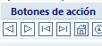
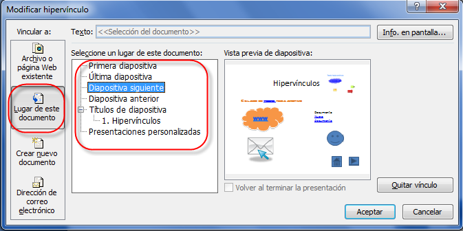
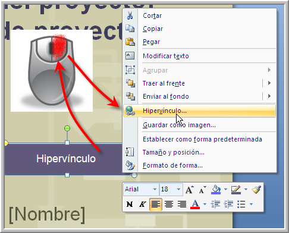
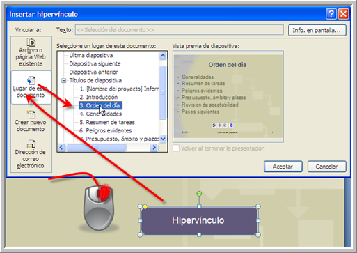
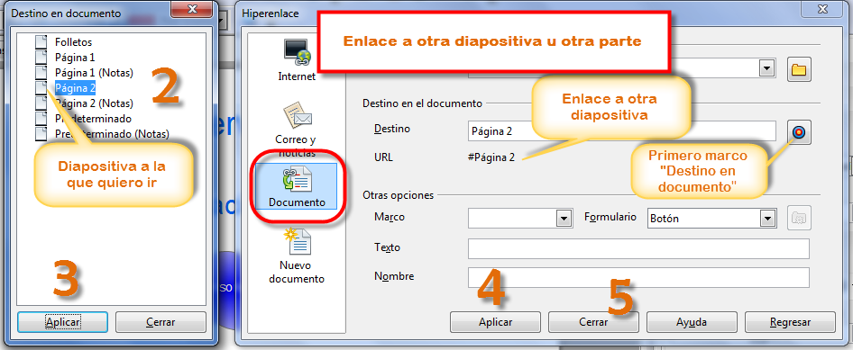
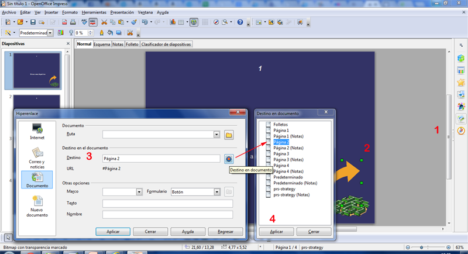
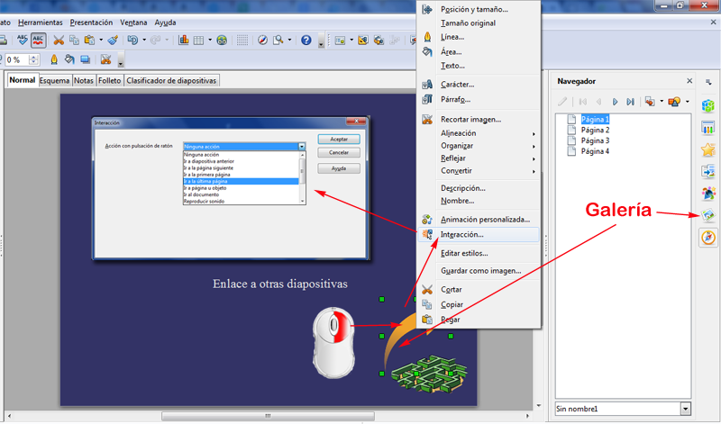
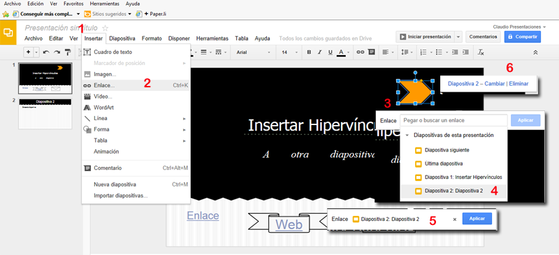

# Hipervínculo a otra diapositiva

## **Estilo**

Cuando trabajes con presentaciones ramificadas, que no sean de una única secuencia, intenta que cada diapositiva tenga **botones** de acceso a cada vía de presentación.

Los botones de navegación en cada diapositiva facilita el poder retomar el control de la secuencia en cualquier momento.   
  

 

Emplea los enlaces como elementos para crear interactividad directa con el alumnado. Así es útil emplear enlaces de preguntas con varias opciones y éstas son hipervínculos a sendas diapositivas de respuesta.

### Hipervínculo a otra diapositiva en PowerPoint

Los botones de acción se verán más adelante.

*   **Hipervínculo a otra diapositiva:**
    

 

Cualquier elemento es enlazable a la primera, última, siguiente, anterior…diapositiva.

*   Podemos insertar un botón sin icono, donde después colocaremos un texto encima de él que vaya a otra diapositiva, tal y como lo indica la figura
    

    

*   Cualquier objeto podemos hacer que tenga un hipervínculo a otra diapositiva, por ejemplo en la figura es un cuadro de texto dando con el botón derecho a **Hipervínculo** luego a **Lugar de este documento** y seleccionar la diapositiva
    

    

### Hipervínculo a otra diapositiva en OpenOffice

#### Ir a una diapositiva concreta.   

 Hemos abierto nuestro OpenOffice Impress desde inicio, todos los programas....

Le hemos aplicado un diseño y hemos añadido unas cuantas diapositivas desde **Insertar** Diapositivas.

Elegimos un objeto desde la Galería penúltimo icono de la derecha, justo encima de la brújula (Navegador)

Insertamos una flecha a nuestro gusto (nosotros una flecha amarilla) y la hemos escalado, tocando los cuadraditos verdes de la misma. (Botón izdo. y encojemos ya que era muy grande).

Pasos para ir de la diapositiva 1 a la 2:

1.  Elegimos flecha u objeto deseado en la galería por ejemplo.
2.  Redimensionamos o escalamos la flecha al tamaño deseado.
3.  Tocamos la diana y seleccionamos la página a la que queremos que nos lleve el botón.
4.  Aplicamos los cambios. Si lanzamos con F5 la presentación nos lleva a la diapositiva 2 en nuestro caso.

Cuidado, de esta forma, no veré que el la flecha hay un enlace.

Si quiero que se veo una mano en la flecha, lo debo hacer con **Interacción** de esta forma:

1.  Botón derecho sobre el obejto (flecha que hemos cogido de la galería desde la derecha)
2.  Interacción
3.  Elegir dónde queremos ir...

### Hipervínculo a otra diapositiva en Drive

Con el resto de inserciones de enlaces, lo podemos hacer en texto y objetos. Nosotros hemos elegido una forma similar a la flecha 3, que por ciento podríamos poner un número para recordar hacia dónde va.

**1** Insertar, vamos a Enlace o Ctrl+K, seleccionamos el objeto naranja **3**, se nos abre un cuadro de diálogo que desplegamos y podemos seleccionar, Diapositiva siguiente, última..., hemos elegido Diapositiva 2 (**4**), sólo nos resta aplicar **5** y si queremos cambiar o eliminar marcaremos el obejto y veremos el punto **6**

### Hipervínculo a otra diapositiva en Keynote

**¿Cómo ir a una diapositiva concreta?**

  
Si deseamos poder movernos por las presentación a lo largo de una ruta no lineal o si deseamos que los usuarios seleccionen sus propias rutas a través de la presentación: Podemos usar hipervínculos para ir directamente a cualquier diapositiva de Keynote. 

Para **añadir un hipervínculo** que vaya directamente a una diapositiva en concreto:

  
1 Seleccionamos el texto o el objeto que desee convertir en un hipervínculo.  
2 Clic en Inspector en la barra de herramientas, clic en el botón **Inspector de hipervínculos** y seleccionar **Activar como hipervínculo**.  
3 En el menú local **Enlazar con,** seleccionar Diapositiva.  
4 Seleccionamos la opción que describe la diapositiva que deseamos mostrar (**siguiente, anterior, primera o última**; última visualizada; o un número de diapositiva concreto).

**Añadir un enlace a texto o a un objeto**

1.  Con la tecla **Control** pulsada, clic en el **texto seleccionado** o en un **objeto** al que deseemos añadir un enlace y, a continuación, seleccionar **“Añadir enlace”.**
    
2.  Seleccionar una de las opciones del menú desplegable “**Enlazar con**”.
    
    *   **Diapositiva**: enlaza con otra diapositiva de la presentación. Clic en “Ir a la diapositiva” para ir a la diapositiva que haya seleccionado
        
    *   **Salir del pase de diapositivas**: sale de la presentación al hacer clic en el texto u objeto.
        
3.  Proporcionemos la información requerida (una diapositiva, por ejemplo).
    
4.  Clic fuera del cuadro de diálogo para cerrarlo o clic en Abrir para abrir el enlace.
    

