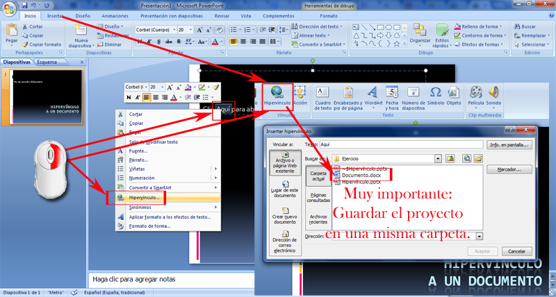
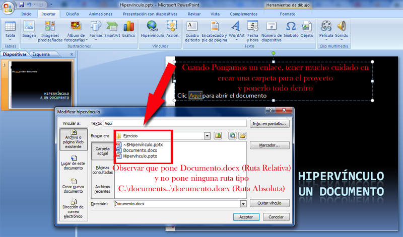
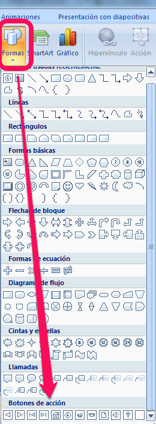
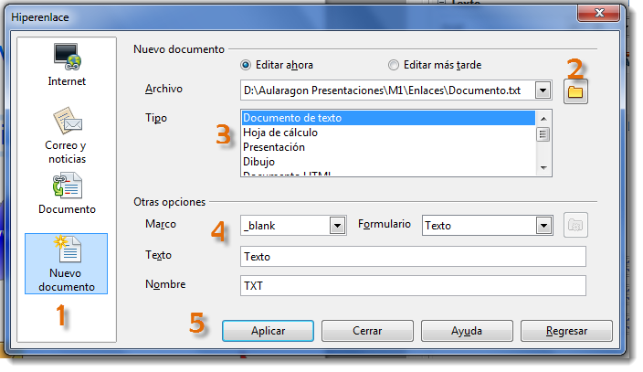
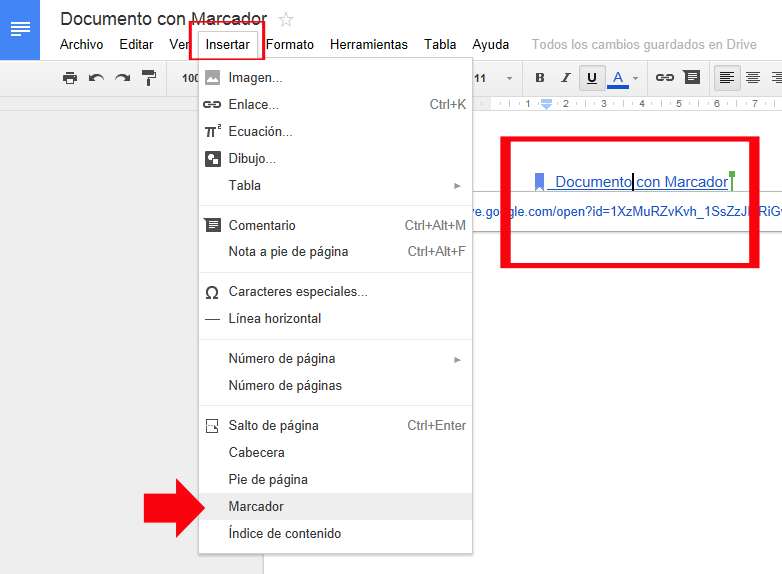
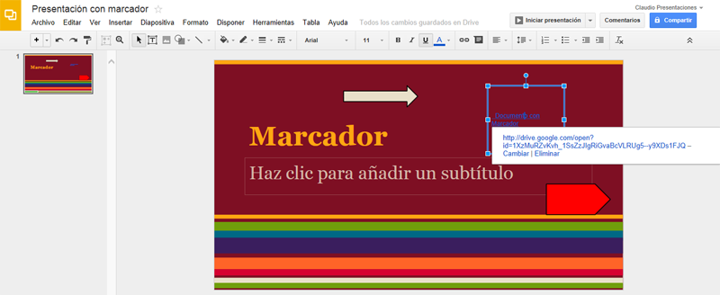

# Hipervínculo a un documento

#### Hipervínculo a un documento en PowerPoint

*   Hipervínculo a un documento

*   Advertir de que debemos crear en enlace correctamente, **colocar presentación y documento en el mismo sitio (misma carpeta)** y luego hacer el hipervínculo y no al revés, si no no nos funcionará al llevar la presentación de un ordenador a otro.
*   **¿Por qué?**: Para evitar sorpresas y después que no se nos vea el documento. Si hemos puesto el enlace a una archivo de nuestro ordenador en casa, si nos llevamos el trabajo a otra máquina, no encuentra el enlace y no se nos muestra el archivo, ya que apunta a un lugar que no existe ese archivo al ser una nueva máquina,

**Hipervínculo a un documento**

1.  Insertamos un texto (el típico "Pincha aquí" )
2.  Seleccionamos el texto donde queremos hacer el hipervínculo
3.  En el menú Insertar-Hipervínculo (o también botón derecho-Hipervínculo)
4.  Seleccionamos el documento

  
**ATENCIÓN** el documento tiene que estar **previamente **en la carpeta donde está guardada la presentación, ocurre igual que los sonidos y los vídeos, si no se hace esto, el hipervínculo se queda con una ruta absoluta que hace no funciona en otros ordenadores.

**Cuidado** con los **botones de acción**

  

Hemos detectado que los hipervínculos a documentos realizados en los botones de acción no funcionan correctamente en otro ordenador (hace referencias absolutas, no relativas, esto lo veremos más adelante), parece ser que están diseñados sólo para hacer hipervínculos a otras diapositivas.

### Hipervínculo a un documento en OpenOffice

####  Abrir otro documento de nuestra máquina.

1.  Seleccionamos Nuevo documento
2.  Buscamos la ruta (en nuestro caso hemos creado previamente el Documento.txt y hemos forzado poner ese nombre en la ruta, para que enlazara bien)
3.  Como en un documento de texto elegimos el primero
4.  Nos gusta que se abra en una página en blanco o nueva. Podemos poner Texto y nombre y observar para que sirve.
5.  Aplicar para grabar lo que hemos hecho y probarlo para ver si funciona. Si falla repetir el proceso y poner bien la ruta del documento. (La podemos buscar con navegador de archivos y copiar y pegar)

### Hipervínculo a un documento en Drive

**Insertar un hipervínculo que vaya a una ubicación en el documento actual**

Para poder establecer un vínculo con un lugar del documento actual, se requiere la utilización de marcadores.

**¿Qué es un marcador?**

Es un elemento o una ubicación de un documento que se identifica y se le asigna un nombre para futuras referencias.

**¿Cómo se agrega un marcador?**

Basta con seleccionar un elemento, o una ubicación y asignarle un nombre de marcador.

1.- Seleccionar un elemento al que deseemos asignar un marcador o clic donde deseemos insertar un marcador.

2.- En la pestaña insertar, buscamos el grupo Vínculos y clic en marcador.

3.- Nombre del marcador: escribir o seleccionar un nombre.

4.- Clic en agregar.

**Mostrar los marcadores**

Los marcadores no son visibles en los documentos. Si deseamos mostrar los marcadores los veremos mientras trabajamos en un documento.

Los marcadores no se imprimen.

1.- Al presionar el boton office, entramos en las opciones de word, y en la categoría avanzadas, busca la sección mostrar contenido de documento.

2.- Activar la casilla de verificacion.

**Insertar un hipervínculo que vaya a una ubicación especifica en otro documento.**

1.  Abrir el archivo al que deseamos ir e insertar un marcador.
    
2.  Abrimos  el archivo desde el que deseamos establecer el vínculo y seleccionamos el texto o el objeto que queremos convertir en hipervínculo.
    
3.  Abrimos el cuadro de dialogo hipervínculo.
    
4.  Debajo de vincular a: clic en archivo o pagina web existente.
    
5.  Buscamos y seleccionamos el documento con el que queremos establecer el vínculo
    
6.  Clic en el marcador…y seleccionamos el marcador que deseemos.
    

 Vamos imágenes, primero en Documento y posteriormente en presentaciones:

¿Qué lío no?

Una forma más fácil, es el documento que tenemos abierto en Drive por ejemplo un texto, copiamos la ruta del navegador y le ponemos un enlace en el objeto o texto pegándolo y funciona también.

### Hipervínculo  con un archivo de Keynote

En este caso explicaremos algo similar  **Cómo agregar un hipervínculo que abre otro archivo de Keynote.**

  
Para añadir un hipervínculo que abre otro documento de Keynote:

  
1. **Seleccionamos** el texto o el **objeto** que deseemos convertir en un hipervínculo.  
2. Clic en Inspector en la barra de herramientas, clic en el botón **Inspector de hipervínculos** y seleccionar **Activar como hipervínculo**.  
3. Seleccionar Archivo de Keynote en el menú local **Enlazar con**.  
4. Vamos hasta el archivo y clic en **Abrir**.  
5. Si deseamos **cambiar el texto** que se muestra como hipervínculo en el documento, escribimos un texto nuevo **en el campo Mostrar.**

Al hacer clic en un enlace a otro documento de Keynote, el nuevo pase de diapositivas comenzará a reproducirse desde la primera diapositiva.

