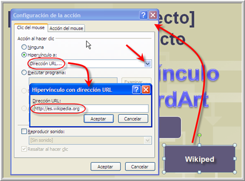
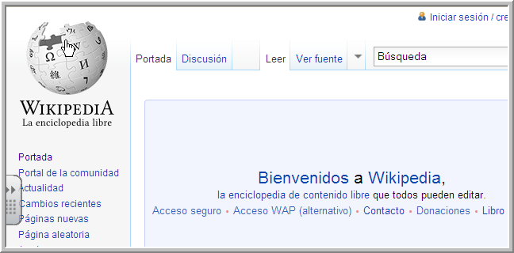
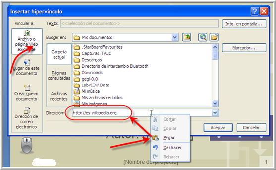
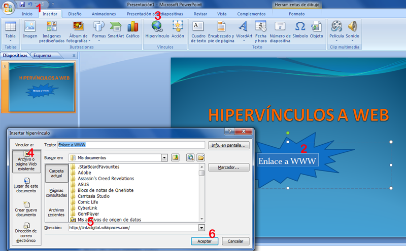
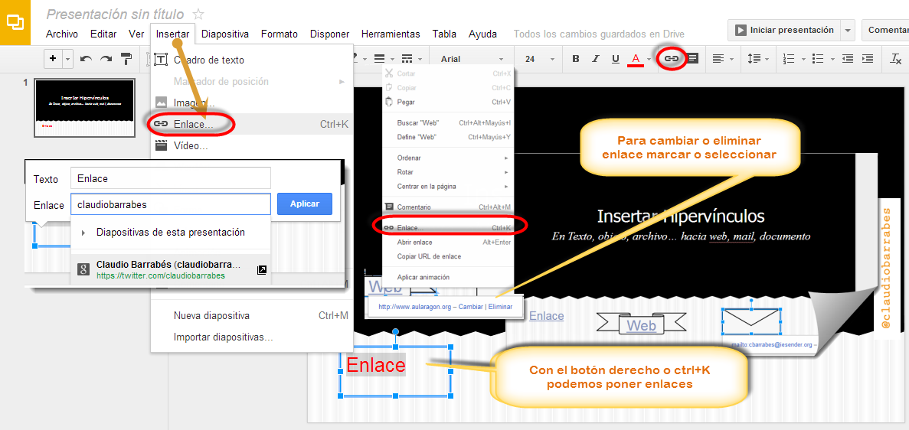
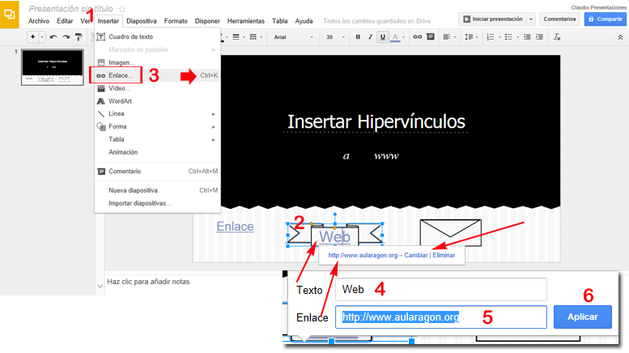

# Hipervínculo a web

#### Normas de estilo

En la realización de la presentación seguro que nos han venido a la cabeza o hemos conocido enlaces interactivos para **obtener o complementar la información**. Resulta elegante, y honesto, que desde nuestro producto final facilitemos el acceso a estos sitios mediante el enlace correspondiente. Es el momento de decidir dónde pondremos los enlaces.

Nuestra recomendación es:

*   que si aluden a una **lista de recursos** o de direcciones, éstos vayan en **una diapositiva aparte**
*   mientras que para **informaciones concretas** y precisas, se haga el enlace **en la diapositiva correspondiente**.

**Hipervínculo a página Web**

Debemos insertar correctamente la dirección web (URL) completo, por ejemplo **http://**www.aularagon.org y probar que el enlace funciona para comprobar que  lo hemos copiado bien.

_En otros programas aconsejamos que el enlace lleve a una página en blanco (abrir en una página nueva **_blank**) si es posible para que nos respete lo que estamos viendo._

Nosotros hemos puesto una página Web, recordemos que también podemos **copiar** del navegador y **pegar** en esta ventana, la dirección Web (**ctrl.+C** y **ctrl. +V**)

Hemos insertado **Formas **> **Botón de acción** sin nada y posteriormente le insertamos el texto. Se nos abre: **Configuración de la acción**, escribimos bien la URL que es la página http://es.wikipedia.org cuidado de escribir bien la dirección **no repetir http://http://** o dejarnos alguna letra el link no funcionaría. Comprobamos si funciona el botón a la www.

 

  Nos hemos dado cuenta que el link está hecho sólo con el botón rectángulo y queremos reforzar, que cuando hagamos la presentación esté también vinculado el texto, lo hacemos como siempre: Seleccionamos -> botón derecho y seleccionamos **Hipervínculo**...  -> **Archivo o página Web existente**, pegando la dirección en **Dirección. **Lo comprobamos desde** Presentación de diapositivas, diapositiva actual, **vemos que el resultado es mejor, todo está vinculado a la Wikipedia.

 

****Hipervínculo a página Web **PowerPoint**

**A tener en cuenta:**

Si queremos hacer vínculos a  Webs,  suelen ser elementos que NO se repiten en todas las diapositivas por lo tanto lo tenemos que hacer **en la vista normal** en las diferentes diapositivas, sobre los diferentes objetos, **y no en la vista patrón**.

Para poner un enlace a una página Web en este programa, debemos ir a la pestaña **1** **Insertar> Hipervínculo 3, **

Marcamos el objeto, o texto a enlazar en nuestro caso hemos puesto un texto, marcamos **página Web existente**, (Enlace a WWW) lo podemos cambiar a la derecha del **4** y nos lo cambiará en la diapositiva.

En nuestro caso hemos ido a un navegador y al encontrar la URL deseada (**Ctrl+C**) y hemos vuelto al programa y sobre el hueco de dirección hemos puesto esto, con (**Ctrl + V**): [http://tintadigital.wikispaces.com/](http://tintadigital.wikispaces.com/) que era la web que nos interesaba a nivel personal, enseñar en la presentación, la pegamos en **Dirección**: (**5**) y pasamos al punto **6** **Aceptar** y ya tenemos nuestro enlace a la página web.

****Hipervínculo a página Web e**n OpenOffice** 

#### Abrir una página web en el navegador web por omisión del ordenador. 

#### Insertar direcciones de páginas Web

1.  Escribir la dirección URL que desee en la línea de entrada para URLs en OpenOffice.org o busque una dirección a través de la función de búsqueda en la barra de hiperenlaces.
2.  Seleccionar  la URL que aparece en la línea de entrada (p.ej. [http://www.sun.com/staroffice](http://www.sun.com/staroffice)). Activar el comando **Editar** -> **Copiar** o pulse  **Ctrl + C**. (En nuestro caso hemos puesto un blog que no necesita www)
3.  Volver a su documento e insertar luego la URL con el comando **Editar** -> **Insertar** o con **Ctrl + V**
4.  ES importante tener en cuenta que  en Nombre, será el texto que nos saldrá vinculado y en nuestro caso www, no enlaza (como texto encima de la nube).
5.  Aplicar para que se grabe el enlace a la web.

****Hipervínculo a página Web en **Drive**

**Insertar un hipervínculo que vaya a una pagina web**

1.- Seleccionamos el texto u objeto de dibujo que deseemos y abrimos el cuadro de dialogo hipervínculo.

2.- Clic en archivo o pagina web existente, debajo de vincular a:

3.- Seleccionar el archivo al que deseas crearle el vínculo.

Manipulación de hipervínculos.

Se puede acceder a las opciones que tiene cada hipervínculo, colocando el Ratón, clic derecho aparecerá un cuadro. Para modificar el hipervínculo

Seleccionamos la opción modificar hipervínculo.

****

Drive sorprende por su simplicidad. Vamos a la pestaña **insertar**\>  **Enlace **marcamos el objeto  o con **ctrl+K**  podemos poner el enlace. Puedo enlazar a una página **web**, sobre un texto objeto...

Veamos que al lado de cambiar el color del texto, también tenemos el símbolo enlace. También puedo forzar su aparición con el botón derecho del ratón.

Una vez puesto el enlace, debajo de mismo me aparece en azul el enlace – **Cambiar** | **Eliminar**

****

****Hipervínculo a página Web en **Keynote**

**Para añadir un hipervínculo que abre una página web:**

1  Seleccionar el texto o el objeto que desee convertir en un hipervínculo. Si escribimos el texto que empieza por “www” o “**http**” (o lo copiamos de otro documento), ese texto se convertirá automáticamente en un hipervínculo. Para desactivar esta opción, seleccione Keynote > Preferencias, haga clic en Autocorrección y anular la selección de la opción “Detectar automática de direcciones web y de correo electrónico”. Este ajuste es específico del ordenador, por lo que si el documento se abre en un ordenador con un ajuste diferente, se utilizará el ajuste de ese ordenador.

2  Clic en Inspector en la barra de herramientas, clic en el botón **“Inspector de hipervínculos”** y seleccionar **“Activar como hipervínculo”.**

3  Seleccionar Página web en el menú local **“Enlazar con”.**

4  Escribir la dirección de la página web en el campo URL.

5  Si deseamos cambiar el texto que se muestra como hipervínculo en el documento, escribir un texto nuevo en el campo Mostrar.

 Añadir un enlace a texto o a un objeto

1.  Con la tecla **Control** pulsada, clic en el **texto seleccionado** o en un **objeto** al que deseemos añadir un enlace y, a continuación, seleccionar **“Añadir enlace”.**
    
2.  Seleccionar una de las opciones del menú desplegable “**Enlazar con**”.
    
    *   **Página web:** enlaza con una página web en el navegador por omisión. Haga clic en Abrir para abrir la página web que ha introducido en el navegador por omisión.
        
3.  Proporcionemos la información requerida (una URL o dirección de correo electrónico, por ejemplo).
    
4.  Clic fuera del cuadro de diálogo para cerrarlo o clic en Abrir para abrir el enlace.
    

