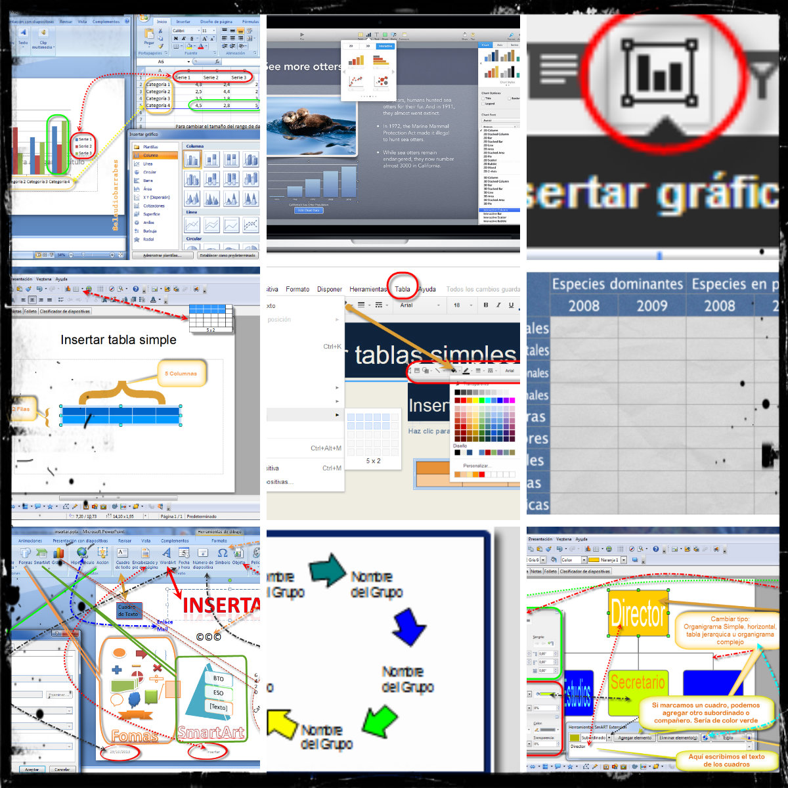

# MÓDULO 2: OBJETOS ESTRUCTURALES

Aprenderemos la inclusión de distintos elementos gráficos en las presentaciones  objetos, tablas, gráficos de datos, organigramas y otros objetos. El módulo 2 se basa en:  
  
**Tablas **  
Se explica cómo se pueden utilizar cierto tipo de objetos en las presentaciones de estos programas, como los objetos o la creación de tablas.   
  
**Gráficos de datos **  
Se explica cómo mostrar de forma gráfica en una diapositiva una serie de datos numéricos, cómo introducirlos y dar formato al gráfico y a sus distintos elementos.   
  
**Organigramas **  
Aplicación de los gráficos SmartArt para mostrar cierto tipo de información de forma esquemática mediante organigramas. También se muestra la forma de insertar o vincular distintos objetos en la presentación. Se aprenderá a instalar un complemento de OpenOffice para desarrollar estos contenidos.

( Fig.2.1.1: C.Barrabés, montaje pantalla captura programa. Collage editado con Pixlr,  [Algunos derechos reservados](http://creativecommons.org/licenses/by-nc-sa/2.0/deed.es "Derechos reservados. Atribución-NoComercial-CompartirIgual 2.0 Genérica (CC BY-NC-SA 2.0)"))

## Objetivos de este módulo 2

Pretendemos con éste módulo preparar una presentación de tarea de clase para que el profesor prepare una propuesta de trabajo con PowerPoint, Impress, Drive o Keynote, que incluya Tablas, Gráficos y Organigramas (Árbol genealógico..., estadísticas, temperaturas, marcas, comparativas de tallas, contenidos de clase...)

Lista de objetivos a alcanzar.

1.  Conocer los conceptos básicos de las presentaciones con PowerPoint, Open Office, Drive y Keynote, en la manipulación de Tablas, Gráficos y Organigramas . 
2.  Practicar presentaciones, con Tablas, Gráficos y Organigramas con diferentes programas.
3.  Conocer las semejanzas, diferencias, ventajas e inconvenientes entre ellos.
4.  Realizar la instalación o registro de las herramientas elegidas para proceder a su conocimiento y la realización de actividades.

