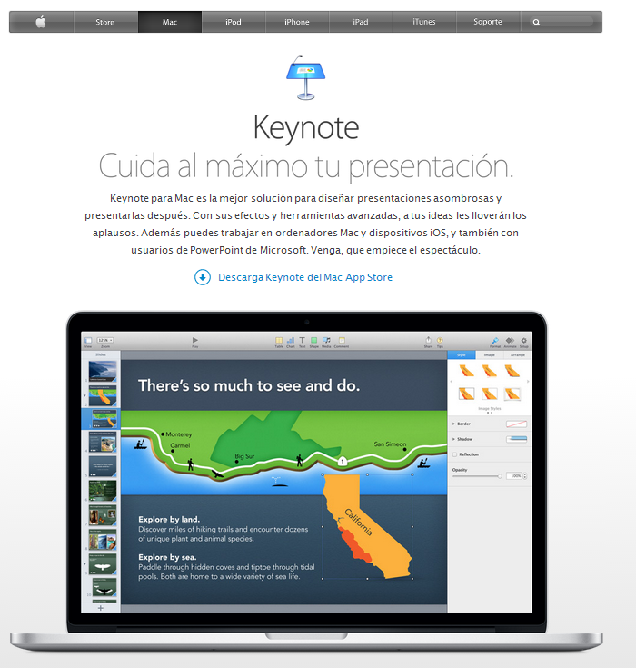

# Keynote

Veamos como descargar e intalar Keynote desde El Mac App Store.

Para descargar Keynote del Mac App Store, necesitamos un Mac con OS X 10.6.6 o posterior. [Más información.](http://www.apple.com/es/mac/app-store/?id=409183694)

[http://www.apple.com/es/mac/keynote/](http://www.apple.com/es/mac/keynote/)

(Fig.1.1.5: C.Barrabés, montaje logos capturados de los diferentes programas,  [Algunos derechos reservados](http://creativecommons.org/licenses/by-nc-sa/2.0/deed.es "Derechos reservados. Atribución-NoComercial-CompartirIgual 2.0 Genérica (CC BY-NC-SA 2.0)"))

