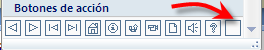
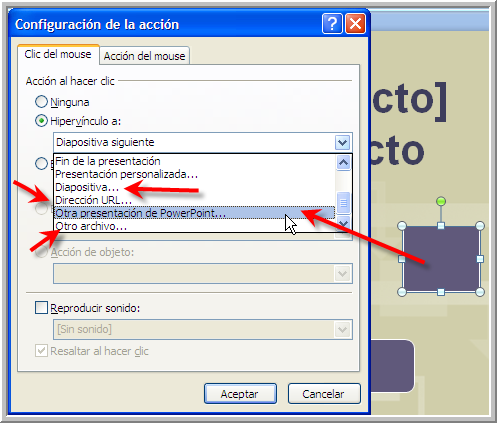
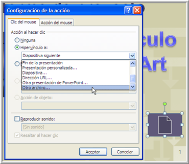
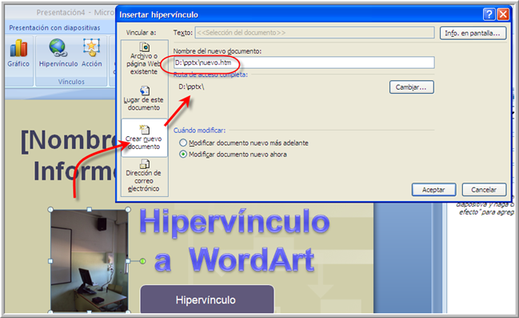
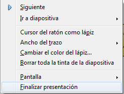
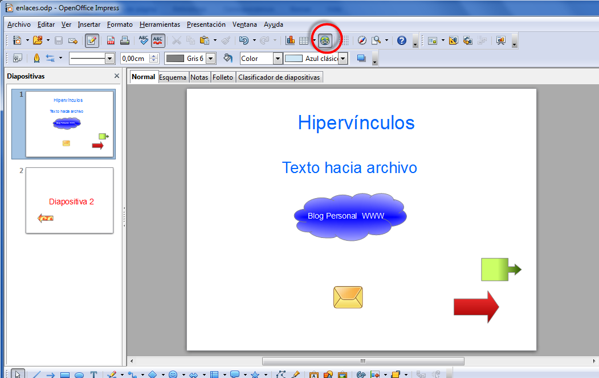

# Más Hipervínculos

Hemos insertado un cuadro de botones de acción desde **insertar** \> **Formas** y hemos elegido en botones de acción el cuadrado

 nos aparece el cuadro botón cuadrado con el color por defecto, al darle con el botón derecho se nos abre un cuadro de dialogo que nos ayudará a crear hipervínculos a: Los diferentes lugares de la propia presentación (otra forma deshacer lo anterior) **Diapositiva, Dirección URL (**_es a una página web www._**),** a **otra presentación** u **otro archivo.** Así de fácil, conseguiremos vincularlo a lo que queramos. También podremos ponerle un sonido al botón de acción sí marcamos el cuadro de **reproducir sonido.**

**Hipervínculo a otro documento con botón (no aconsejable)**

Podemos tener un hipervínculo a un documento Word por ejemplo, y su realización se hace exactamente igual que un hipervínculo a otra presentación.

No es aconsejable, pues nos hemos encontrado que PowerPoint hace RUTAS ABSOLUTAS con lo cual se ve en tú ordenador pero en otro ordenador no se visualiza)

La única diferencia es que si es a través de un botón sin icono, en vez de elegir _Otra presentación_ hay que elegir **_Otro archivo_**

_**Ver gráfico**_  Nos abre ottra ventana y lo único que debemos hacer es seleccionar otro archivo. Recordar la misma carpeta hay que tener las mismas precauciones que hemos comentado antes de usar una carpeta para todo el proyecto y de esa forma evitaremos sorpresas y problemas de rutas.

**Hipervínculo imagen o wordArt: Crear un nuevo documento**

Si en vez de ser un botón queremos que sea otro objeto, por ejemplo una imagen, simplemente con el botón derecho, seleccionamos **Hipervínculo** en la figura se ha seleccionado un texto en WordArt y una foto.

Si elegimos hipervínculo a **Crear nuevo documento, nos crea un nuevo documento,** si no le ponemos extensión le pone por defecto .htm de página web.

### OpenOffice

#### Salir del pase de diapositivas.

Siempre podemos apretar botón derecho y buscar el final de la presentación.

Pero si lo deseamos podemos poner un botón en todas las diapositivas para mandar la presentación a la última diapositiva.

