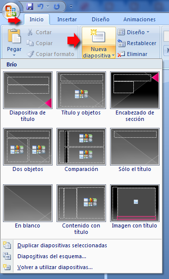
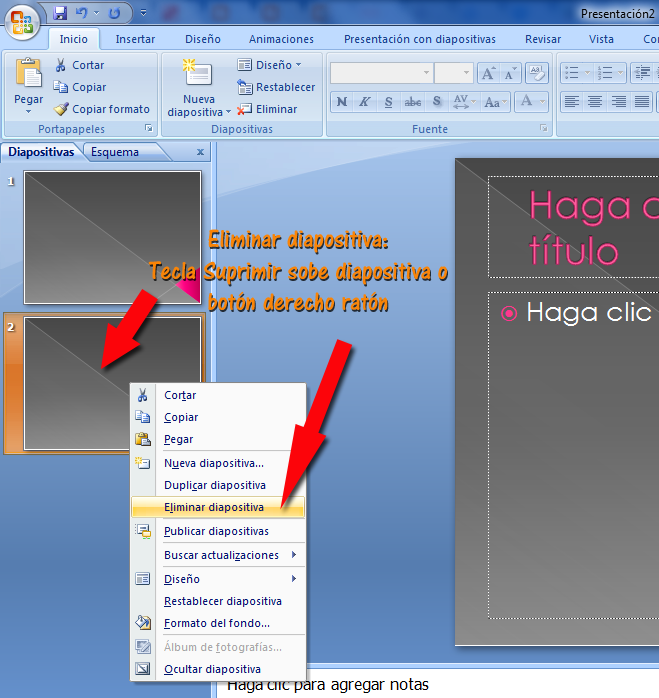
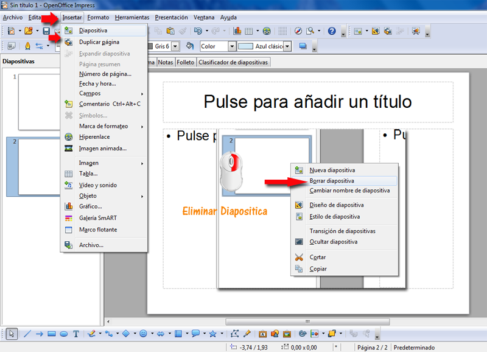
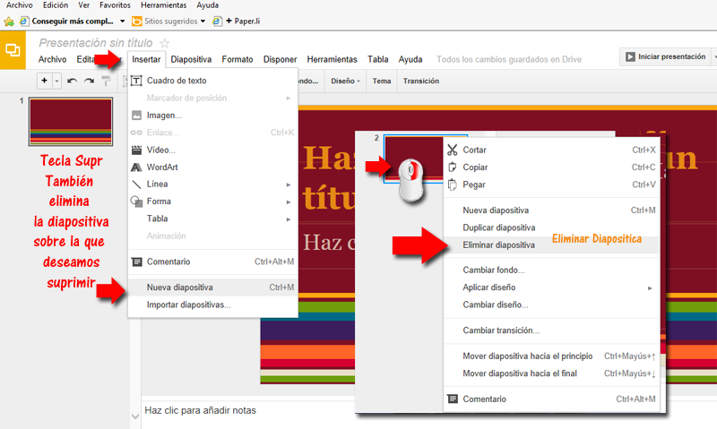

# Nueva diapositiva

**1.5.1.1 En PowerPoint**

**Insertar y definir el diseño**

Evidentemente ya en el menú de la barra de herramientas de **Inicio** tenemos un botón que nos indica insertar una **nueva diapositiva**, tenemos dos formas de insertar una nueva diapositiva:

1.  Respetando el mismo diseño que la diapositiva anterior
2.  Definiendo otro diseño

Los diseños lo trataremos en la [Unidad 9](u9_diseo.html), según donde hagamos click en el botón (en la parte superior o en la inferior) estamos eligiendo una de las dos opciones:

( Fig.1.5.1.1: C.Barrabés, montaje pantalla captura programa,  [Algunos derechos reservados](http://creativecommons.org/licenses/by-nc-sa/2.0/deed.es "Derechos reservados. Atribución-NoComercial-CompartirIgual 2.0 Genérica (CC BY-NC-SA 2.0)"))

**Eliminar**

Si queremos eliminar una diapositiva enseguida que la hemos insertado podemos hacer un ctrl+ Z o deshacer. 

Nos podemos poner en vista normal o clasificador de diapositivas, nos ponemos encima y le damos clic a la tecla **Supr.**

También si nos ponemos sobre la diapositiva, botón derecho y elimina diapositiva.

( Fig.1.5.1.2: C.Barrabés, montaje pantalla captura programa,  [Algunos derechos reservados](http://creativecommons.org/licenses/by-nc-sa/2.0/deed.es "Derechos reservados. Atribución-NoComercial-CompartirIgual 2.0 Genérica (CC BY-NC-SA 2.0)"))

**1.5.1.2 En Open Office**

Se realiza de forma muy similar al anterior ver gráfico:

 

( Fig.1.5.1.3: C.Barrabés, montaje pantalla captura programa,  [Algunos derechos reservados](http://creativecommons.org/licenses/by-nc-sa/2.0/deed.es "Derechos reservados. Atribución-NoComercial-CompartirIgual 2.0 Genérica (CC BY-NC-SA 2.0)"))

**1.5.1.3. En Drive**

**Insertar**

**Ctrl + M** o Insertar --> Nueva diapositiva.

**Eliminar**

Se hace igual, nos ponemos sobre la diapositiva que deseamos eliminar**, botón derecho Borrar diapositiva.**

****

( Fig.1.5.1.4: C.Barrabés, montaje pantalla captura programa,  [Algunos derechos reservados](http://creativecommons.org/licenses/by-nc-sa/2.0/deed.es "Derechos reservados. Atribución-NoComercial-CompartirIgual 2.0 Genérica (CC BY-NC-SA 2.0)"))

**1.5.1.4. En Kynote**

[Aquí](https://support.apple.com/kb/PH16922?locale=es_ES&viewlocale=es_ES) tienes toda la información al respecto, en la web oficial de soporte de Apple.

