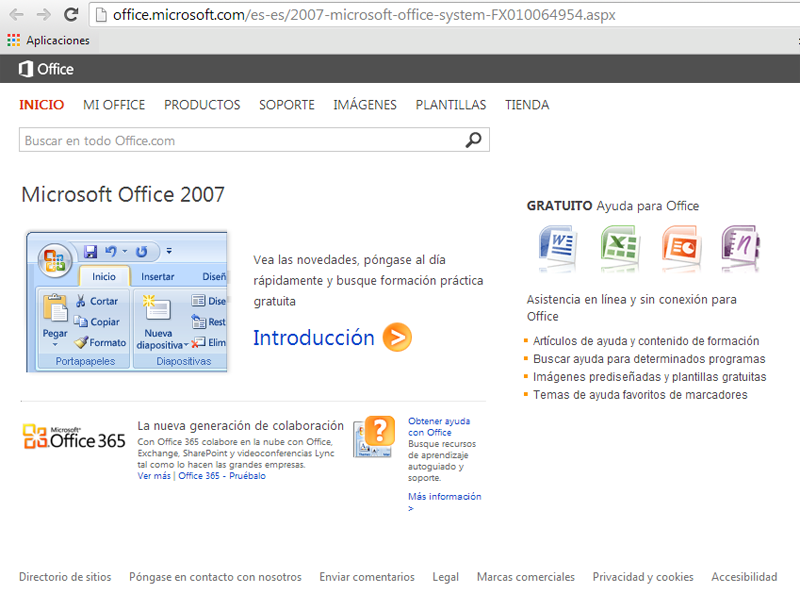
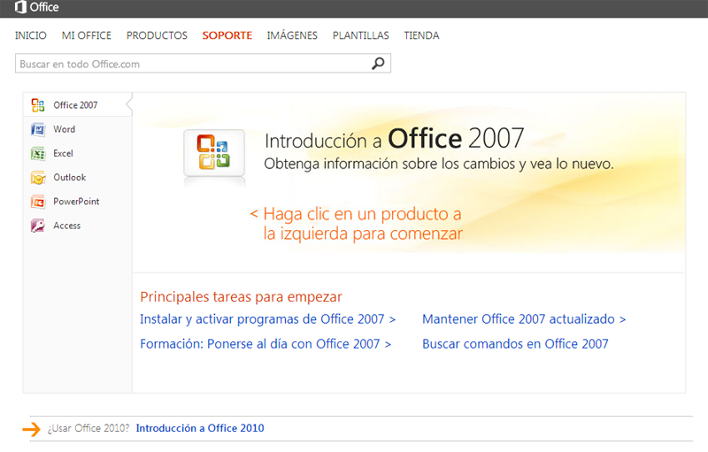
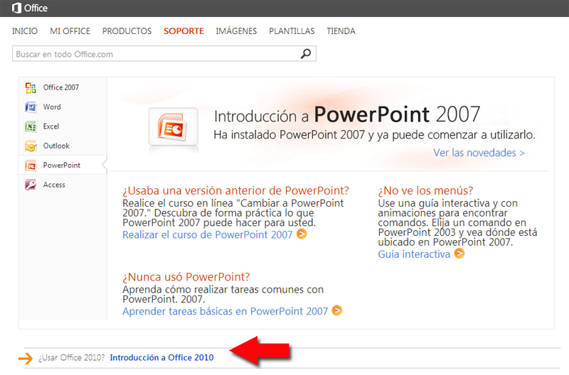
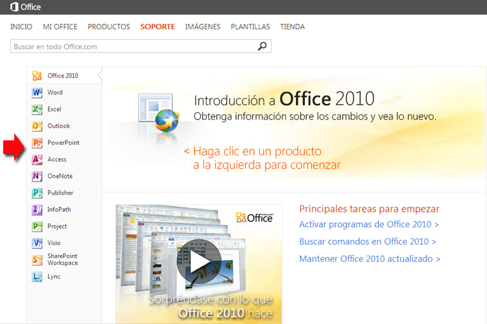

# Office OnLine

## Nota

Nuestra experiencia nos dice que para utilizar el Office OnLine es mejor **Google Drive** que lo veremos más adelante, pero añadimos estos contenidos para mostrar que Microsoft sigue el mismo camino.

Debido a que es mejor Drive, estos contenidos **SON OPTATIVOS** y no se exige Office OnLine en las tareas.

## Office OnLine

Si entramos en la [Web](http://office.microsoft.com/es-es/2007-microsoft-office-system-FX010064954.aspx) que nos informan de las novedades del programa, y nos ofrecen, la nueva generación de colaboración Con Office 365 colabore en la nube con Office, Exchange, SharePoint y videoconferencias Lync. [Ver más](http://office.microsoft.com/es-es/redir/XT102843340.aspx) | [Office 365 - Pruébalo](http://office.microsoft.com/es-es/redir/XT102857483.aspx) vemos la siguiente pantalla:

##### Planes y precios de Office 365 Ámbito educativo. Ver Web: **[http://office.microsoft.com/es-es/academic/comparar-planes-de-office-365-academico-FX103045755.aspx](http://office.microsoft.com/es-es/academic/comparar-planes-de-office-365-academico-FX103045755.aspx "Office 365")**

 Entrando en la sección de la i[ntroducción de esta web](http://office.microsoft.com/es-es/support/introduccion-a-microsoft-office-2007-FX010105508.aspx), nos encontramos con las novedades del Office 2007:

Y si entramos en la [sección de PowerPoint](http://office.microsoft.com/es-es/powerpoint-help/obtener-ayuda-plantillas-cursos-y-contenido-adicional-en-linea-HP010047453.aspx) (a mano izquierda de la pantalla principal) nos encontramos con:

**Con Office 2010 aparece Office Web Apps**

Office Web Apps nos permite crear y compartir documentos de Word, libros de Excel, presentaciones de **PowerPoint** y blocs de notas de OneNote en línea en el explorador web. Con quien compartamos podrá abrir estos documentos en su explorador. En lugar de enviar datos adjuntos por correo electrónico, [envíar un vínculo](http://office.microsoft.com/es-es/web-apps-help/redir/HA101820121.aspx?CTT=5&origin=HA101785172) al documento en línea.

