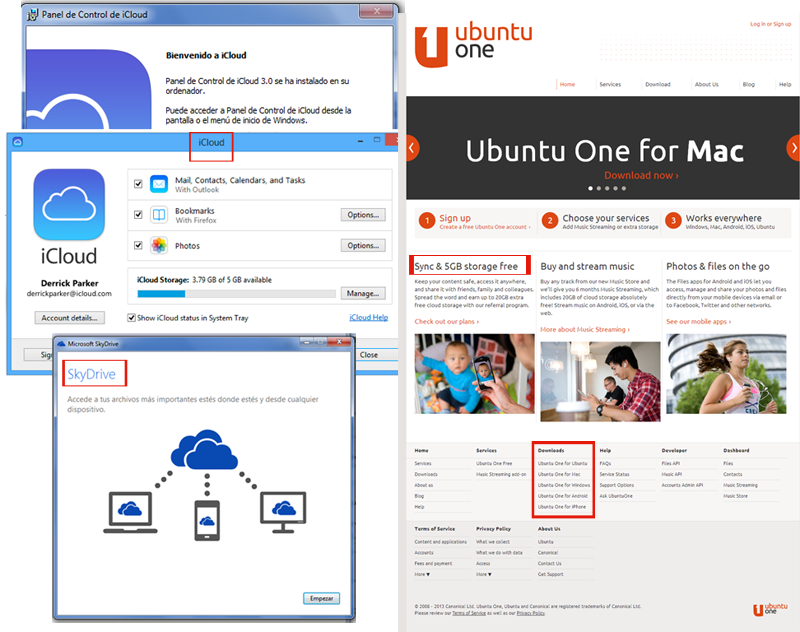

# Para saber más

1.  Otros métodos de subir documentos a la nube:
    1.  Windows tiene su espacio en [SkyDrive](https://skydrive.live.com/‎ "SkyDrive") (7Gb de espacio)
    2.  **Ubuntu One** es un servicio de alojamiento de archivos, integrado con el [entorno de escritorio](http://es.wikipedia.org/wiki/Entorno_de_escritorio "Entorno de escritorio") del sistema operativo [Ubuntu](http://es.wikipedia.org/wiki/Ubuntu "Ubuntu"), enfocado a la copia de seguridad y a la sincronización de archivos e información entre ordenadores conectados a Internet. Para Ubuntu, Mac, [Windows](https://one.ubuntu.com/downloads/windows/ "Ubuntu One par Windows"), Android, Iphone [https://one.ubuntu.com/](https://one.ubuntu.com/) (5GB libres)
    3.  **iCloud** es un [sistema de almacenamiento nube](http://es.wikipedia.org/wiki/Servicio_de_alojamiento_de_archivos "Servicio de alojamiento de archivos") o _[cloud computing](http://es.wikipedia.org/wiki/Computaci%C3%B3n_en_la_nube "Computación en la nube")_ de Apple Inc.. _[http://www.apple.com/la/icloud/](http://www.apple.com/la/icloud/) (Lo podemos descargar para windows: ([http://www.apple.com/la/icloud/setup/pc.html](http://www.apple.com/la/icloud/setup/pc.html "Icloud"))_ (5GB)
2.  Para mejorar tus presentaciones
    1.  Consejos para hacer una buena presentación. [Ver ampliación](http://claudiobarrabes.blogspot.com/2013/12/consejos-para-hacer-una-buena.html)
    2.  Más recursos en: [http://tintadigital.wikispaces.com/](http://tintadigital.wikispaces.com/)

