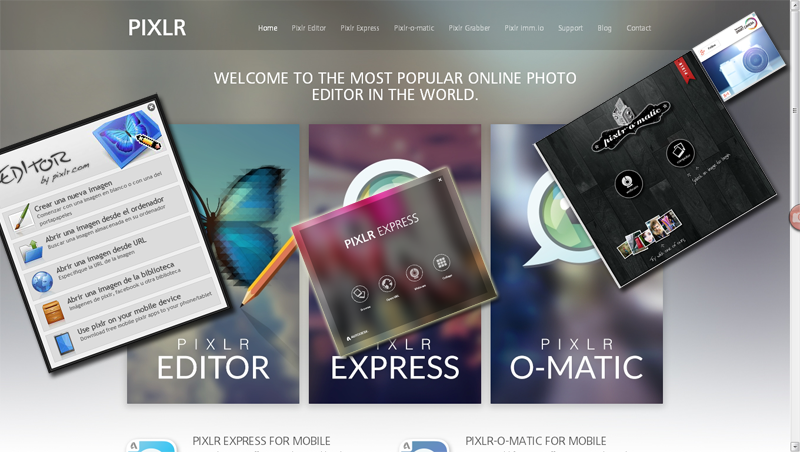
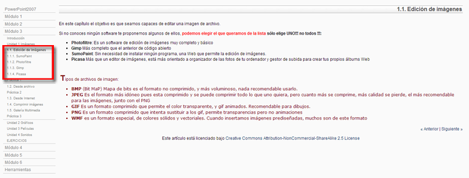

# Para Saber más

**Edición de Imágenes PIXLR**

Una de las tareas más habituales para adecuar nuestras imágenes y usarlas en nuestras presentaciones en Internet es realizar pequeños ajustes a imágenes o fotografías.

Recomendamos un programa On line de retoque de imagen, se llama PIXLR [http://pixlr.com](http://pixlr.com/ "Retoque de imagen Online"). [**Pixlr**](http://pixlr.com/ "Pixlr") es una herramienta de edición de imágenes **online y gratuita**, que puede utilizarse desde cualquier navegador que disponga de la tecnología **Flash**.

Cuenta con aplicaciones para [**iOS**](https://itunes.apple.com/app/pixlr-express-plus/id526783584?mt=8 "Pixlr Express para iOS") y [**Android**](https://play.google.com/store/apps/details?id=com.pixlr.express "Pixlr Express para Android en Google Play") lo que permite utilizarla desde prácticamente cualquier dispositivo actual.

**No es necesario realizar ningún tipo registro**, aunque si lo hacemos tendremos posibilidad de guardar nuestras imágenes en la nube.

Tiene para compartir nuestras imágenes **[imm.io](http://imm.io/ "imm.io").**  

[**Grabber**](http://pixlr.com/grabber "Grabber"), una extensión para FireFox y Chrome, que nos permite realizar capturas de pantalla.

[**Pixlr-o-matic**](http://pixlr.com/o-matic/ "Pixlr-o-matic"). La más sencilla de las 3, **intuitiva**, funciona como Instagram , podemos realizar ajustes sencillos y aplicar muchos de filtros a nuestras fotografías.

[**Pixlr express**](http://pixlr.com/express/ "Pixlr Express"). También fácil de usar, permite añadir efectos, marcos, textos y pegatinas componer posters utilizando varias imágenes. Ideal para diseñar carteles sencillos utilizando como base una fotografía.

[**Pixlr editor**](http://pixlr.com/editor/ "Pixlr Editor").  Disponible  **Español. **Interfaz que imita la de Photoshop más sencilla, tiene herramientas de dibujo, filtros capas, efectos de capa,  transparencias… .Es la más avanzada de las herramientas que componen el programa.

Colgaremos un manual en nuestro [Blog](claudiobarrabes.blogspot.com.es "Blog del Autor Curso")

 Existen multitud de programas que permiten, con más o menos posibilidades, editarlas o crearlas desde cero. Desde el profesional [**PhotoShop**](http://www.adobe.com/es/products/photoshop.html "PhotoShop"), pasando por Picasa, [**Gimp**](http://www.gimp.org/ "Gimp"), [**Paint.NET**](http://www.getpaint.net/ "Paint.NET"), o incluso [**PhotoScape**](http://www.photoscape.org/ps/main/index.php?lc=es "PhotoScape").

**Redimensionar imágenes por lotes**

*   **XnConvert**  es un programa en español, gratis y  muy útil para convertir imágenes entre formatos, o hacer algunos ajustes a varias imágenes, incluso a una sola, y desean hacerlas por lotes. De [Xnview](http://cajondesastres.wordpress.com/2009/12/07/visor-y-conversor-de-imagenes-gratuito-xnview/).  
    
*   **Fotosizer** otro similar ver  [el enlace del programa](http://www.fotosizer.com/).
*   **Image Tools**: Sitio Web: [Image Tools](http://union-d.ru/dev/node/6). Descarga [Image Tools](http://union-d.ru/downloads/imagetools-3.6.zip) (portable)
    
*   **BIMP Lite** Batch Image Processor es una herramienta preparada para aplicar diferentes operaciones a nuestras imágenes y de forma simultánea. Puede usarse para crear miniaturas, añadir sufijos o prefijos, renombrar utilizando número secuencial, sustituir o eliminar espacios, rotarlas, incluir texto… La opción redimensionar permite forzar el ancho y el alto especificado y mantener las proporciones. Además puede convertir entre formatos GIF, JPG, PNG, BMP, MIFF, TIFF, PCX o TGA. Incluye cliente FTP Web autor de descarga: [http://www.files.cerebralsynergy.com/BIMPLite.exe](http://www.files.cerebralsynergy.com/BIMPLite.exe)
    
      
    

**MUY IMPORTANTE:**Cuidado con las webs de descarga de programas, nos instalan una aplicación para descargar el programa que quizás lleve alguna sorpresa. Si aceptamos, es posible que nos encontremos con la **suscripción **a boletín de noticias de esa página, al aceptar sus cookies, permitimos en algunos casos que sepan nuestra IP  y algunos datos más, la instalación de **toolbar **si no hemos desmarcado las pestañas para que no lo haga. Por eso, nuestro consejo es BUSCAR LA PÁGINA DE AUTOR del programa. Tras la descarga pasar el antivirus (recomendamos tener un buen antivirus), siempre a algo que hemos descargado de Internet. Corremos el peligro que nuestra máquina se ralentice y debamos limpiar o desinstalar todo lo que no queramos, con la perdida de tiempo que nos va a suponer.

## **Compartirla y subirla a la nube**

**Flickr **

Si queremos compartirlas y que nos las comenten las podemos subir a Flickr [http://www.flickr.com/](http://www.flickr.com/ "Flickr ") (1 Terabyte de espacio, con publicidad, pero la propiedad de las imágenes son nuestras. No como otros, Facebook.... etc.) También podemos jugar con permisos de visualización privado, público. Los cambios se hacen en Información adicional.

Podemos tener una cuenta, con nuestra cuenta facebook, google o un mail de yahoo.

**500 píxels**

Otra similar es:

[http://500px.com/?lang=es](http://500px.com/?lang=es)

Upload, share, and discover inspiring photos. Subir, compartir y descubrir fotos inspiradoras.

Para saber más veamos los links:

 [Retoque de imagen básico](http://claudiobarrabes.blogspot.com.es/2013/12/retoque-de-imagen-basico.html "Retoque de imagen básico")

Del curso PowerPoint 2007 realizado junto con Javier Quintana.

