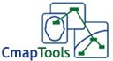

# Para saber más

## ParaSaberMas

**Otros Programas:**

Hay otros curso en aularagón que habla de mapas conceptuales.

En Internet, se pueden encontrar muchos programas para Aprendizaje Visual (mapas conceptuales, líneas de tiempo, diagramas de causa-efecto...)

*   **Cmap Tools** (Español) [http://cmap.ihmc.us/](http://cmap.ihmc.us/)

*   **Inspiration** (Español) [http://www.inspiration.com/espanol/](http://www.inspiration.com/espanol/)

Recordar que tenemos el programa Kidinspiratión en todos los centros de primaria de Aragón, se compró licencia hace unos años con el proyecto Ramón y Cajal.

[http://www.eduteka.org/modulos/4/114/](http://www.eduteka.org/modulos/4/114/)

*   **Creategraph**: 
    
    Los gráficos o diagramas pueden ayudar a impresionar a la audiencia  de una manera rápida y visual.
    
    Aquí encontraremos cinco gráficos y tablas diferentes para elegir.
    
    *   ¿No estoy seguro de qué gráfico de usar? ¿Confundido entre gráficos de barras y gráficos circulares? En la web también existe un manual para usarlo.
        
        [http://nces.ed.gov/nceskids/createagraph/default.aspx](http://nces.ed.gov/nceskids/createagraph/default.aspx)
    
*   Otras herramientas para elaborar gráficas: [http://www.eduteka.org/modulos/8/256/2114/1](http://www.eduteka.org/modulos/8/256/2114/1)
*   Gráficas Matemáticas:
    *   [http://fooplot.com](http://fooplot.com)
    *   [http://graph.uptodown.com/](http://graph.uptodown.com/)sencilla herramienta matemática que nos ayuda a llevar funciones al plano visual, pudiendo realizar distintas operaciones de edición sobre esa misma gráfica resultante.
*   El **diagrama de Gantt** es una popular herramienta gráfica cuyo objetivo es mostrar el tiempo de dedicación previsto para diferentes tareas o actividades a lo largo de un tiempo total determinado. [http://www.tomsplanner.es/](http://www.tomsplanner.es/)

 [**Visitar Tinta Digital Viki**](http://tintadigital.wikispaces.com/ "Más programas")

