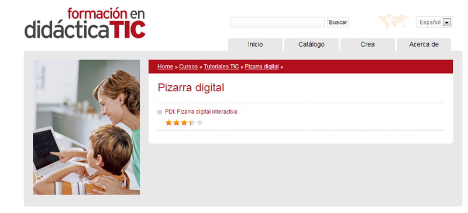

# Para saber más

## ParaSaberMas

**Protocolo de uso de las PDI**

[http://www.catedu.es/Escuela20\_Primaria/images/documentos/protocolo\_uso_pdis.pdf](http://www.catedu.es/Escuela20_Primaria/images/documentos/protocolo_uso_pdis.pdf)

**Pizarra Digital**

¿Y me pregunta mi amigo Javier Quintana por qué la PDI?

En nuestros centros, va unido el monitor, el vídeo proyector y la PDI

Nuestras presentaciones las lanzamos a través de este montaje, y es necesario saber como funciona, si no nuestra presentación no tendrá éxito.

**Truco:**

La Hitachi trio, que funcionan con el dedo, a veces se queda polvo en el borde de la pizarra y no conecta bien, si pasamos un paño y limpiamos el polvo de tiza y puede funcionar.

Otra cosa interesante es **calibrarla**: 

1\. Seleccione StarBoard - Calibrar en el menú Configuración.

Se mostrará el cuadro de diálogo Calibración.

**[Manual Starborad. Software PDI Hitachi dúo](https://docs.google.com/file/d/0BxjFf-4XynYsY2xicFhkcE1NaE0/edit?usp=sharing) **(Si necesitamos manejar o instalar en nuestra máquina, el programa de la PDI, para preparar materiales, presentaciones con el mismo formato de la PDI de nuestras clases)

