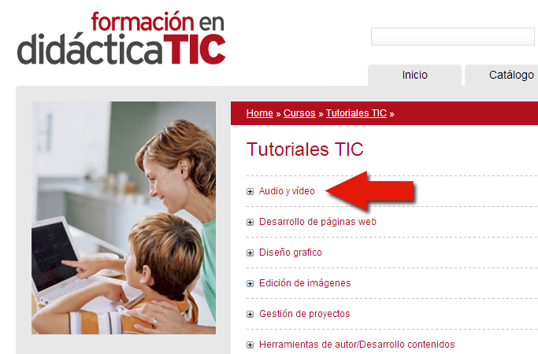

# Para saber más: Grabar, editar sonido y vídeo

## ParaSaberMas

Os dejamos unos enlaces para que editéis o grabéis vuestros multimedias.

## Audio y vídeo

*   [Audacity: grabación y edición de sonidos.](http://didacticatic.educacontic.es/curso/audio-y-video/audacity-grabacion-y-edicion-de-sonidos)
    
*   [Kino: edición de vídeo.](http://didacticatic.educacontic.es/curso/audio-y-video/kino-edicion-de-video)
    
*   [Galerías de vídeo: clips de vídeo en la red](http://didacticatic.educacontic.es/curso/audio-y-video/galerias-de-video-clips-de-video-en-la-red)
    
*   [Windows Movie Maker: Creación de vídeos](http://didacticatic.educacontic.es/curso/audio-y-video/windows-movie-maker-creacion-de-videos)
    
*   [Galerías fotográficas: banco de imágenes](http://didacticatic.educacontic.es/curso/audio-y-video/galerias-fotograficas-banco-de-imagenes)
    
*   [Soundation ](http://soundation.com/)es un editor musical on-line que nos permite mezclar música, descargarla y publicarla en nuestro blog.
*   Divertido compositor musical de [incredibox](http://www.incredibox.fr/en/#/application)
*   [Ivoox](http://www.ivoox.com/) nuestras emisiones de radio en su audioKiosco y embebíamos las emisiones en nuestro blog
*   Radio en internet [free stream hosting](http://freestreamhosting.org/features.php)

Si estamos muy interesaros podemos ver alguna información más extensa en otros curso de aularagón.

[Multimedia: Vídeo y sonido ](http://www.aularagon.org/aula/bienvenida.asp?id=0&titulo_ut=&externa=&ult_ut=0&idL=1 "Curso Aularagon")

[http://didacticatic.educacontic.es/cursos/tutoriales-tic](http://didacticatic.educacontic.es/cursos/tutoriales-tic)

