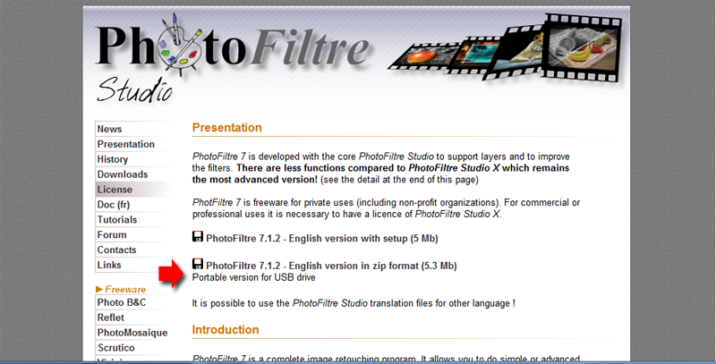
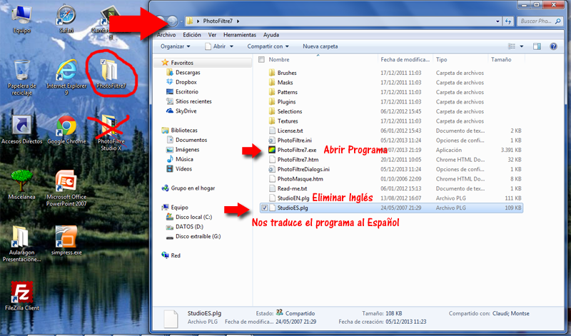

# PhotoFiltre

**Instalar PhotoFiltre**

Por coordinación con el Curso de Retoque de imagen de Aularagón, vamos a utilizar el programa PhotoFilter en su versión 7.

Podéis descargar el archivo portable desde: [http://www.photofiltre-studio.com/pf7-en.htm](http://www.photofiltre-studio.com/pf7-en.htm "Photofiltre") y elijo el portable, para no tener que instalarlo.

Os bajará un .Zip de unos 5.3 megas que se almacenará en la carpeta de descargas que tenga configurado nuestro navegador (si tenemos activo el antivirus se habrá analizado a la vez que se descargaba).

**Ahora lo pasamos al Español:**

Descargamos en parche español [Spanish / Español / Espagnol](http://static.infomaniak.ch/photofiltre/utils/StudioES.zip)

Baja el siguiente archivo (**studioEs**) y copiarlo en la carpeta donde tenemos el photofiltre, **elimina el archivo studioEN.plg** y sólo dejamos el **studioES.plg**

Si dejamos los dos nos lo abre en inglés.  
  
Y listo, ahora queda en español. 

Cuidado no descargar el PhotoFiltreStudio X sólo nos durará 30 días.

 

