# Power Point

## ATENCIÓN

Sólo mostramos la instalación del OFFICE 2007 (Es el que tenemos instalados en los minis, tablet PC de los centros.)

La instalación de otras versiones de Power Point es parecido.

**Instalación**

Tenemos que comprobar que nuestro equipo reúne los [requisitos mínimos](http://office.microsoft.com/es-es/powerpoint-help/requisitos-de-la-version-2007-microsoft-office-system-HA010166865.aspx?CTT=1#BM17) para instalar el PowerPoint 2007

Luego es necesario el DVD de instalación del Office 2007, lo insertamos y si no arranca automáticamente el programa de instalación, examinamos el DVD, y hacemos doble click en el archivo **_setup_**:

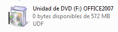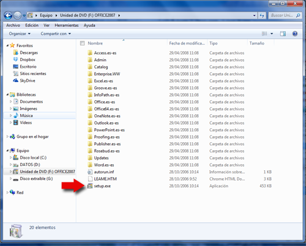

 (Fig.1.1.1: C.Barrabés,montaje captura antes de la instalación programa,  [Algunos derechos reservados](http://creativecommons.org/licenses/by-nc-sa/2.0/deed.es "Derechos reservados. Atribución-NoComercial-CompartirIgual 2.0 Genérica (CC BY-NC-SA 2.0)"))

Al ejecutarlo, nos pedirá la clave de instalación que son 25 caracteres alfanuméricos.

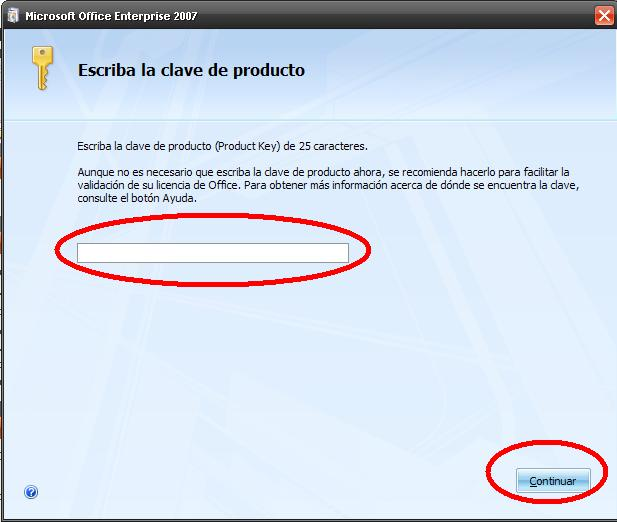

 (Fig.1.1.2: J.Quintana, montaje captura durante la instalación programa,  [Algunos derechos reservados](http://creativecommons.org/licenses/by-nc-sa/2.0/deed.es "Derechos reservados. Atribución-NoComercial-CompartirIgual 2.0 Genérica (CC BY-NC-SA 2.0)"))

Si la clave es correcta, nos saldrá la aceptación de las condiciones de la licencia.

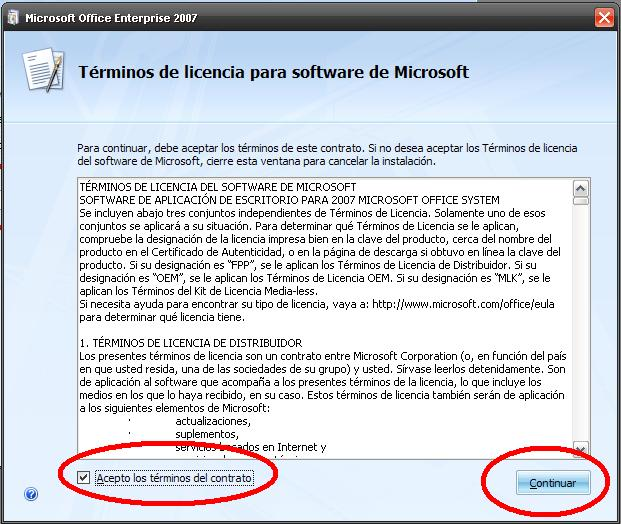

 (Fig.1.1.3: J. Quintana, montaje captura durante la instalación programa,  [Algunos derechos reservados](http://creativecommons.org/licenses/by-nc-sa/2.0/deed.es "Derechos reservados. Atribución-NoComercial-CompartirIgual 2.0 Genérica (CC BY-NC-SA 2.0)"))

**Si ya tenemos instalado** **el Office 2003** **en el ordenador** nos aparecerá la siguiente pantalla preguntando si queremos actualizar nuestro ordenador o entrar en opciones avanzadas.

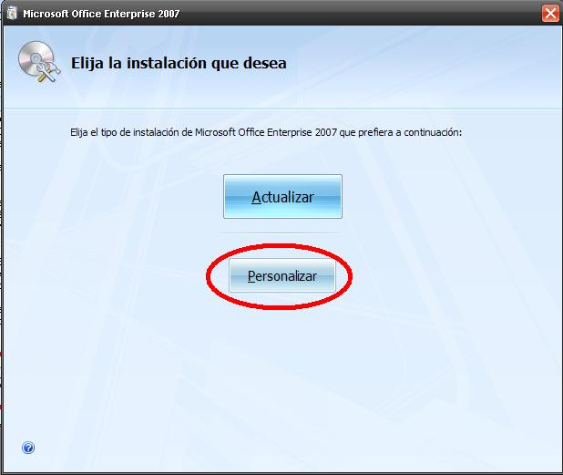

  (Fig.1.1.3: J. Quintana, montaje captura durante la instalación programa,  [Algunos derechos reservados](http://creativecommons.org/licenses/by-nc-sa/2.0/deed.es "Derechos reservados. Atribución-NoComercial-CompartirIgual 2.0 Genérica (CC BY-NC-SA 2.0)"))

Podríamos elegir la primera opción, pero como somos muy atrevidos, utilizaremos Personalizar, y nos sale las siguientes pantallas:

**En la pestaña Actualizar,** podríamos conservar las versiones anteriores del 2003 pero nuestro consejo es dar el paso definitivo y acostumbrarnos a la nueva versión.

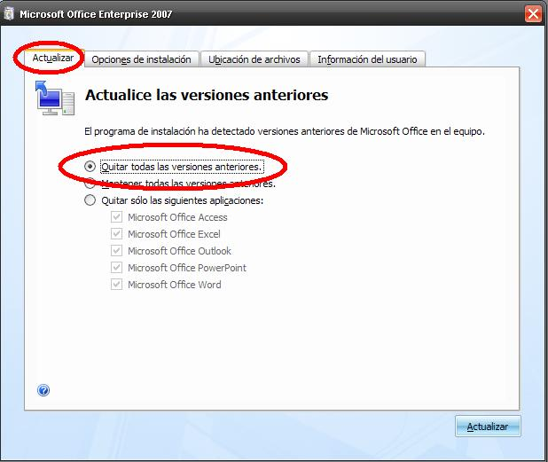

 (Fig.1.1.4: J. Quintana, montaje captura durante la instalación programa,  [Algunos derechos reservados](http://creativecommons.org/licenses/by-nc-sa/2.0/deed.es "Derechos reservados. Atribución-NoComercial-CompartirIgual 2.0 Genérica (CC BY-NC-SA 2.0)"))

**En la pestaña Opciones de Instalación,** nos pregunta por los programas a instalar, evidentemente el importante para este curso es el POWER POINT pero PARA SEGUIR EL CURSO ES NECESARIO EL WORD (ejercicios de exportación Word-Power Point) Y EL EXCELL (para los gráficos en Power Point).

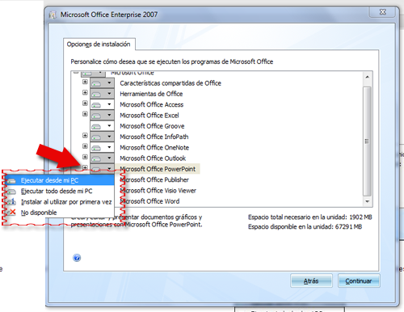

 (Fig.1.1.5: C. Barrabés, montaje captura durante la instalación programa,  [Algunos derechos reservados](http://creativecommons.org/licenses/by-nc-sa/2.0/deed.es "Derechos reservados. Atribución-NoComercial-CompartirIgual 2.0 Genérica (CC BY-NC-SA 2.0)"))

De cada uno de los programas o ítems (subprogramas al ir desplegando el árbol en diferentes ramas) tenemos varias opciones:

1.  **Ejecutar desde mi PC**: el programa se instala con las opciones elegidas (es decir si desplegamos el árbol podemos elegir los subprogramas que deseamos instalar).
2.  **Ejecutar todo desde mi PC:** el programa se instala con todas las opciones.
3.  **Instalar al utilizar por primera vez**: no lo instala, pero se graba en el ordenador el archivo de instalación por si en un momento dado necesitas el programa, entonces lo instala.
4.  **No disponible**: no instalar este ítem.

Elegimos a primera opción, con las opciones por defecto del Power Point nos vale para nuestros objetivos.

**En la pestaña Ubicación de archivos,** tenemos la opción de instalar el Office en otro disco duro. RECUERDA QUE SI TIENES EL DISCO DURO CONGELADO TIENES QUE DESCONGELARLO PREVIAMENTE ANTES DE INSTALAR EL OFFICE.

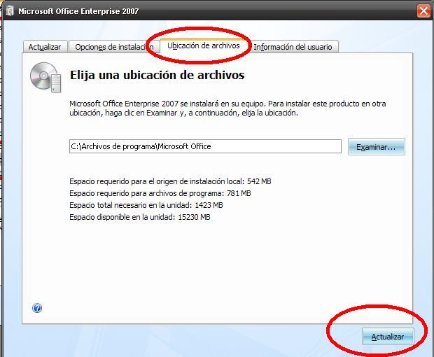

  (Fig.1.1.6: J. Quintana, montaje captura durante la instalación programa,  [Algunos derechos reservados](http://creativecommons.org/licenses/by-nc-sa/2.0/deed.es "Derechos reservados. Atribución-NoComercial-CompartirIgual 2.0 Genérica (CC BY-NC-SA 2.0)"))

Le damos al botón Actualizar y se irá copiando e instalando el Office 2007 la velocidad dependerá de tu sistema ([Requisitos mínimos](http://office.microsoft.com/es-es/powerpoint-help/requisitos-de-la-version-2007-microsoft-office-system-HA010166865.aspx?CTT=1#BM17))

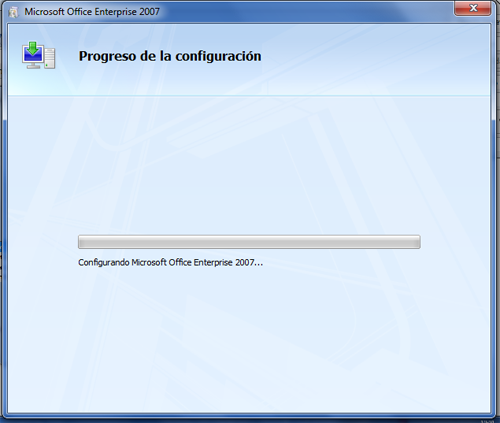

(Fig.1.1.7: C. Barrabés, montaje captura durante la instalación programa,  [Algunos derechos reservados](http://creativecommons.org/licenses/by-nc-sa/2.0/deed.es "Derechos reservados. Atribución-NoComercial-CompartirIgual 2.0 Genérica (CC BY-NC-SA 2.0)"))

Finalmente nos saldrá una ventana donde nos invita a conectarnos con Office Online ([ver sección](office_online.html))

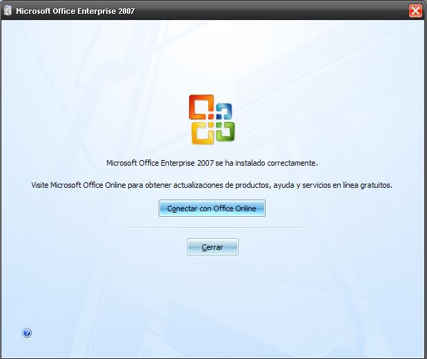

 (Fig.1.1.4: J. Quintana, montaje captura durante la instalación programa,  [Algunos derechos reservados](http://creativecommons.org/licenses/by-nc-sa/2.0/deed.es "Derechos reservados. Atribución-NoComercial-CompartirIgual 2.0 Genérica (CC BY-NC-SA 2.0)"))

O si lo teníamos instalado:

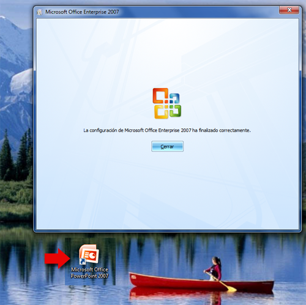

(Fig.1.1.4: C. Barrabés, montaje captura durante la instalación programa, [Algunos derechos reservados](http://creativecommons.org/licenses/by-nc-sa/2.0/deed.es "Derechos reservados. Atribución-NoComercial-CompartirIgual 2.0 Genérica (CC BY-NC-SA 2.0)"))

y finalmente, se es una **reinstalación** nos crea un nuevo acceso directo y si es una instalación **nueva** nos pide reiniciar el ordenador, indispensable para que nuestro office 2007 se ejecute correctamente.

