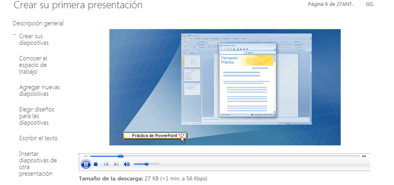

# Práctica

## Actividad

Vamos a ir a superar un reto con un ejercicio de la web.

Es posible que nos pida que instalemos Windows Media Player. 

Sigamos los pasos y podremos realizar la práctica

se puede instalar la extensión siguiendo estas instrucciones:

1. Descargar la extensión de [aquí](http://www.interoperabilitybridges.com/ChromeWMP/wmpChrome.crx)  (clic derecho y "Guardar enlace como ...") y guárdelo en su máquina local.

2. en Chrome, seleccione el menú / herramientas / extensiones de Chrome.

3. Usted tendrá que marcar la casilla Modo de desarrollador para instalar la extensión.

4. Arrastrar y soltar el archivo de extensión en la página de extensiones. Chrome le pedirá que instalar la extensión.

[Windows Media Player HTML5 Extension para Chrome Notas de la versión](http://www.interoperabilitybridges.com/ChromeWMP/wmp%20releasenotes.txt)

## Crear su primera presentación

Escuchar audio de la página y prácticas

[http://office.microsoft.com/es-es/training/ejercicio-RZ010186615.aspx?section=9](http://office.microsoft.com/es-es/training/ejercicio-RZ010186615.aspx?section=9)

