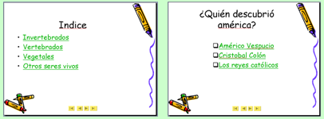

# Práctica 3.1.0

## Actividad

**Botones de acción.**

Los hipervínculos a diapositivas a la misma presentación tienen posibilidades didácticas:

*   Por ejemplo **UN ÍNDICE DE LA PRESENTACIÓN** y así ir a la diapositiva correspondiente.
*   Otro ejemplo más sofisticado es crear una **presentación INTERACTIVA** con los alumnos con preguntas tipo **TEST de esta manera despertamos su atención en la presentación** y según la opción salta a una diapositiva que diga BIEN o diga MAL

( Fig.P.3.1.0.1: J.Quintana, montaje pantalla captura programa,  [Algunos derechos reservados](http://creativecommons.org/licenses/by-nc-sa/2.0/deed.es "Derechos reservados. Atribución-NoComercial-CompartirIgual 2.0 Genérica (CC BY-NC-SA 2.0)"))

Se puede jugar con las diapositivas ocultas, por ejemplo las diapositivas Bien y Mal son ocultas y sólo se visualiza a través de los hipervínculos correspondientes

Te proponemos practicar estos dos tipos de presentaciones.

