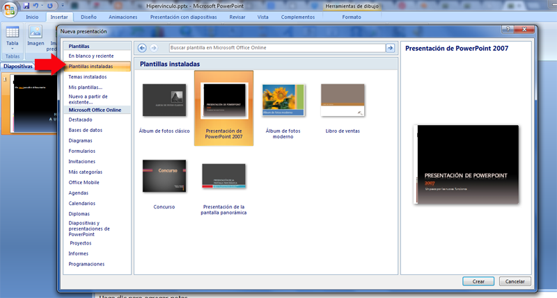
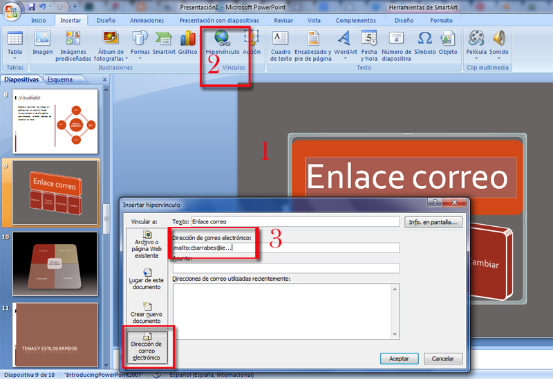

# Práctica 3.1.1

## Actividad

**Practicar estos enlaces:**

*   Abrir una nueva presentación. 
*   Elegir una de varias diapositivas.
*   Insertar una objeto o texto.
*   Enlazarlo a diferentes posiciones: a la primera, última, siguiente, anterior…diapositiva.
*   Enlace a correo electrónico.

 **Ayuda**

**Crear un nuevo documento**: nos crea una nueva presentación, con el nombre que deseemos o podemos vincularlo a una presentación existente. Nosotros creamos una nueva presentación, seleccionar una plantilla.

 

Enlace a un correo electrónico, nos ayuda y nos pone el **mailto**: completamos con la información que nos interesa.

 

**La info. En pantalla** no es necesario ponerlo, a nivel básico. Recordar que la dirección debe ser correcta y al abrirlo en una máquina, el receptor se le abrirá el programa de correo que tenga predeterminado. A veces falla, pero lo importante es poner el enlace a la dirección de correo correcta y en algunos programas forzar el mailto:

