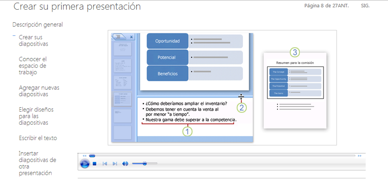

# Práctica 4.1.1

## Práctica 4.1.1

### **Vamos a añadir notas y/o comentarios:**

Practica con un par de programas.

En Keynote se haría de la siguiente forma:

**Cómo realizar comentarios en las diapositivas **

  
Mientras trabajamos en el pase de diapositivas, podemos añadir comentarios a las mismas.   
_Por ejemplo_, podemos usar comentarios que le recuerden los **cambios** que deseamos realizar en una diapositiva; o podemos usar comentarios para **comunicarnos** con otras personas con las que esté colaborando en el desarrollo de una presentación, haciendo un **trabajo colaborativo**.

(Los comentarios son distintos de las notas del presentador)  
Los comentarios siempre **aparecen en la parte superior** del lienzo de diapositivas, por lo que es posible que oculten parte del contenido de las diapositivas. Para ver todo el contenido, basta con que arrastremos los comentarios fuera de la diapositiva, los ocultemos o modifiquemos su tamaño.

 CREAR SU PRIMERA PRESENTACIÓN

[http://office.microsoft.com/es-es/training/crear-su-primera-presentacion-RZ010186615.aspx?section=8](http://office.microsoft.com/es-es/training/crear-su-primera-presentacion-RZ010186615.aspx?section=8)

