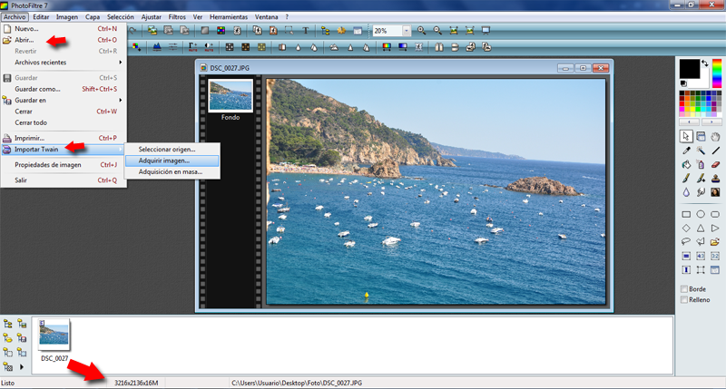
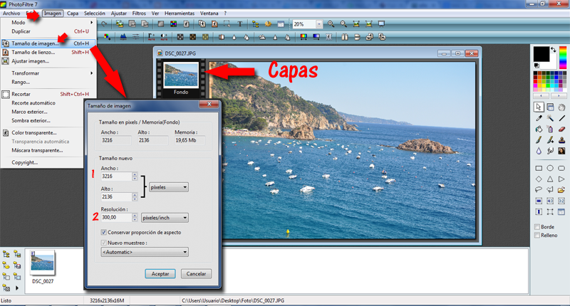
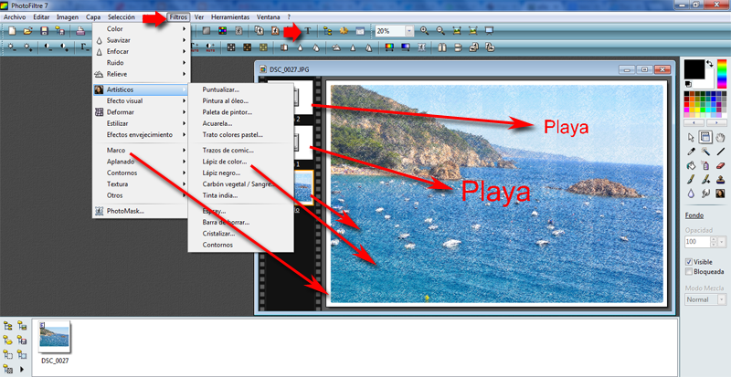

# Retoque Básico

**Redimensionarla, bajar peso.**

Hemos elegido una imagen de nuestra cámara, en vez de cable, como es una tarjeta SD, la hemos puesto en nuestro lector de tarjetas (algunos portátiles la llevan de serie y los sobre mesas podemos adquirir un lector, de esa forma no es necesario la cámara y el cable especial usb de conexión.

Nos damos cuenta que esa imagen pesa casi 4 megas, por lo tanto, el objetivo es bajar ese peso,

Lo podemos hacer bajando los píxels (cogida de la cámara es de 3216x2136, ancho y alto) 

También podemos bajar la resolución de 300 píxels a 72 píxels por pulgada si va a web o a una presentación y queremos que la imagen pese poco.

**Abrir el Photofiltre** desde el archivo y elegimos el **PhotoFiltre7.exe**

**Abrimos archivo desde carpeta o lo importamos desde escáner.**

****

(Fig.1.7.2.1: C.Barrabés, montaje pantalla captura programa  PhotoFiltre,  [Algunos derechos reservados](http://creativecommons.org/licenses/by-nc-sa/2.0/deed.es "Derechos reservados. Atribución-NoComercial-CompartirIgual 2.0 Genérica (CC BY-NC-SA 2.0)")) 

La flecha inferior de la imagen nos indica el tamaño y el peso 16 Megas.

 (Fig.1.7.2.2: C.Barrabés, montaje pantalla captura programa  PhotoFiltre,  [Algunos derechos reservados](http://creativecommons.org/licenses/by-nc-sa/2.0/deed.es "Derechos reservados. Atribución-NoComercial-CompartirIgual 2.0 Genérica (CC BY-NC-SA 2.0)"))

Hagamos unos retoques: Ponemos dos textos (se añaden automáticamente 2 capas de texto), ponemos un marco y la aplicamos un filtro.

 (Fig.1.7.2.3: C.Barrabés, montaje pantalla captura programa  PhotoFiltre,  [Algunos derechos reservados](http://creativecommons.org/licenses/by-nc-sa/2.0/deed.es "Derechos reservados. Atribución-NoComercial-CompartirIgual 2.0 Genérica (CC BY-NC-SA 2.0)"))

