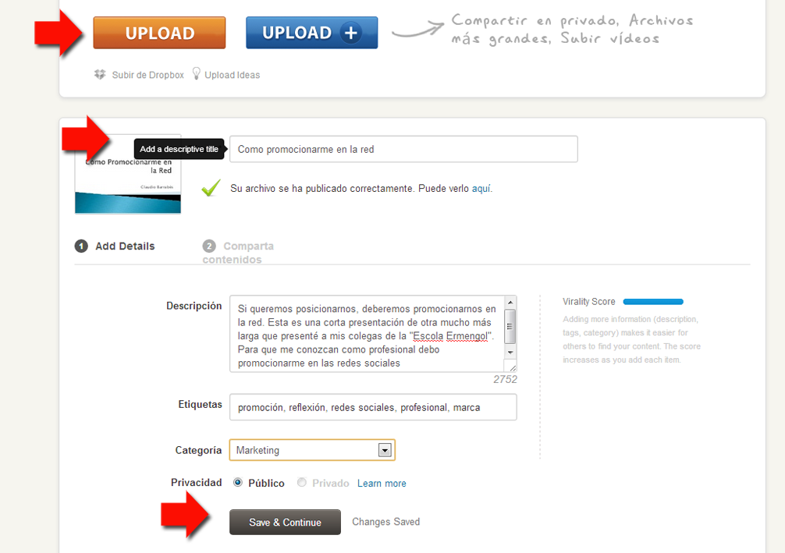
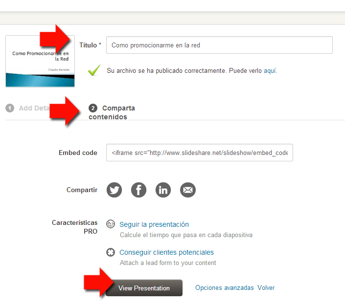

# Subir Archivos

Una vez logeados.

Le daremos a subir

Incluir un  **título**  y una breve  **descripción**  del contenido cargado. La adición de este nivel de detalle impulsará el tráfico de búsqueda a nuestro sitio.

**Clasificar** el contenido. Una categoría adecuada para su archivo también hará que sea más fácil de encontrar y atraer más participación. 

**Etiquetar** la presentación, poniendo etiquetas definiendo de que va aquella presentación.

Podemos compartir el contenido, a través de plataformas sociales como LinkedIn, Facebook, Twitter, Google +, Pinterest o por correo electrónico.

1.  **Subir**. Nos lleva a Upload
2.  ### Inicie sesión en SlideShare to start uploading...
    
3.  Si ya me dí de alta y no recuerdo la contraseña, puedo poner mi mail que me registré y me permitirá cambiarla, como hace Wordpress y otras aplicaciones web.
4.  Si tengo abierta Facebook o Linkedin, puedo acceder con ellas. (Cuidado con lo que deseo compartir o no. Desmarcar lo que no interese. Si quiero más privacidad deberemos saltar a una cuenta PRO)
5.  Seleccionar el archivo de mi máquina
6.  Empezará a subir y rellenamos: Título, descripción, etiquetas, categorías...
7.  Salvar y continuar
8.  Ver presentación

Fig. 6.6.1

Nos confirma la subida, ya podemos compartir.

Fig. 6.6.2

Si quieres ver la presentación subida: [http://es.slideshare.net/cbarrabes/como-promocionarme-en-la-red](http://es.slideshare.net/cbarrabes/como-promocionarme-en-la-red)

No esperemos filigranas, animaciones, practicarlo y veréis los cambios.

