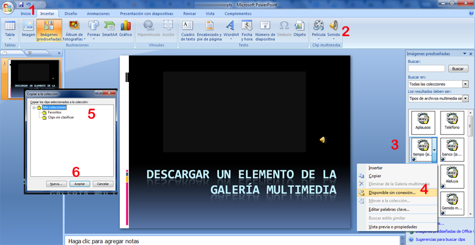
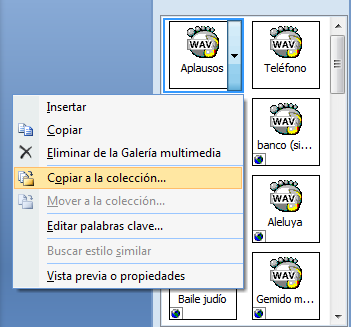
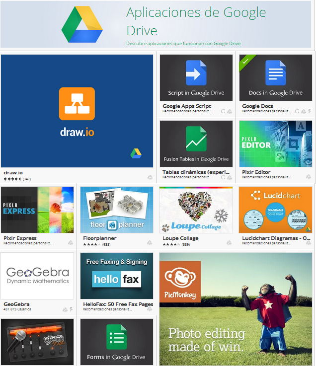
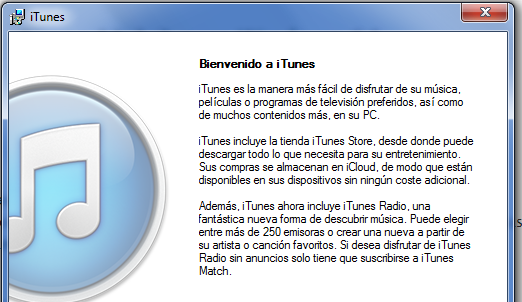

# Tus propias colecciones de elementos de la Galería

### Descargar un elemento de la Galería Multimedia Online en PowerPoint

Un elemento de la Galería Multimedia de la colección Web puede ser interesante tenerla descargada por si no tenemos conexión de Internet, o para crearnos nuestra propia colección de elementos favoritos a mano.

Pinchamos en el menú del elemento de la Galería Multimedia en cuestión y elegimos **4** "**Disponible sin conexión**" observa que tiene un icono bola azul que indica que ese elemento está en Internet, en los otros elementos no nos saldrá está opción pues ya los tenemos descargados.

sale un diálogo **5** para que lo guardemos en la carpeta de tus colecciones que queramos, incluso crearnos carpetas para tener nuestro elementos favoritos un acceso directo para tenerlos siempre a mano. Una vez descargado, desaparece la bola azúl. 

**LLevar a la colección un elemento que ya está descargado**

Un elemento que no esté en la Web también puedes llevarlos a tu colección particular, pulsando "**Copiar a la colección..."**

**¿Cómo puedo localizar mi colección de elementos?**

En la Galería Multimedia, sólo seleccionando tu colección

## Una duda

Este capítulo de crear tu  propia colección de elementos Multimedia es aplicable no sólo a sonidos, sino también a Imágenes y vídeos ¿por qué explicarlo en esta Unidad de sonidos?

%accordion%Solución%accordion%

Normalmente el contenido de la Galería Multimedia con Imágenes y Vídeos es un poco pobre (recuerda que en vez de vídeos, son imágenes animadas) y en Internet tanto la búsqueda de imágenes por Google como la búsqueda de vídeos por Youtube dan buenos resultados.

Pero el sonido la cosa cambia, es un poco más difícil encontrar sonidos de efectos sonoros en Internet, y la colección que hay en la Galería Multimedia está bien. Luego hemos querido exponer la forma de crear tu propia colección en el capítulo donde lo necesitarás: Sonidos.

%/accordion%

### Descargar un elemento de la Galería Multimedia en Open Office

Repasar el apartado anterior Galería Multimedia de Open Office impress

### Instalar el cliente desde la web de google.com/drive.

Para sincronizar nuestros documentos locales con Google Drive tendriamos que instalar el cliente desde la web de google.com/drive.

Instalar Google Drive para tu Mac o PC de sobremesa en cuanto tengamoss acceso a Google Drive en la Web.

Una vez hecho esto Google se encarga de sincronizar copiando los nuevos documentos que tengamos a nuestro **Drive**: tenemos un documento en nuestro ordenador, lo borramos  en el ordenador local y también de Google Drive y además vaciamos la papelera.

Si hacemos esto, no sólo tendremos lo relacionado con elementos multimedia, sino **todos lo componentes de Drive.**

Para Windows: 

1.  Ir [http://drive.google.com](http://drive.google.com/)
2.  Clic en **Conectar Drive al ordenador** debajo de la lista de vistas de Drive en la parte izquierda de la pantalla.
3.  Clic en **Descargar Drive para PC**.
4.  Abrir **googledrivesync.exe** para instalar e iniciar automáticamente Google Drive en tu PC.  Clic en el botón **Abrir**.
5.  Introducir el **nombre de usuario de tu cuenta de Google** y la **contraseña** en la ventana que aparece. Esa será la cuenta que se asocie a Google Drive en Windows.
6.  Seguir todos los pasos de la instalación.
7.  Iniciar Google Drive para tu PC en el menú Inicio. Arrastrar archivos y carpetas a la carpeta de Google Drive para comenzar la sincronización de elementos en **Mi unidad** (parte de Google Drive en la Web).

Para Mac:

1.  Ir a [http://drive.google.com](http://drive.google.com/)
2.  Clic en el botón **Descargar Google Drive para Mac**.
3.  Abrir **installgoogledrive.dmg**.
4.  Abrir el archivo de instalación y arrastrar el icono de Google Drive a la carpeta **Aplicaciones**.
5.  Abrir Google Drive desde la carpeta "Aplicaciones". Puede que recibamos una advertencia que indique que Google Drive es una aplicación descargada de Internet. Clic en el botón **Abrir**.
6.  Introducir el **nombre de usuario de tu cuenta de Google** y la **contraseña** en la ventana que aparece. Esa será la cuenta que se asocie a Google Drive en el Mac.
7.  Seguir todos los pasos de la instalación.
8.  Iniciar sesión en Google Drive para tu Mac en la barra de herramientas. Arrastrar archivos y carpetas a la carpeta de Google Drive para comenzar la sincronización de elementos en **Mi unidad** (parte de Google Drive en la Web).

### Instalar aplicaciones en Google Drive

 Google Drive se comporta como un disco duro local incluso en el terreno de las aplicaciones.

En la **Chrome Web Store** tenemos disponible una tienda de aplicaciones virtual para Google Drive (Muchas aplicaciones Free interesantes): [Drive Apps](https://chrome.google.com/webstore/category/collection/drive_apps).

### Colecciones de elementos en Keynote

Si nos faltan elementos, imágenes, fotos música , vídeos, los podemos bajar de iTunes (Pero claro deberemos ver el coste)

Abrir iTunes para comprar y descargar Apps

Si nos interesan **temas** e **iconos** libres podemos investigar los siguientes enlaces: 

[http://www.applesfera.com/curiosidades/plantillas-gratuitas-para-keynote09](http://www.applesfera.com/curiosidades/plantillas-gratuitas-para-keynote09)

[http://www.ilitvision.com/Free/](http://www.ilitvision.com/Free/)

[http://www.freepik.es](http://www.freepik.es/)

**1,4 Millones** de Archivos Gráficos Gratis. Encuentra Vectores gratis, PSD, Iconos y fotos.

