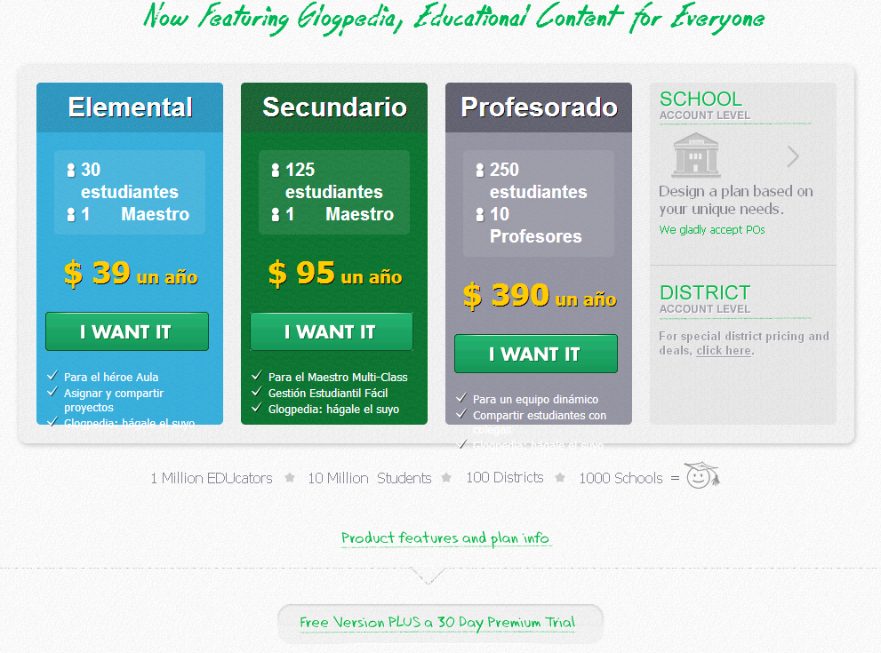

# U.10 Glogster

[http://www.glogster.com/](http://www.glogster.com/)

**¿Qué es Glogster?**

Glogster EDU es la plataforma líder mundial de educación para la expresión creativa de los conocimientos y las habilidades en el aula y fuera de ella. (Dicen)  Motivamos a los educadores y estudiantes con la tecnología para crearGLOGS - **posters multimedia en línea** \- con texto, fotos, vídeos, gráficos, sonidos, dibujos, archivos adjuntos de datos y más.

## Características

**Glog Interface Creación** A Glog se crea usando una aplicación muy fácil de entender, arrastrar y soltar interfaz que es relevante, agradable y escalable para los estudiantes de todas las edades y estilos de aprendizaje. 

A Glog es una plataforma visual interactiva en la que los usuarios crean una "_**página de cartel o web**_" contiene elementos multimedia como: texto, audio, vídeo, imágenes, gráficos, dibujos y datos.

**Crear plan de estudios basado Proyectos sobre Trabajo, grupos, equipos o personas** , el profesorado puede trabajar con los estudiantes en un aula o mediante instrucción remota utilizando esta plataforma multimedia - un sistema comunitario de intercambio

El profesor crea proyectos con plantillas y directrices de instrucción, las asigna a los estudiantes, proporciona retroalimentación a lo largo de la asignación, y evalúa su trabajo terminado.

**GLOG Presentaciones!proyectos _participativos_ estudiante o profesor de la clase, la escuela, la población o Más allá de** los proyectos una vez que se ha completado, el profesor puede compartir trabajo de los estudiantes en una variedad de entornos educativos. GLOGS se pueden incrustar en un blog, wiki o página web o compartidos con otras personas que utilizan las capacidades de presentación innovadoras de Glogster EDU. Elige proyectos de estudiantes ejemplares y demostrar logros de los estudiantes con los padres, administradores, estudiantes, y otros educadores.

**Privado y seguro ambiente de aprendizaje para profesores y estudiantes** El profesor crea fácilmente un aula virtual privada con los estudiantes mediante el registro de una cuenta administrada docente, generando cuentas de los estudiantes con los inicios de sesión y contraseñas seguras, y supervisar todas las actividades dentro de la cuenta durante todo el proceso de aprendizaje. Las cuentas de los estudiantes se pueden crear sin proporcionar direcciones de correo electrónico u otra información de contacto.Tablero del profesor proporciona acceso directo a todos los estudiantes, proyectos y otras actividades.

**1\. Interfaz de creación**

1.  *   Glog se crea usando una aplicación muy fácil de entender, arrastrar y soltar, agradable y escalable para los estudiantes de todas las edades y estilos de aprendizaje. A Glog es una plataforma visual interactiva en la que los usuarios crean una "página de cartel o web" o posters que contiene elementos multimedia como: texto, audio, vídeo, imágenes, gráficos, dibujos y datos.

**2\. Características principales**

Glog - Interfaz de creación

1.  Proyectos
2.  Mensajería
3.  Buscador
4.  Control de Privacidad
5.  Asignaciones
6.  Comentarios

*   GLOGS favoritos
*   Buscador
*   Biblioteca de recursos Educador
*   Glog Recomendaciones
*   Glog Puntuación
*   Glog Biblioteca [http://edu.glogster.com/glogpedia](http://edu.glogster.com/glogpedia)
*   Manejo de Estudiantes

**3\. Opciones Premium**

*   Gestión Estudiantil completa
*   Gestión de clases completo
*   Gestión Escolar Completo
*   Imágenes Galerías extra
*   Apoyo Tecnológico
*   Intercambio Estudiantil

*   Atención al Cliente
*   Glog Adjuntos
*   Presentaciones de maestros
*   Portafolios estudiantiles
*   No hay anuncios
*   Glog Dibujo

**4\. Glogster EDU Sharing (Compartir)**

*   Código Embed
*   Escuela Wiki
*   Wikispaces
*   Edmodo
*   Twitter
*   Facebook

*   Redes sociales (Blogger, Wordpress, iGoogle, ...)
*   Estudiantes Portafolios
*   Presentaciones de maestros
*   Enviar al correo electrónico
*   Marcadores (Digg, Del.icio.us, tropiezo, ...)
*   Comparte proyectos GLOG con el mundo!

**5\. Cómo utilizar Glogster EDU**

*   Reserve Reports
*   Informes Relacionados
*   Proyectos de clase
*   Entorno digital seguro
*   Deberes
*   Enseñanza a distancia
*   Presentaciones sobre cualquier tema
*   Carteles digitales ahorrar papel
*   Crear biblioteca de conocimiento digital

*   Inspírate
*   Desarrollar la creatividad del estudiante
*   Ampliar las habilidades de presentación estudiantes
*   Hacer el aprendizaje divertido
*   Adaptarse a cualquier plan de estudios
*   Preparación de la lección
*   Asignaciones sobre cualquier tema
*   Tours
*   Explorar

Nos ofrecen una demo de 30 días, os mostramos los precios en octubre de 2013

Nuestros alumnos deberán registrase con un número de centro y deberán poner un usuario y contraseña.

Este programa es más que un simple programa de presentaciones, destacamos el trabajo colaborativo del mismo.

Otra cosa que nos ha sorprendido, es la motivación económica, premiando a los 50 glogs mejores. (Muy americano)

Fig. 6.10.1

Veamos un vídeo:

