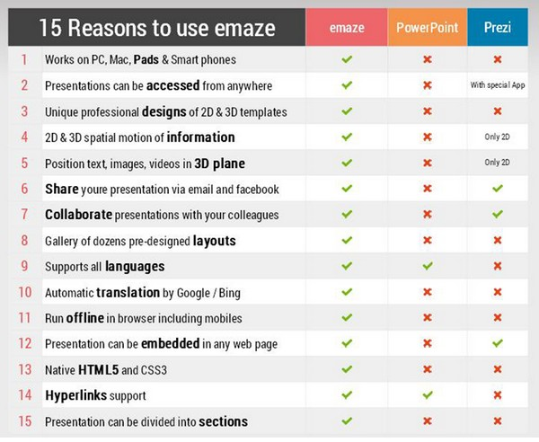

# U.11 emaze

(El contenido de esta página ha sido publicado por Jose Ramón Olalla en su blog [jr2punto0](http://jr2punto0.blogspot.com.es/2015/11/presenta-con-emaze.html).)

Para empezar a utilizar [Emaze](https://www.emaze.com/) hay que identificarse con email y contraseña.  
Permite exportar a distintos formatos, embeber o compartir en Internet e importar presentaciones ya realizadas por Power Point  
Favorece la elaboración de documentos en colaboración.  
Es muy sencillo de utilizar y los resultados son espectaculares.

Una breve guía de Emaze realizada con el propio Emaze puede resultar ilustrativa acerca de este servicio.

[Guía emaze](https://www.emaze.com/@AFROCILO/emaze-gua-breve)

