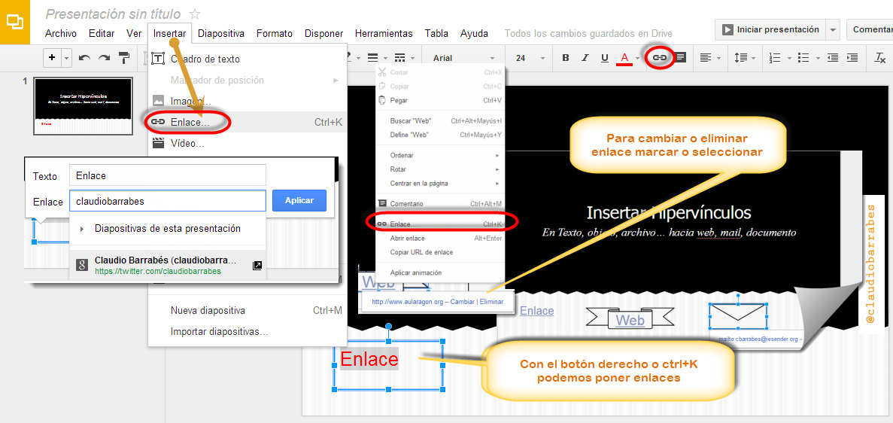

# U.1. Insertar Hipervínculos

Acerca de los hipervínculos

**ATENCIÓN cuando elegimos hipervínculos a documentos tienen que estar en la misma carpeta que la presentación inicial antes de hacer el hipervínculo **pues en caso contrario funcionaría en nuestro ordenador, pero en otro ordenador no. Esto también lo veremos que ocurre con la música y el vídeo.

Los hipervínculos son elementos de navegación que nos pueden servir como ayuda para desplazarse a través de la presentación de un pase de diapositivas **a otra diapositiva** o para ir directamente **a una página en Internet**. Los hipervínculos también pueden desencadenar determinadas acciones, como **abrir un mensaje de correo electrónico** en el que ya aparece la dirección o **abrir otro documento** (texto, presentación, pdf...).

### **A.1.  PowerPoint**

Más adelante veremos como insertar hipervínculos a Web, Correo Electrónico, a otra diapositiva, a otro documentos y más hipervínculos.

**A tener en cuenta:**

**Cuidado **con el **patrón de diapositivas:**

Si hacemos un hipervínculo en el patrón de diapositivas (por ejemplo botones de acción vinculados a la diapositiva siguiente, la anterior, al final de la presentación y al principio de la misma, estos botones SI se repiten en todas las diapositivas por lo tanto interesa ponerlo en la vista patrón). Los cambios no se pueden hacer en vista normal, sólo en vista patrón.

Si queremos hacer vínculos a otros lugares (documentos, webs, emails, otras diapositivas..) suelen ser elementos que NO se repiten en todas las diapositivas por lo tanto lo tenemos que hacer **en la vista normal** en las diferentes diapositivas, sobre los diferentes objetos, **y no en la vista patrón**.

Para poner un hipervínculo en Power Point, debemos ir a la pestaña **Insertar> Hipervínculos,** podemos observar que hipervínculo, no abrirá enlaces a diferentes lugares y **Acción** nos permite, Hipervínculo a (Diapositiva siguiente, anterior, última, primera… URL, otro archivo. Algo muy interesante como, **Ejecutar programa** (para que hagan un ejercicio en el mismo nuestro receptores o alumnado). **Ejecutar marco, Acción de objeto, Reproducir un sonido**… etc.

Podemos hacer enlaces a **Archivo** \> Carpeta actual: a otros documentos de nuestra presentación. Por ello, aconsejamos, que al crear cualquier proyecto, metamos todo en una carpeta, para después no perder los enlaces al abrirlo en otro ordenador. Nosotros hemos apuntado a un simple documento.txt.

### **B.2. En OpenOffice**

Los enlaces en OpenOffice, son muy similares a los de PowerPoint, veremos más adelante como se hace.

### **C.3. En Drive**

Google Drive, destaca pos la simplicidad como vamos diciendo, cualquier enlace que queramos colocar, al igual que los dos anteriores, lo haremos de forma muy simple. Vamos a **Insertar, Enlace o (ctrl+K), **seleccionamos el objeto texto o elemento a enlazar y pegamos la dirección web.

**Insertar hipervínculos**

1.- En el documento actual, insertar un marcador en la ubicación a la que deseamos ir o el número de marcadores que necesitemos.

2.- Seleccionar el texto o el objeto que deseamos representar en el hipervínculo.

3.- Clic en el hipervínculo del grupo vínculos en la pestaña insertar.

4.- Debajo de vincular a: clic en lugar de este documento.

5.- En la lista, selecciona el marcador al que desees vincular.

Veremos más adelante como se enlaza a página web, mail, otra diapositiva, objeto, otro documento...

### **D.4. En Keynote**

[http://help.apple.com/keynote/mac/6.0/#/tande32a1b86](http://help.apple.com/keynote/mac/6.0/#/tande32a1b86)

Acerca de cómo convertir un objeto en un hipervínculo

Podemos convertir texto, imágenes y figuras en hipervínculos que realicen una acción cuando se haga clic en ellos durante una presentación.  Al convertir un objeto en un hipervínculo, se marca con un distintivo de fecha curva en el lienzo de diapositivas; este distintivo no es visible cuando se visualiza la presentación. Sin embargo, el texto convertido en un hipervínculo integrado aparece subrayado; el subrayado del texto es visible cuando se visualiza la presentación, a menos que haya seleccionado cambiar el formato del texto sin el subrayado.

Estas flechas predibujadas que apuntan hacia delante y hacia atrás son un ejemplo de un elemento de navegación que puede usarse en un pase de diapositivas. El pequeño distintivo de fecha curva que se muestra en la esquina inferior de cada una indica que se ha convertido en un hipervínculo.

**¿Hacia dónde podemos vincular?**

*   Ir a una diapositiva concreta.  
*   Abrir una página web en el navegador web por omisión del ordenador.
*   Abrir otro documento de Keynote.
*   Abrir un mensaje de correo electrónico.
*   Salir del pase de diapositivas.

Lo vemos en cada apartado a continuación.

