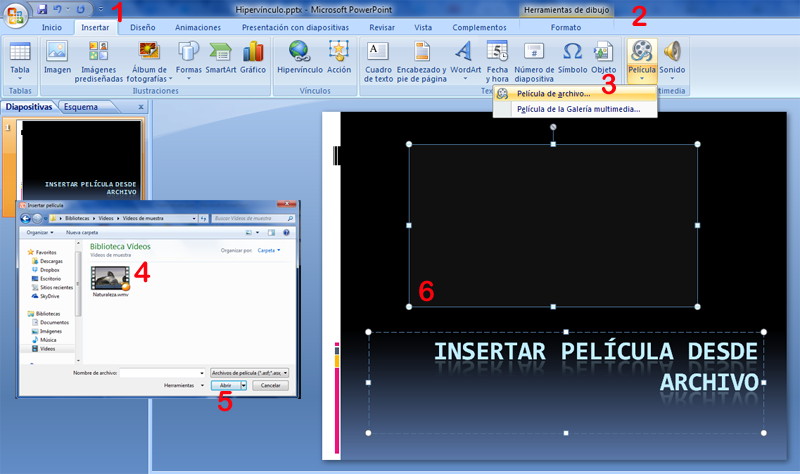
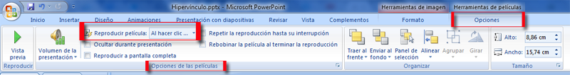
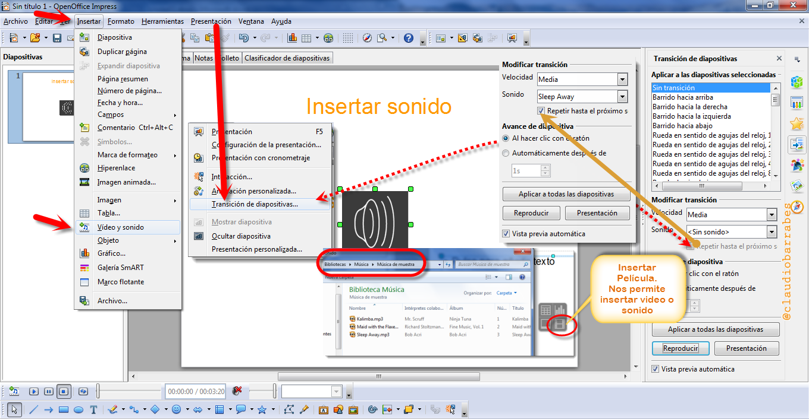
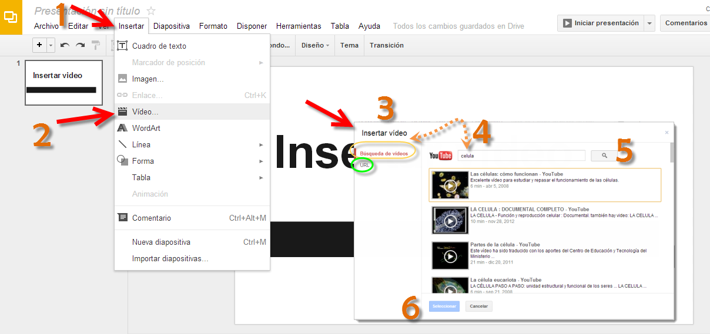
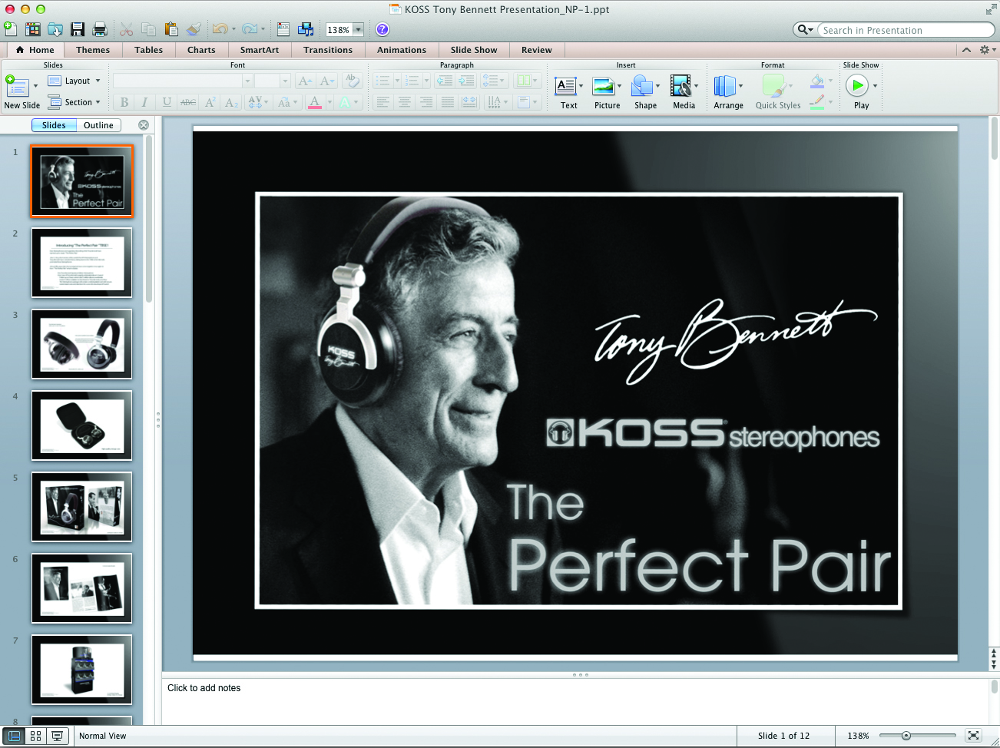

# U.1. Insertar Sonido y películas

Vamos ha hacer una breve introducción de como se insertan Sonido y Vídeo y los 4 programas que estamos viendo, para pasar a estudiarlos en más profundidad en la Unidad U1 apartados: **1.1 Sonidos** y en **1.2 Películas**. Son los apuntes que realizamos en el 2012 actualizados al presente curso.

## 1.1.    PowerPoint

### Sonido

Para evitar posibles problemas con los vínculos, se recomienda **copiar los sonidos en la misma carpeta que la presentación antes de agregarlos a la misma**.

Invertir el orden sería incorrecto: Agregar el sonido en la presentación y luego incorporar el fichero en la carpeta donde está la presentación. ¿qué ocuriria? Se realiza un **direccionamiento absoluto** es decir, si el fichero estaba en el escritorio, lo busca en el escritorio, por lo tanto en tu ordenador funciona pero en otro no. 

Realizarlo de forma correcta se produce un **direccionamiento relativo**, es decir, busca el archivo con sólo su nombre, sin su ruta, por lo que tiene que estar en la misma carpeta que donde está la presentación, y la presentación funciona en cualquier ordenador.

### ¿qué hay que hacer?

1.  Copiar el fichero de audio EN LA MISMA CARPETA que está el fichero de la presentación.
2.  En el panel que contiene las fichas Esquema y Diapositivas, clic en la ficha **Diapositivas**. (Debajo del 1)
3.  Clic en la diapositiva a la que deseamos agregar un sonido.
4.  En la ficha **1****Insertar**, en el grupo **Clip multimedia**, clic en la flecha situada bajo **2****Sonido**.
    

1.  Sigamos pasos:
    *   Clic en **Sonido de archivo**, **4** busquemos la carpeta que contiene el archivo y  doble clic en el archivo que deseemos agregar.
    *   Elijamos **5** si queremos que se reproduzca **Automáticamente** o **Al hacer Clic encima**.
    *   Siempre podremos modificar esto en **Opciones de Sonido:**
    
    *   **Desde Sonido de la Galería multimedia**, desplacémonos hasta el clip que deseemos en el panel de tareas **Imágenes prediseñadas** y, a continuación, clic en él para agregarlo a la diapositiva.
    * **Sugerencia**  podemos obtener una vista previa de un clip antes de agregarlo a la presentación. En el panel de tareas **Imágenes prediseñadas**, en el cuadro **Resultados** que muestra los clips disponibles, movamos el puntero del _mouse_ sobre la vista en miniatura del clip. Clic en la flecha que aparece y, a continuación, clic en **Vista previa o propiedades**.
        

Podemos conseguir canciones con diferentes permisos de la Web [Jamendo.com](http://www.jamendo.com/es/ "Música")

### Películas

Lo más importante será aprender a descargar los archivos por si los queremos utilizar off line.

Esto es algo que está cambiando se ha bloqueado en algunos navegadores, Explorer u Chrome, pero Mozilla Firefox tiene complementos que permiten hacerlo (aunque últimamente, está funcionando bastante mal Firefox) Iremos actualizando la forma de bajar vídeos en nuestro [Blog](http://claudiobarrabes.blogspot.com.es/ "Blog Personal") video downloadhelper. Ver Punto 3.4 Desde Internet, tenéis manuales de programas de descarga. ¿Conoces alguno nuevo, lo sabes hacer de otra forma? comentarlo con vuestro tutor.

No es posible agregar una película digital de un DVD de vídeo a una presentación en Microsoft Office PowerPoint 2007. Sin embargo, algunos complementos de otros proveedores, como PFCMedia [http://www.playsforcertain.com/](http://www.playsforcertain.com/), permiten reproducir un DVD de vídeo durante una presentación de PowerPoint.

Es posible descargar la película de un DVD en un formato AVI compatible con Power Point, pero hay que tener en cuenta que al menos que tengamos licencia para hacerlo, viola los derechos de autor. [http://www.mundodivx.com/](http://www.mundodivx.com/) 

### Agregar una película

Para evitar posibles problemas con los vínculos, es conveniente **copiar las películas en la misma carpeta que la presentación** antes de agregarlas a la presentación.

1.  En la vista Normal, clic en la diapositiva a la que deseamos agregar una película o un archivo GIF animado.
2.  En la ficha **1** **Insertar**, en el grupo **2** **Clips multimedia**, clic en la flecha situada bajo **Película**.
    

    

1.  Pasos:
    *   Clic en **3****Película de archivo**, busquemos la carpeta que contiene el archivo y doble clic en el archivo que deseemos agregar. **5** Añadir
    *   Clic en **3****Película de la Galería multimedia**, ir hasta el clip que deseemos en el panel de tareas (panel de tareas: ventana de una aplicación Office que proporciona comandos utilizados frecuentemente. Su ubicación y pequeño tamaño le permiten utilizar estos comandos mientras trabajamos en los archivos.) **Imágenes prediseñadas** y, a continuación, clic en él para agregarlo a la diapositiva.
        
        **Sugerencia**  Podemos obtener una vista previa de un clip antes de agregarlo a la presentación. En el panel de tareas **Imágenes prediseñadas**, en el cuadro **Resultados** que muestra los clips disponibles, mover el puntero del _mouse_ sobre la vista en miniatura del clip, clic en la flecha que aparece y, a continuación, en **Vista previa o propiedades**.
        

### Elegir entre Automáticamente o Al hacer clic encima
  
Al insertar una película, un mensaje le pregunta cómo desea que se inicie la película: automáticamente (**Automáticamente**) o al hacer clic en la película (**Al hacer clic encima**).

*   Para iniciar automáticamente la película cuando muestre la diapositiva, haga clic en **Automáticamente**. Para pausar una película mientras se está reproduciendo, clic en ella. Para continuar reproduciendo la película, volvamos a hacer clic.

*   Para iniciar manualmente la película cuando haga clic en la diapositiva, clic en **Al hacer clic encima**.

Al insertar una película, se agrega un efecto desencadenador de pausa. Se conoce como desencadenador porque hay que hacer clic en una parte específica de la diapositiva para reproducir la película. Por ejemplo, en una presentación, podemos hacer clic en el marco de la película para pausarla y volver a hacer clic para reanudarla.

**Nota**   Podemos cambiar esta opción en cualquier momento. Clic en la película y, a continuación, en **Herramientas de películas**, clic en la ficha **Opciones**. En el grupo **Opciones de las películas**, seleccionar la opción que deseemos en la lista **Reproducir película**.

### Refuerza tus conocimientos

*   [Formatos de audio y vídeo compatibles con PowerPoint 2010](http://office.microsoft.com/es-es/powerpoint-help/formatos-de-audio-y-video-compatibles-con-powerpoint-2010-HA010336709.aspx)

### 1.2. En OpenOffice

### Cómo insertar Sonido

Veamos cómo insertar un archivo de sonido en impress :

**Insertar** \> Vídeo y sonido buscamos un archivo mp3 de nuestra máquina. Nosotros elegimos Kalimba de la ….\\Music\\Sample Music. Y clic en **abrir**.

Nos aparece un icono en nuestro diapositiva, justo en el centro, lo podemos mover como una figura.

Vamos a  **Presentación** \> **Transición de diapositivas**

Nos aparece el cuadro que veremos en el gráfico, que nos **permitirá configurar el sonido** , si será para una diapositiva, parar el sonido de la anterior diapositiva o queremos que dure unas cuantas diapositivas.

El sonido puede ponerse en marcha al hacer clic con el ratón o automáticamente después de los segundos que le marquemos.

IMPORTANTE: Debajo de la lista desplegable de sonido, hay una casilla de verificación que dice "Repetir hasta el próximo sonido". Marcamos y este sonido se repetirá hasta que en otra diapositiva fijemos la reproducción de otro sonido.

### Cómo Insertar Vídeo en OpenOffice

https://www.youtube.com/watch?v=kBDRSTQKoUY

### 1.3. En Drive

Lo podremos hacer desde la red, pero deberemos hacerlo como si fuera un vídeo, ver imagen:

### Refuerza tus conocimientos:

*   [Cómo insertar un vídeo o una imagen en una diapositiva en Drive](https://support.google.com/drive/answer/1696522?hl=es&ref_topic=1694924)

### 1.4. En Keynote

Podemos dar vida al pase de diapositivas añadiendo una pista de sonido, o reproduciendo música, un efecto de sonido o una película en cualquier momento en una diapositiva. Keynote también proporciona herramientas para grabar una narración en of para su pase de diapositivas, lo que resulta especialmente útil para pases de diapositivas de reproducción automática.

### Tipos de sonido y película que se reproducen en Keynote

Podemos añadir audio (un archivo de música o una lista de reproducción de nuestra biblioteca de iTunes, o cualquier otro archivo de sonido) a un documento de Keynote.

Keynote acepta todos los tipos de archivo QuickTime o iTunes, incluidos los siguientes:

MOV, MP3, MPEG-4, AIFF, AAC  

Tengamos en cuenta que algunos archivos multimedia están protegidos bajo la ley de copyright. Algunos archivos de música descargados de Internet solo pueden reproducirse en el ordenador en el que se han descargado. Asegúrese de que el ordenador que esté usando tenga permiso para reproducir todos los archivos multimedia incluidos en su pase de diapositivas.

Al añadir archivos multimedia a nuestro pase de diapositivas, **asegurémonos de que estarán disponibles** si transferimos el documento a otro ordenador.  Al guardar el documento, asegurémonos de que esté seleccionada la opción “**Copiar películas y sonido en el documento**” en la ventana Guardar. (si no vemos esta opción, clic en el botón junto al campo Guardar para mostrar toda la ventana Guardar y, a continuación, clic en el triángulo desplegable “Opciones avanzadas”.)

### **Cómo añadir audio al pase de diapositivas**

En el pase de diapositivas, podemos usar sonido de las siguientes formas:

*   **En una sola diapositiva:** el sonido sólo se reproduce en una diapositiva. Podemos iniciar y detener la reproducción en cualquier momento mientras visualizamos la diapositiva. Al avanzar a la siguiente diapositiva, la reproducción del sonido se detiene automáticamente. Para obtener información sobre la forma de colocar un archivo de sonido o lista de reproducción que solamente se reproduzca en una diapositiva individual, más abajo.
*   **Como una pista de sonido para todo el pase de diapositivas:** el audio comienza a reproducirse cuando se inicia el pase de diapositivas y se reproduce hasta el final o hasta que finaliza el pase de diapositivas (dependiendo de cuál dure más). También podemos seleccionar que el audio se reproduzca una sola vez, se reproduzca en bucle o se reproduzca hacia delante y, después, hacia atrás.
*   **Como una narración en of:** podemos crear una grabación sincronizada de nosotros mismos hablando acerca de cada una de las diapositivas. Esta grabación se reproducirá a lo largo de todo el pase de diapositivas.

Manual uso Keynote pág 114 (Keynote09\_Manual\_del_usuario.pdf)

### **Cómo colocar una película en una diapositiva**

  Las películas pueden colocarse dentro de marcadores de posición de gráficos o en cualquier lugar del lienzo de diapositivas. También pueden moverse dentro y fuera de una diapositiva, o iniciarse y detenerse cuando el presentador hace clic con el ratón, mediante el uso de composiciones de objetos. 

### Cómo añadir una película:

*   Arrastrar un archivo de película desde el Finder hasta el lienzo de diapositivas o hasta un marcador de posición de contenido.
*   Clic en Multimedia en la barra de herramientas y, a continuación, clic en Películas en el visualizador multimedia. Seleccionar un archivo y, a continuación, arrastrarlo hasta el lienzo de diapositivas o hasta un marcador de posición de contenido.
*   Seleccionar **Insertar** \> **Seleccionar** y buscar el archivo de película que deseemos.  Seleccionarlo y clic en Insertar. Arrastrar la película al lugar donde deseemos en el lienzo de diapositivas.

Si deseamos que un objeto (figura, imagen, sonido o archivo de película, tabla o gráfica) sea un elemento de fondo, añadirlo a la diapositiva maestra y editar su tamaño y posición en la diapositiva.

Después de colocar un objeto, podemos seleccionar Disposición > Bloquear para evitar moverlo sin darse cuenta mientras trabajamos.

Si añadimos sonido o películas que deseamos guardar en el tema, seleccionar “Copiar películas y sonido en el tema" Si no vemos esta opción, clic en el triángulo desplegable situado a la derecha del campo “Guardar como”.

Al guardar los archivos multimedia con un documento, éste se hace mucho mayor.

Imagen cogida de: [http://www.downloadsource.es/iwork-la-suite-ofimatica-de-apple/a/84/](http://www.downloadsource.es/iwork-la-suite-ofimatica-de-apple/a/84/)

