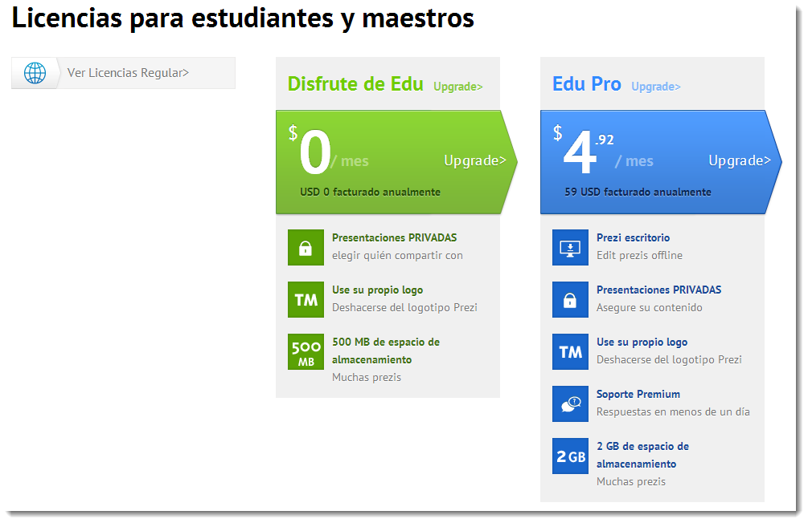

# U1. Prezi

**Prezi** es un fantástico programa, que da un salto cualitativo en la espectacularidad de las presentaciones. Algunos lo han definido como un "Zooming"

Wikipedia lo define así:

1.  Prezi es una aplicación multimedia para la creación de presentaciones similar a Microsoft Office PowerPoint o a Impress de LibreOffice pero de manera dinámica y original. La versión gratuita funciona solo desde Internet y con una "limitante" de almacenamiento.
    
    [http://es.wikipedia.org/wiki/Prezi](http://es.wikipedia.org/wiki/Prezi)

CUIDADO: Prezi ha transformado bastante el programa y ahora es diferente a lo que era hace unos años.

**Características  
**

Una de las principales características de Prezi es la posibilidad de organizar la información en forma de un esquema y exponerlo con libertad sin la secuencia de diapositivas. De manera que el conferenciante o quien consulta una presentación en Prezi, puede acceder a cualquier contenido con solo clicar. Se puede navegar por la presentación -que es en realidad un solo _frame_ de 3 dimensiones- desde la vista general, ampliando o reduciendo la vista, o desplazando el lienzo. Los efectos visuales deben estar supeditados a una correcta narrativa.

Algunos usuarios han criticado el "Zoom user interface" (ZUI) de Prezi alegando que tiende a producir náuseas. La empresa ha reconocido este efecto potencial y ofrece manuales con recomendaciones para un uso más sensato de diseño y evitar así esta estimulación visual excesiva.

Prezi permite trabajar on-line con todas sus herramientas de forma gratuita (**100 megas**), las presentaciones serán **públicas** y permite editar y compartir

Las modalidades de pago (59 USD al año y la PRO con 159 dolares al año) que permiten ocultar los trabajos on-line (Presentaciones privadas), ofrecen más capacidad de almacenamiento que la versión gratuita (500 MB y 2 GB) .  

Otros usuarios prefieren medios libres de pago tales como: **Sozi, Latex Beamer and Prosper o Dizzy**, con los que obtienen resultados similares.

Texto anterior modificado de: Colaboradores de Wikipedia, "Prezi," _Wikipedia, La enciclopedia libre,_ [http://es.wikipedia.org/w/index.php?title=Prezi&oldid=70744786](http://es.wikipedia.org/w/index.php?title=Prezi&oldid=70744786) (descargado 15 de noviembre de 2013).

Fig 6.1.1

Para educación podemos elegir las licencias de Maestros y estudiantes. Elegir la Edu que nos ofrece 500 MB de espacio de almacenamiento, si nos interesa más espacio podemos elegir la Edu Pro.

Fig 6.1.2

**Funciones**

*   Permite Impactar visualmente, podemos importar textos, **imágenes**, **vídeos**, documentos PDF y la  la función de “zoom” crea efectos muy llamativos las primeras veces que la audiencia lo ve.
*   Permite **trabajo colaborativo. **Prezi es perfecto para sesiones de clase interactivas o proyectos de grupo. Colaborar en tiempo real con hasta otros 10, ya sea en el aula o en casa, para intercambiar ideas y crear su presentación en una pizarra virtual compartida. [http://prezi.com/collaborate/](http://prezi.com/collaborate/)

*   Podemos usarla como si de una pizarra interactiva amigable se tratara, presentada con tabletas permite jugar con la presentación.

*   Se puede **convertir** un archivo **de PowerPoint a Prezi** con la función “PowerPoint Import“. Si ya tenemos nuestros apuntes de clase en PowerPoint, no es necesario empezar de cero. Podemos utilizar la función Importar PowePoint para traer el contenido existente directamente a Prezi.
*   **Acceso a Prezi desde cualquier lugar.** Prezi guarda nuestras presentaciones **en la nube** para facilitar el acceso desde cualquier lugar. Editar y presentar en el aula, la biblioteca, o en casa. O bien, utilizar Prezi para tabletas para la movilidad total.
*   Podemos crear Porfolios personales, currículums, cuentos, cómics, mapas conceptuales, lluvia de ideas, trabajos en grupos...

