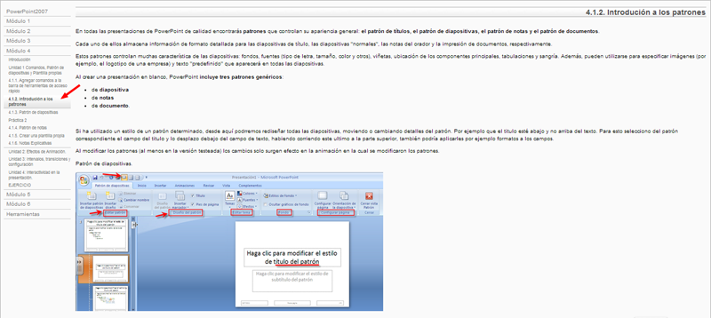
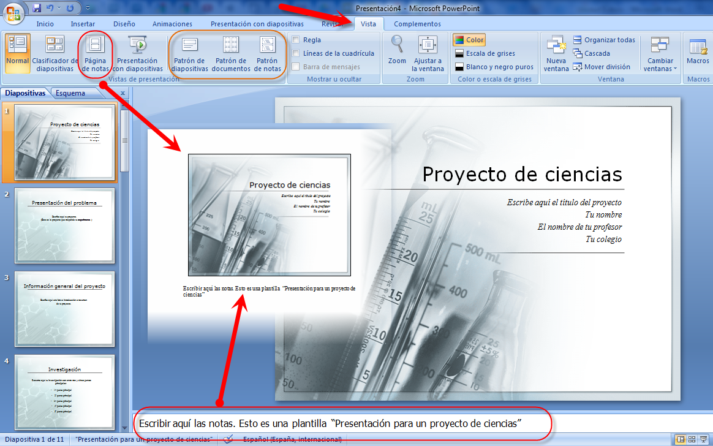
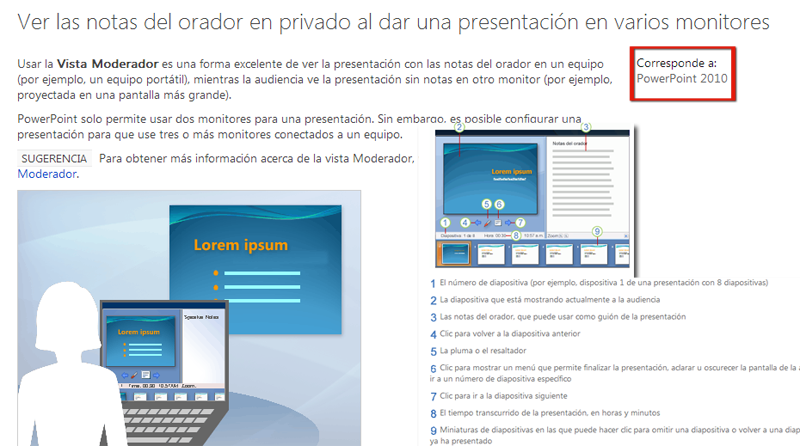
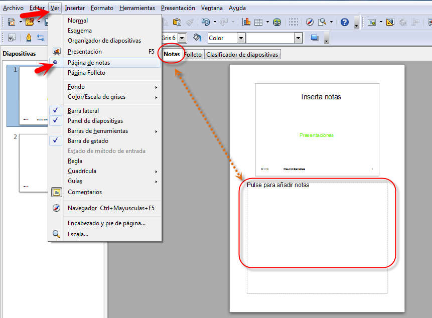
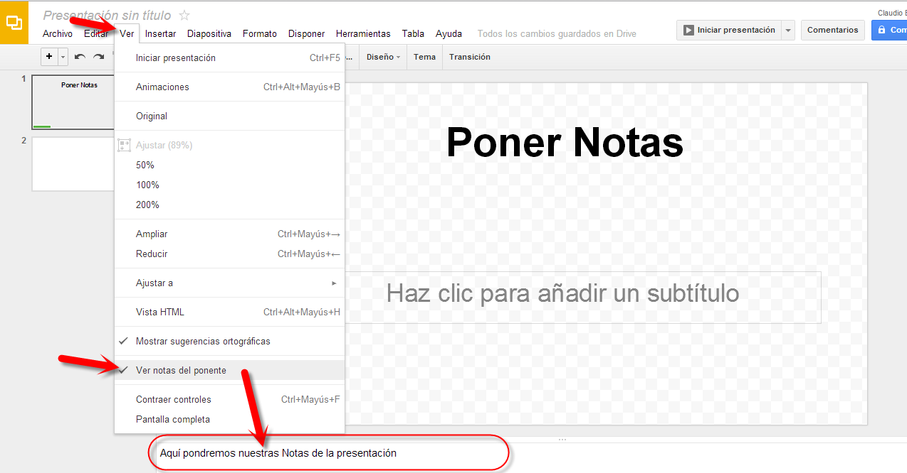
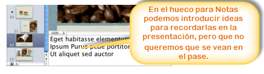

# U.1. Insertar notas de orador

**1.1. PowerPoint**

 Si queremos repasar todo lo referente a patrones ver Introducción a estos en la dirección o web Powerpoint 2007 de aularagon:

[http://www.aularagon.org/Files/UserFiles/File/Forprof/PowerPoint2007/412\_introducin\_a\_los\_patrones.html](http://www.aularagon.org/Files/UserFiles/File/Forprof/PowerPoint2007/412_introducin_a_los_patrones.html)

( Fig.4.1.1: C.Barrabés, montaje pantalla captura programa,  [Algunos derechos reservados](http://creativecommons.org/licenses/by-nc-sa/2.0/deed.es "Derechos reservados. Atribución-NoComercial-CompartirIgual 2.0 Genérica (CC BY-NC-SA 2.0)"))

(Fig.4.1.2: C.Barrabés, montaje pantalla captura programa, [Algunos derechos reservados](http://creativecommons.org/licenses/by-nc-sa/2.0/deed.es "Derechos reservados. Atribución-NoComercial-CompartirIgual 2.0 Genérica (CC BY-NC-SA 2.0)"))

[http://office.microsoft.com/es-es/powerpoint-help/ver-las-notas-del-orador-en-privado-al-dar-una-presentacion-en-varios-monitores-HA010336515.aspx](http://office.microsoft.com/es-es/powerpoint-help/ver-las-notas-del-orador-en-privado-al-dar-una-presentacion-en-varios-monitores-HA010336515.aspx)

( Fig.4.1.3: C.Barrabés, montaje varias pantalla captura web,  [Algunos derechos reservados](http://creativecommons.org/licenses/by-nc-sa/2.0/deed.es "Derechos reservados. Atribución-NoComercial-CompartirIgual 2.0 Genérica (CC BY-NC-SA 2.0)"))

Para **Office 2007 de Windows**, iremos a **Presentación con diapositivas** y en **Mostrar presentación activada** elegiremos la deseada.

Vídeo: [http://vimeo.com/21245755](http://vimeo.com/21245755 "Vista moderador")

**1.2. En OpenOffice**

**Vista modo páginas de notas**

Este modo de vista nos permitirá a ingresar a texto adicional en las diapositivas, pero no aparecerán en la presentación, estos textos o notas de orador nos sirven, yugoslava, se utilizan para destacar comentarios o profundizar algunos de los puntos tratados una diapositiva.

Hay dos formas de activar esta vista:

*   La primera es a través de la acción de la barra de menú **Ver > Página de notas**
*   La segunda a través de las pestañas que aparecen en el área de trabajo en la diapositiva activa. **Notas**

****( Fig.5.2.1: C.Barrabés, montaje pantalla captura programa,  [Algunos derechos reservados](http://creativecommons.org/licenses/by-nc-sa/2.0/deed.es "Derechos reservados. Atribución-NoComercial-CompartirIgual 2.0 Genérica (CC BY-NC-SA 2.0)"))

#### **1.3. En Drive**

Muy sencillo: **Ver** --\> **Ver notas** **del Ponente**

(Fig.5.2.1: C.Barrabés, montaje pantalla captura programa, [Algunos derechos reservados](http://creativecommons.org/licenses/by-nc-sa/2.0/deed.es "Derechos reservados. Atribución-NoComercial-CompartirIgual 2.0 Genérica (CC BY-NC-SA 2.0)"))

**1.4. En Keynote**

#### Cómo añadir notas del presentador

Utilizaremos el campo de notas del presentador para escribir o visualizar las notas de cada diapositiva. Es posible imprimir estas notas o visualizarlas en otra pantalla, que sólo nosotros veremos, mientras realizamos la presentación. Las notas del presentador no son lo mismo que los comentarios; consulte “Cómo realizar comentarios en las diapositivas” .

Mostramos diversas formas de trabajar con las notas del presentador:

Para ver las notas del presentador, clic en Visualización en la barra de herramientas y seleccionar **“Mostrar notas del presentador”.**

Para añadir notas del presentador, escribir en el área situada debajo del lienzo de diapositivas.

Para **imprimir** las notas del presentador, seleccionar **Archivo** \> **Imprimir**, seleccionar Keynote en el menú local **“Copias y páginas”** y **“Diapositivas con notas”.**

Para ocultar las notas del presentador, seleccionamos **Visualización** \> **Ocultar notas del presentador. **

** **(Fig.5.1.2: Apple retoque C.Barrabés, montaje pantalla captura programa, [Algunos derechos reservados](http://creativecommons.org/licenses/by-nc-sa/2.0/deed.es "Derechos reservados. Atribución-NoComercial-CompartirIgual 2.0 Genérica (CC BY-NC-SA 2.0)"))

**Proyectar con 2 pantallas en Keynote**

Una vez conectado el portátil Mac al proyector iremos a las **Preferencias del Sistema** y elegiremos el icono **Pantallas**.

Hacemos clic en **Alineación** y desactivamos la opción **Pantallas duplicadas,** **alinear correctamente las pantallas**. La pantalla con la franja horizontal blanca en la parte superior representa el monitor principal, normalmente el del portátil.

**Invertir las Pantallas**

Para **Keynote** de Mac, basta con desplazar el cursor del ratón hasta la pantalla donde esté la vista del moderador y situarnos en la parte de arriba de la pantalla, en el centro. Aparecerá entonces una pequeña barra de herramientas dónde podremos pulsar en el icono de **Opciones** y elegiremos **Invertir pantallas**. 

En **Preferencias del sistema/Pantallas/Alineación****arrastraremos la barra superior de menú de una pantalla a la otra** (aparece como un fino rectángulo en blanco). **Para nuestro Mac la pantalla principal será la que tenga la barra superior de menú en ella**, por tanto, al hacer este simple gesto habremos invertido las pantallas

